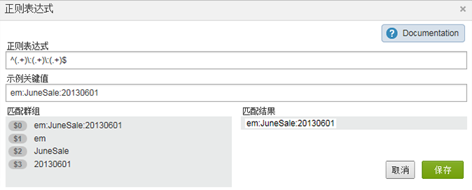

# 分类规则定义（旧版）

{{classification-rulebuilder-deprecation}}

分类规则生成器中的页面上界面元素的定义。

## “规则”页面

此页面显示规则集中的规则。

**定义**

<table id="table_2B3A8BB7BDE14836ACA6A1D444B011CD"> 
 <thead> 
  <tr> 
   <th colname="col1" class="entry"> 元素 </th> 
   <th colname="col2" class="entry"> 描述 </th> 
  </tr> 
 </thead>
 <tbody> 
  <tr> 
   <td colname="col1"> 
选择报表包和变量 
 </td> 
   <td colname="col2"> 
<b>报表包</b> 
 
要对其应用规则集的报表包。 
 
<b>变量</b> 
 
创建分类规则集时，只能应用一个变量。如果您要为一个变量创建多个规则集，则必须将每个规则集应用到多个报表包。 
 
注意：您只能使用您在报表包中拥有访问权限的变量。只有在变量至少定义了一个分类后，变量才会在新建规则集面板中显示。 
 
 您可以在管理员 &gt; 报表包 &gt; 流量 &gt; 流量分类（或转化 &gt; 转化分类）中对变量创建分类。然后选择该变量，并单击添加分类。 
 
请参阅管理员帮助中的<a href="https://experienceleague.adobe.com/docs/analytics/admin/admin-tools/traffic-variables/traffic-classifications.html?lang=zh-Hans"  >流量分类</a>和<a href="https://experienceleague.adobe.com/docs/analytics/admin/admin-tools/conversion-variables/conversion-classifications.html?lang=zh-Hans"  >转化分类</a>。 
 </td> 
  </tr> 
  <tr> 
   <td colname="col1"> 
 激活 
 </td> 
   <td colname="col2"> 
验证并激活规则。活动规则每天进行处理，通常每月检查一次返回的分类数据。规则会自动检查新值，并上传分类。 
 </td> 
  </tr> 
  <tr> 
   <td colname="col1"> 
 停用 
 </td> 
   <td colname="col2"> 
停用规则，以便可对其进行编辑和测试。 
 </td> 
  </tr> 
  <tr> 
   <td colname="col1"> 
配置报表包和变量 
 </td> 
   <td colname="col2"> 
显示可用报表包页，其中可以选择一个或多个用于所有规则集的可用报表包。（当您首次运行分类规则生成器时，此页面也会显示。） 
 
此功能旨在帮助减少存在成百上千个可用报表包时报表包的加载时间。 
 
创建规则时，当您单击“添加报表包”后，您在此处选择的报表包将可用于规则级别。 
 
注意：仅当报表包在“管理工具”中至少为变量定义了一个分类时，报表包才可用。 
（请参阅<a href="/help/components/classifications/crb/classification-rule-set.md"  >分类规则集</a>中的“变量”，了解关于此先决条件的说明。） 
 
 </td> 
  </tr> 
  <tr> 
   <td colname="col1"> 
规则会覆盖任何现有的值 
 </td> 
   <td colname="col2"> 
 （默认设置）始终覆盖现有的分类键值，包括通过导入器 (SAINT) 上载的分类。 
 </td> 
  </tr> 
  <tr> 
   <td colname="col1"> 
规则仅会覆盖未设置的值 
 </td> 
   <td colname="col2"> 
仅填写空白（未设置）的单元格。不会更改现有分类。 
 </td> 
  </tr> 
  <tr> 
   <td colname="col1"> 
回顾窗口 
 </td> 
   <td colname="col2"> 
激活并验证规则时，您可以指定规则是否应覆盖受影响键值的现有分类。（只有之前在指定的时间段内传递给 Adobe Analytics 的分类键值才会受到影响。） 
 
如果未指定回顾窗口，则规则大约一个月回顾一次（取决于当前日期）。 现有分类不会被覆盖，除非您启用此选项。 
 
<b>开发中心</b>：合作伙伴可以在开发中心创建分类规则。当客户激活集成时，即会部署这些规则。在开发中心，合作伙伴通过覆盖开始时间选项可以指定客户在激活或编辑集成时，是否能够决定覆盖值。 
 
请参阅<a href="/help/components/classifications/crb/classification-quickstart-rules.md"  >如何处理规则</a>，以了解有关规则处理的详细信息。 
 </td> 
  </tr> 
  <tr> 
   <td colname="col1"> <a href="/help/components/classifications/crb/classification-quickstart-rules.md"  > 添加规则 </a> </td> 
   <td colname="col2"> 
允许您将规则添加到规则集。 
 
注意：如果某个值在规则集中匹配了两次或更多次，则系统会使用最后的规则对该值进行分类。 
 </td> 
  </tr> 
  <tr> 
   <td colname="col1">  草稿 </td> 
   <td colname="col2"> 允许您指定规则处于草稿模式。草稿状态可让您在运行规则之前对其进行测试。 </td> 
  </tr> 
  <tr> 
   <td colname="col1">  复制 </td> 
   <td colname="col2"> 复制一个规则集，以便可以将该规则集应用到其他变量，或应用到不同报表包中的相同变量。 </td> 
  </tr> 
  <tr> 
   <td colname="col1"> 
 <a href="/help/components/classifications/crb/classification-quickstart-rules.md"  > 测试规则集 </a> 
 </td> 
   <td colname="col2"> 
允许您测试规则集的有效性。 
 </td> 
  </tr> 
  <tr> 
   <td colname="col1">  匹配条件 </td> 
   <td colname="col2"> 指定所需的规则条件。 </td> 
  </tr> 
  <tr> 
   <td colname="col1">  分类操作 </td> 
   <td colname="col2"> 
指定在“匹配条件”出现时执行的操作。 
 
例如，将“促销活动名称”设置为 $2，这会将跟踪代码中的位置 2 识别为“促销活动名称”。 
 </td> 
  </tr> 
  <tr> 
   <td colname="col1">  # </td> 
   <td colname="col2"> 
规则编号。 
 
有关详细信息，请参阅<a href="/help/components/classifications/crb/classification-quickstart-rules.md"  >如何处理规则</a>。 
 </td> 
  </tr> 
  <tr> 
   <td colname="col1">  选择规则类型 </td> 
   <td colname="col2"> 
每个规则集适用于特定的变量。有效的选择包括： 
 
    <ul id="ul_6A8E06BB4AF2402B99C215823CB3D59D"> 
     <li id="li_5C702D4F460841D38A59621A5161A3BC">开头 </li> 
     <li id="li_8052A741D9F34A2FBC136C181600193E">结束 </li> 
     <li id="li_D0FA6EA4F09644FFBC9E6BC568BE80AC">包含 </li> 
     <li id="li_48675FE5253942ED887C6A72D1DCEF54"> <a href="/help/components/classifications/crb/classification-quickstart-rules.md"  > 正则表达式 </a> </li> 
    </ul> </td> 
  </tr> 
  <tr> 
   <td colname="col1">  输入匹配条件 </td> 
   <td colname="col2"> 在键值中查找的文本模式。这些条件可以是搜索词、字符或正则表达式。 </td> 
  </tr> 
  <tr> 
   <td colname="col1">  设置分类 </td> 
   <td colname="col2"> 满足匹配条件时要设置的分类列。 </td> 
  </tr> 
  <tr> 
   <td colname="col1">  目标值 </td> 
   <td colname="col2"> 满足匹配条件时要为选定的分类列指定的值。 </td> 
  </tr> 
  <tr> 
   <td colname="col1"> 过滤器 </td> 
   <td colname="col2"> 允许您搜索规则。 </td> 
  </tr> 
 </tbody> 
</table>

## “正则表达式”页面 {#section_C932A5469E774841B2229965A154163C}

您可以在“[!UICONTROL 正则表达式]”页面上编辑正则表达式。

**定义**

| 元素 | 描述 |
|---|---|
| 示例关键值 | 要使用的测试字符串。例如，您可以从跟踪代码中的特定字符创建分类。您可以匹配特定字符、词语或字符模式。 |
| 匹配群组 | 显示正则表达式与促销活动 ID 字符的对应方式，以便您可以对促销活动 ID 中的位置进行分类。 |
| 匹配结果 | 显示与正则表达式成功匹配的字符串部分。 |

请参阅分类规则中的[正则表达式](/help/components/classifications/crb/classification-quickstart-rules.md)。

## “测试”页面 {#section_EC926F97901C4E65901413F9683AA70A}

在此页面中，您可以测试规则集中的规则。

**定义**

| 元素 | 描述 |
|---|---|
| 运行测试 | 在测试规则集时，使用报表中的键值来查看规则集将如何影响键值。 |
| 过滤器 | 过滤“[!UICONTROL 结果]”面板中的值。 |
