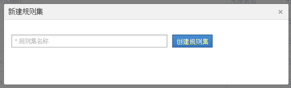
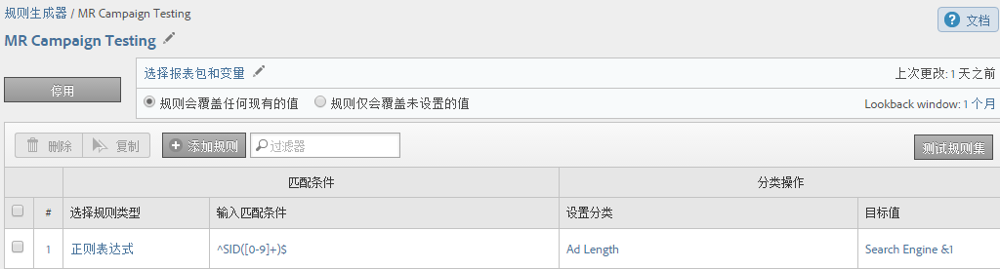

# 分类规则集（旧版）

{{classification-rulebuilder-deprecation}}

*此页面说明分类规则集是[分类规则生成器](classification-rule-builder.md)的一部分。 查看[分类集](../sets/overview.md)以了解当前在Adobe Analytics中分类数据的方法。*

规则集是特定变量的一组分类规则。您可将变量应用到规则集。如果您要为一个变量创建多个规则集，则必须将每个规则集应用到多个报表包。

## 分类规则生成器页面 {#section_C60B0888C76D49C596EF19F11808B718}

**[!UICONTROL Analytics]** > **[!UICONTROL 管理员]** > **[!UICONTROL 分类规则生成器]**

“[!UICONTROL 分类规则生成器]”中提供了以下字段和选项。

<table id="table_A5D92409969747E39E041216A5AA32CD"> 
 <thead> 
  <tr> 
   <th colname="col1" class="entry"> 元素 </th> 
   <th colname="col2" class="entry"> 描述 </th> 
  </tr> 
 </thead>
 <tbody> 
  <tr> 
   <td colname="col1"> 
<a href="/help/components/classifications/crb/classification-rule-set.md"  > 添加规则集</a> 
 </td> 
   <td colname="col2"> 
创建一个规则集。 
 </td> 
  </tr> 
  <tr> 
   <td colname="col1"> 
规则 
 </td> 
   <td colname="col2"> 显示规则集中包含的规则数量。 </td> 
  </tr> 
  <tr> 
   <td colname="col1"> 
状态 
 </td> 
   <td colname="col2"> 显示规则集的活动状态，如“草稿”或“活动”。活动规则每天进行处理，通常每月检查一次返回的分类数据。规则会自动检查新值，并上传分类。 </td> 
  </tr> 
  <tr> 
   <td colname="col1"> 
上次更改 
 </td> 
   <td colname="col2"> 指示规则集的编辑时间。 </td> 
  </tr> 
  <tr> 
   <td colname="col1"> 
复制 
 </td> 
   <td colname="col2"> 复制一个规则集，以便可以将该规则集应用到其他变量，或应用到不同报表包中的相同变量。 </td> 
  </tr> 
 </tbody> 
</table>

## 创建分类规则集 {#create-classification-rule-set}

为分类规则集命名、应用变量并指定覆盖设置。

1. （前提条件）在&#x200B;**[!UICONTROL 管理员]** > **[!UICONTROL 报表包]**&#x200B;中定义分类结构。

   只有在变量至少定义了一个分类后，变量才会在[!UICONTROL 新建规则集]面板中显示。

   您可以在&#x200B;**[!UICONTROL 管理员]** > **[!UICONTROL 报表包]** > **[!UICONTROL 流量]** > **[!UICONTROL 流量分类]**（或&#x200B;**[!UICONTROL 转化]** > **[!UICONTROL 转化分类]**）中对变量创建分类。然后选择该变量，并单击&#x200B;**[!UICONTROL 添加分类]**。

1. 要创建规则集，请单击&#x200B;**[!UICONTROL 管理员]** > **[!UICONTROL 分类规则生成器]** > **[!UICONTROL 添加规则集]**。

   

1. 命名规则集，然后单击&#x200B;**[!UICONTROL 创建规则集]**。
1. 选择要编辑的规则集。

   

1. 单击&#x200B;**[!UICONTROL 选择报表包和变量]**。

   报表包和变量列表中填充了可在登录公司的所有报表包中使用的所有分类变量。报表包中的单个变量只能属于一个规则集。

   有关详细信息，请参阅&#x200B;*`Variable`*&#x200B;分类规则生成器[页面的定义中的](/help/components/classifications/crb/classification-rule-definitions.md)。
1. 指定要使用的报表包和变量，然后单击&#x200B;**[!UICONTROL 保存]**。
1. 继续向规则集[添加分类规则](/help/components/classifications/crb/classification-rule-set.md)。
