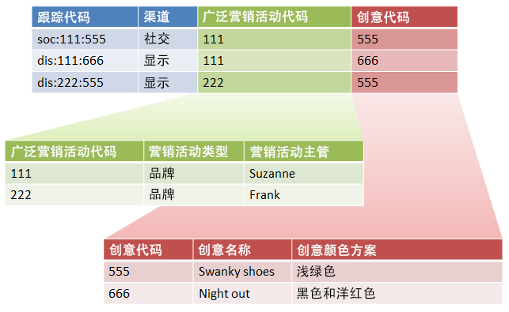

# 子分类和规则生成器（旧版）

{{classification-rulebuilder-deprecation}}

如果确保每个子分类都有父值，则可以将分类规则生成器与子分类结合使用。

结合使用分类规则生成器和子分类可以简化分类管理和减少所需的规则数量。如果您的跟踪代码中包含需要单独分类的代码，您可能需要此功能。

请参阅[子分类](/help/components/classifications/importer/subclassifications.md)，了解子分类的概念信息。

## 示例

假定以下跟踪代码：

`channel:broad_campaign:creative`

使用分类层次结构可以将分类应用到分类（称为 *`sub-classification`*)。 表示您可以对多个表格使用导入器（如关系数据库）。一个表格将完全跟踪代码映射到键值，另一个表格将键值映射到其他表格。

建立此结构后，可以使用[分类规则生成器](/help/components/classifications/crb/classification-rule-builder.md)上载只更新查找表（上图中的绿色和红色表）的小文件。 然后，您可以使用规则生成器来保持主分类表格最新。

以下任务描述如何完成此操作。

## 使用规则生成器设置子分类

描述如何使用规则生成器上载子分类的示例步骤。

1. 在分类管理器中创建分类和子分类。

   示例：

   

1. 在[分类规则生成器](/help/components/classifications/crb/classification-rule-builder.md)中，从原始跟踪代码中对子分类键值进行分类。

   使用正则表达式来执行此操作。在此示例中，要填充&#x200B;*`Broad Campaign code`*&#x200B;的规则将使用此正则表达式：

   | `#` | 规则类型 | 匹配 | 设置分类 | 至 |
   |---|---|---|---|---|
   |   | 正则表达式 | `[^\:]:([^\:]):([^\:])` | 广泛促销活动代码 | `$1` |
   |   | 正则表达式 | `[^\:]:([^\:]):([^\:])` | 创作代码 | `$2` |

   >[!NOTE]
   >
   >此时，您无需填充子分类 *`Campaign Type`* 和 *`Campaign Director`*。

1. 上载仅包含指定子分类的分类文件。

   请参阅[多级别分类](/help/components/classifications/importer/subclassifications.md)。

   示例：

   | 键 | 渠道 | 广泛促销活动代码 | 广泛促销活动代码&Hat;促销活动类型 | 广泛促销活动代码&Hat;促销活动主管 | ... |
   |---|---|---|---|---|---|
   | &#42; |  | 111 | 品牌 | Suzanne |  |
   | &#42; |  | 222 | 品牌 | Frank |  |

1. 要维护查找表，请上载一个小文件（如上方所示）。

   例如，当引入新 *`Broad Campaign code`* 时，您需要上载此文件。此文件将应用于之前分类的值。同样，如果您创建新的子分类（如&#x200B;*`Creative Theme`*&#x200B;作为&#x200B;*`Creative code`*&#x200B;的子分类），则只上载子分类文件，而不是上载整个分类文件。

   这些子分类函数的报告方式与顶级分类类似。这降低了使用它们所需的管理负担。
