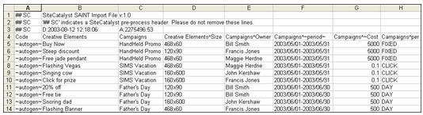

# 分类数据文件（旧版）

{{classification-importer-deprecation}}

导入器允许您将文件中的分类数据批量上载至分析报告。 要成功上传数据，导入操作需要特定的文件格式。

为了帮助您创建有效的数据文件，您可以下载一个模板文件，该文件提供了一个可以粘贴分类数据的文件结构。 有关详细信息，请参阅[下载分类模板](/help/components/classifications/importer/c-download-saint-data.md)。

请参阅[通用文件结构](/help/components/classifications/importer/c-saint-data-files.md)，以了解有关分类中字符限制的详细信息。

## 通用文件结构

下图是一个示例数据文件：



数据文件必须遵循以下结构规则：

* 分类的值不能为0（零）。
* Adobe 建议您将导入和导出列的数量限制为 30。
* 上载的文件应使用不带BOM字符编码的UTF-8。
* 包含制表符、换行符和引号在内的特殊字符可以嵌入在单元格内，前提是指定了 v2.1 文件格式，并且该单元格已被正确[转义](/help/components/classifications/importer/importer-faq.md)。 特殊字符包括：

  ```text
  \t     tab character 
  \r     form feed character 
  \n    newline character 
  "       double quote
  ```

  逗号不是特殊字符。

* 分类名称不能包含脱字符号(^)，因为此字符用于表示子分类。
* 使用连字符时请小心。 例如，如果您在 Social 术语中使用连字符 (-)，则 Social 会将连字符识别为 [!DNL Not] 运算符（减号）。 例如，如果您使用导入指定 *`fragrance-free`* 作为术语，则 Social 会将该术语识别为 fragrance *`minus`* free，并收集提及 *`fragrance`*，但未提及 *`free`* 的帖子。
* 在对报告数据进行分类时必须执行字符限制。 例如，如果上载产品名称长度超过 100 个字符（字节）的产品的分类文本文件 (*`s.products`*)，将不会在报告中显示这些产品。 跟踪代码和所有自定义转化变量（eVar）允许 255 字节。 此策略还扩展到分类和子分类列值，这些值受相同的255字节限制的约束。
* 以制表符分隔的数据文件（可以使用任一款电子表格应用程序或文本编辑器来创建模板文件）。
* 使用 `.tab` 或 `.txt` 作为文件扩展名。
* 井号(#)将该行标识为用户注释。 Adobe忽略任何以#开头的行。
* 双井号后面接SC (`## SC`)表示该行是报告使用的预处理标题注释。 请勿删除这些行。
* 由于键中存在换行字符，分类导出可能包含重复的键。 在FTP或浏览器导出中，可以通过为FTP帐户启用报价来解决此问题。 这将在每个键周围加上引号，其中带有换行字符。
* 导入文件第一行中的单元格C1包含版本标识符，该标识符确定分类如何处理在文件的其余部分使用引号的情况。

   * v2.0忽略引号，并假定它们都是指定键和值的一部分。 例如，请考虑以下值：&quot;这是&quot;&quot;一些值&quot;&quot;。 v2.0会按字面含义将此解析为：&quot;这是&quot;一些值&quot;&quot;。
   * v2.1告诉分类，假定引号是Excel文件中使用的文件格式的一部分。 因此，v2.1会将上述示例格式设置为：这是“一些值”。
   * 如果在文件中指定了v2.1，但实际需要的是v2.0，即，当以在Excel格式下非法的方式使用引号时，可能会出现问题。 例如，如果具有以下值：“VP NO REPS” S/l Dress w/ Overlay。 使用v2.1时，格式不正确（值应用开头和结尾引号括起来，属于实际值的引号应用引号转义），超出此范围将无法进行分类。
   * 请确保您执行了以下操作之一：通过更改上载文件中的标题（单元格 C1）将您的文件格式更改为 v2.0，或者在所有文件中正确实施 Excel 引号功能。

* 数据文件的第一个（非注释）行包含用于标识该列中分类数据的列标题。 导入器要求为列标题使用特定格式。 有关详细信息，请参阅[列标题格式](/help/components/classifications/importer/c-saint-data-files.md)。
* 数据文件中的标题行后面紧接着是数据行。 每行数据应包含每个列标题的数据字段。
* 数据文件支持以下控制代码，Adobe使用这些代码为文件提供结构，并正确导入分类数据：

<table id="table_0548F2E58B6644208147434EB9B3C21B"> 
 <thead> 
  <tr> 
   <th colname="col1" class="entry"> 控制代码 </th> 
   <th colname="col2" class="entry"> 描述 </th> 
  </tr> 
 </thead>
 <tbody> 
  <tr> 
   <td colname="col1"> <p>&lt;New Line&gt; </p> </td> 
   <td colname="col2"> <p>新行字符是数据文件中数据行/记录之间唯一支持的分隔符。 通常，在编写程序以自动生成数据文件时，您只需专门插入这些字符即可。 </p> </td> 
  </tr> 
  <tr> 
   <td colname="col1"> <p>~autogen~ </p> </td> 
   <td colname="col2"> <p>请求Adobe自动为此元素生成唯一ID。 </p> <p>在营销活动上下文中，此控制值指示Adobe为每个创意元素分配一个标识符。 请参阅<a href="/help/components/classifications/importer/c-saint-data-files.md"  >密钥</a>。 </p> </td> 
  </tr> 
  <tr> 
   <td colname="col1"> <p>~period~ </p> </td> 
   <td colname="col2"> <p>指定数据列表示与项目关联的日期范围。 请参阅<a href="/help/components/classifications/importer/c-saint-data-files.md"  >日期</a>。 </p> </td> 
  </tr> 
  <tr> 
   <td colname="col1"> <p>空字段 </p> </td> 
   <td colname="col2"> <p>表示当前字段的NULL值。 如果特定数据列不适用于当前记录，则使用此选项。 </p> </td> 
  </tr> 
  <tr> 
   <td colname="col1"> <p>PER修饰符 </p> </td> 
   <td colname="col2"> <p>指定此数据列代表 <span class="wintitle">PER 修饰符</span>字段。 请参阅 <a href="/help/components/classifications/importer/c-saint-data-files.md"  >PER 修饰符标题</a>。 </p> </td> 
  </tr> 
 </tbody> 
</table>

## 列标题格式

>[!NOTE]
>
>Adobe 建议您将导入和导出列的数量限制为 30。

分类文件支持以下列标题：

### 键

在整个系统中，此值必须唯一。 此字段中的值对应于在您网站的 [!DNL JavaScript] 信标中分配给 [!DNL Analytics] 变量的值。 该列中的数据可能包含 ~autogen~ 或任何其他唯一跟踪代码。

### 分类列标题

>[!NOTE]
>
>[!UICONTROL 分类]列标题中的值必须完全符合分类的命名规范，否则会导致导入失败。 例如，如果管理员在[!UICONTROL 促销活动设置管理器]中将[!UICONTROL 促销活动]更改为[!UICONTROL 内部促销活动名称]，则文件列标题必须随之更改。 “Key”是保留的分类（标头）值。 不支持名为“Key”的新分类。

此外，数据文件支持以下附加标题约定，以确定子分类和其他专门的数据列：

### 子分类标题

例如，`Campaigns^Owner`是包含`Campaign Owner`值的列的列标题。 同样，`Creative Elements^Size`是包含`Creative Elements`分类的`Size`子分类的列的列标题。

## 有关分类的疑难解答

* [常见 上载问题](https://helpx.adobe.com/cn/analytics/kb/common-saint-upload-issues.html)：知识库文章，描述由于文件格式以及文件内容不正确导致的问题。
