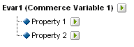
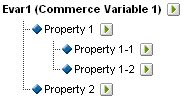

# 子分类

{{classification-importer-deprecation}}

Adobe Analytics 支持单级别和多级别分类模型。 使用分类层次结构可以将分类应用到分类。

>[!NOTE]
>
>子分类是指创建分类的分类的功能。 但请注意，这与创建[!UICONTROL 层次]报表的[!UICONTROL 分类层次]不同。 有关分类层次结构的详细信息，请参阅[分类层次结构](/help/admin/tools/manage-rs/edit-settings/conversion-var-admin/classification-hierarchies.md)。

例如：

此模型中的每个分类都是独立的，并与所选报告变量的新子报告相对应。 此外，每个分类在数据文件中构成一个数据列，分类名称作为列标题。 例如：

| 键 | 属性1 | 属性2 |
|---|---|---|
| 123 | ABC | A12B |
| 456 | DEF | C3D4 |

有关数据文件的更多信息，请参阅[分类数据文件](/help/components/classifications/importer/c-saint-data-files.md)。

多级分类由父分类和子分类组成。 例如：

**父项分类：**&#x200B;父项分类是指具有一个关联子项分类的任何分类。 分类既可以为父项分类也可以为子项分类。 顶级父项分类对应于单级别分类。

**子项分类：**&#x200B;子项分类是以其他分类而非变量做为其父项的分类。 子分类提供有关其父分类的其他信息。 例如，[!UICONTROL 营销活动]分类可能具有营销活动所有者子分类。 [!UICONTROL 数值]分类也可当作分类报表中的指标。

每个分类（父分类或子分类）在数据文件中构成一个数据列。 子分类的列标题使用以下命名格式：

`<parent_name>^<child_name>`

有关数据文件格式的详细信息，请参阅[分类数据文件](/help/components/classifications/importer/c-saint-data-files.md)。

例如：

| 键 | 属性1 | 属性 1^属性 1-1 | 属性 1^属性 1-2 | 属性 2 |
|---|---|---|---|---|
| 123 | ABC | 绿色 | 小 | A12B |
| 456 | DEF | 红色 | 大 | C3D4 |

虽然多级分类的文件模板较为复杂，但在多级分类中，单独的级别可以作为单独的文件上传。 此方法可用于最大限度地减少需要定期（每天、每周等等）上传的数据量，方法是将数据分组为随时间变化的分类级别（而非不随时间变化的分类级别）。

>[!NOTE]
>
>如果数据文件中的[!UICONTROL 键值]列为空白，则 Adobe 会自动地为每个数据行生成唯一的键值。 要避免在上传具有二级或更高级分类数据的数据文件时可能出现的文件损坏，请以星号 (*) 填充[!UICONTROL 键值]列的每一行。

## 示例

>[!NOTE]
>
>产品分类数据仅受与产品直接相关的数据属性的限制， 这些数据不仅限于产品在网站上的分类或销售方式。 销售类别、网站浏览节点或销售项目等数据元素不是产品分类数据。 相反，这些元素是在报告转化变量中捕获的。

在上传此产品分类的数据文件时，您可以将分类数据作为单个或多个文件进行上传（请参阅下文）。 通过分隔文件1中的颜色代码和文件2中的颜色名称，只有在创建新的颜色代码时才需要更新颜色名称数据（可能只有几行）。 这会从更新较频繁的文件1中消除颜色名称(CODE^COLOR)字段，并在生成数据文件时降低文件大小和复杂性。

### 产品分类 — 单个文件 {#section_E8C5E031869C449F9B636F5EB3BFEC17}

| 键 | 产品名称 | 产品详细信息 | 性别 | 大小 | 代码 | 代码^颜色 |
|---|---|---|---|---|---|---|
| 410390013 | Polo-SS | 男式Polo衬衫，短袖(M，01) | M | M | 01 | 石头 |
| 410390014 | Polo-SS | 男士马球衫，短袖(L，03) | M | L | 03 | Heather |
| 410390015 | Polo-LS | 女式Polo恤，长袖(S，23) | F | S | 23 | 水绿色 |

### 产品分类 — 多个文件（文件 1） {#section_A99F7D0F145540069BA4EEC0597FF13F}

| 键 | 产品名称 | 产品详细信息 | 性别 | 大小 | 代码 |
|---|---|---|---|---|---|
| 410390013 | Polo-SS | 男式Polo衬衫，短袖(M，01) | M | M | 01 |
| 410390014 | Polo-SS | 男士马球衫，短袖(L，03) | M | L | 03 |
| 410390015 | Polo-LS | 女式Polo恤，长袖(S，23) | F | S | 23 |

### 产品分类 — 多个文件（文件 2） {#section_19ED95C33B174A9687E81714568D56A3}

| 键 | 代码 | 代码^颜色 |
|---|---|---|
| &#42; | 01 | 石头 |
| &#42; | 03 | Heather |
| &#42; | 23 | 水绿色 |
