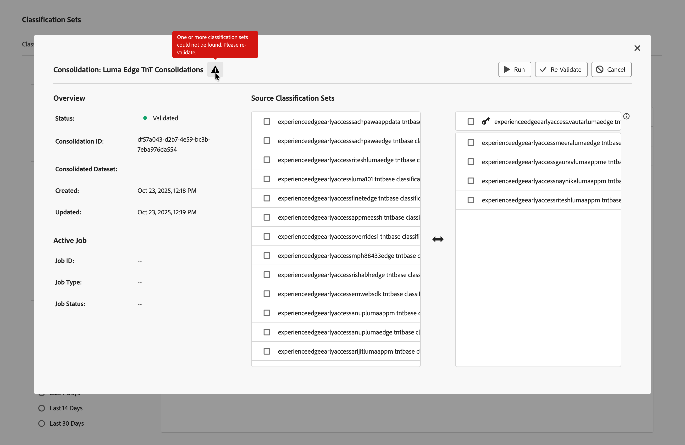
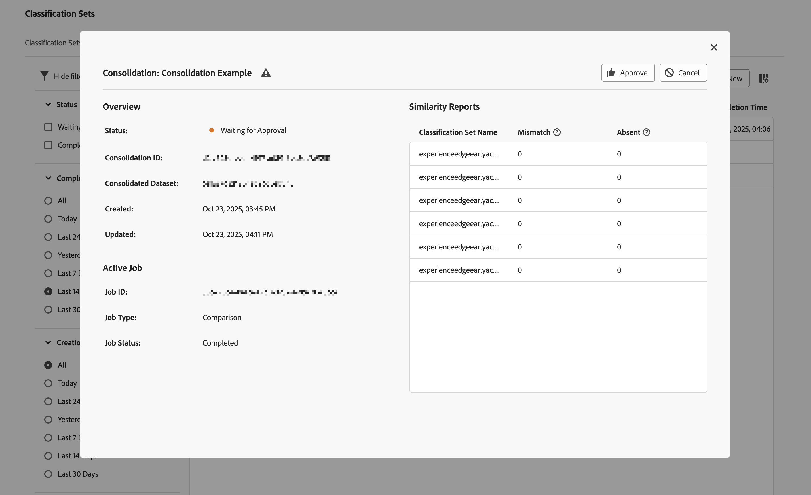

# 创建和编辑分类合并

分类集合并允许您从多个分类集获取分类并将它们组合到一个分类集中。 使用此界面从头到尾创建分类集合并。 此界面对于从旧版分类迁移到分类集的组织最有价值。 使用分类集的组织已经不需要使用此合并工作流。

## 创建合并 {#create-a-consolidation}

>[!CONTEXTUALHELP]
>id="classificationsets_consolidation_setpriority"
>title="分类集优先级"
>abstract=" *分类集*&#x200B;是基本分类集，它定义了整个架构，在任何合并冲突中都具有优先权。 其他分类集按从上到下的顺序应用。"

要创建分类合并，请在Adobe Analytics主界面中：

1. 从&#x200B;**[!UICONTROL 组件]**&#x200B;菜单中选择&#x200B;**[!UICONTROL 分类集]**。
1. 在&#x200B;**[!UICONTROL 分类集]**&#x200B;管理器中，选择&#x200B;**[!UICONTROL 合并]**&#x200B;选项卡。
1. 在&#x200B;**[!UICONTROL 分类集 — 合并]**&#x200B;管理器中，选择 **[!UICONTROL 新建]**。
1. 在&#x200B;**[!UICONTROL 新建合并]**&#x200B;对话框中，

   
   1. 输入&#x200B;**[!UICONTROL 名称]**。 例如：`Consolidation Example`。
   1. 输入&#x200B;**[!UICONTROL 描述（可选）]**。 例如，`Example classification set`。
   1. 在&#x200B;**[!UICONTROL 通知问题]**&#x200B;中输入一个或多个电子邮件地址（以逗号分隔）。 向这些用户发送有关问题的电子邮件通知。
   1. 从&#x200B;**[!UICONTROL 要匹配的分类集]**&#x200B;下拉菜单中选择一个分类集。

      **[!UICONTROL Source分类集]**&#x200B;左侧列表中填充了与选定分类列表类似且可合并的分类集。 使用选定的分类集自动填充右侧列表。 该基集定义了整个架构，在任何合并冲突中始终具有优先权。

   1. 从左侧列表中选择要合并的分类集，并将所选分类集拖放到右侧列表中，使其位于选定基本&#x200B;**[!UICONTROL _分类集_]**&#x200B;的下方。

      运行合并时，附加分类集将按升序合并。 如果一个键值存在于多个其他集中，则采用来自排名最前的分类集的键值。 如果基集和任何其他集都存在键，则使用基集中的值。

      要管理使用键的值，请通过拖放移动列表中的单个分类集和选定的分类集。 您还可以通过拖放将 **[!UICONTROL _分类集_]**&#x200B;替换为选定的分类集。

   1. 选择&#x200B;**[!UICONTROL 保存]**&#x200B;以保存分类合并。 选择&#x200B;**[!UICONTROL 取消]**&#x200B;即可取消。

保存后，将自动验证分类整合以进行整合。 此验证可确保每个单独的分类集对此合并有效。 一旦成功，分类合并列表中的条目将显示状态&#x200B;**[!UICONTROL 已验证]**。

创建合并后，接下来的步骤为：

* [对初始配置进行更改后，重新验证](#re-validate)分类合并。
* [运行](#run)分类合并。
* [批准](#approve)分类合并。

## 编辑合并 {#edit-a-classification}

>[!CONTEXTUALHELP]
>id="classificationsets_consolidations_mismatch"
>title="不匹配"
>abstract="当合并分类集中的值与源分类集不匹配时的键不匹配百分比。"

>[!CONTEXTUALHELP]
>id="classificationsets_consolidations_absent"
>title="不存在"
>abstract="键在统一分类集中，但不在源分类集中所占的百分比。"

要编辑分类合并，请在Adobe Analytics主界面中：

1. 从&#x200B;**[!UICONTROL 组件]**&#x200B;菜单中选择&#x200B;**[!UICONTROL 分类集]**。
1. 在&#x200B;**[!UICONTROL 分类集]**&#x200B;管理器中，选择&#x200B;**[!UICONTROL 合并]**&#x200B;选项卡。
1. 在&#x200B;**[!UICONTROL 分类集合并]**&#x200B;管理器中：
   1. 选择分类合并的名称。 出现&#x200B;**[!UICONTROL 合并： _分类合并名称_]**&#x200B;对话框。 外观和可用操作取决于合并的当前状态，以及您是否仍可以选择修改分类合并。

      | 可用操作 | 描述 |
      |---|---|
      |  **[!UICONTROL 取消]** | [取消合并](#cancel)。 |
      |  **[!UICONTROL 重新验证]** | [重新验证合并](#re-validate)。 |
      |  **[!UICONTROL 运行]** | [运行合并](#run)。 |
      |  **[!UICONTROL 批准]** | [批准合并](#approve)。 |

### 重新验证

您可以在“合并：分类合并”对话框中重新验证分类合并。 可能会提供有关需要重新配置合并的合并问题的其他信息。

要重新验证分类整合，请执行以下操作：

1. 使用与创建合并相同的拖放界面重新配置合并。
1. 选择 **[!UICONTROL 重新验证]**。 验证将确保每个单独的分类集对此合并有效。 成功后，将显示Toast消息：  **[!UICONTROL 已成功提交合并进行验证！]**
1. 选择关闭对话框。 或者选择 **[!UICONTROL 运行]**&#x200B;以运行合并，或者选择 **[!UICONTROL 取消]**&#x200B;以取消分类。

<!--
Once you have created a consolidation, a list of source datasets appears on the right. The **[!UICONTROL Validate]** button makes sure that each individual classification set is valid for this consolidation. You can reorder the classification steps here to determine priority in cases of mismatched classification values. **The highest classification set in the list overwrites any mismatched values in other classification sets.**

-->

### 运行

成功验证分类合并后，即可运行合并。

要运行分类合并，请执行以下操作：

1. 选择 **[!UICONTROL 运行]**。 Toast消息显示 **[!UICONTROL 已成功提交合并以进行处理！]**
1. 选择关闭对话框。

### 批准

成功运行分类合并后，合并状态为 **[!UICONTROL 正在等待批准]**。 批准分类综合以综合分类集取代个别分类集，而个别分类集则予以移除。

要批准分类集合并，请执行以下操作：

1. 使用&#x200B;**[!UICONTROL 相似性报告]**&#x200B;报告查看合并。 此报告显示一个包含以下列的表：

   * **[!UICONTROL 分类集名称]**：分类集的名称。
   * **[!UICONTROL 不匹配]**：键值与源分类集不匹配的行的百分比。 如果不匹配百分比很高，则该不匹配可能表示分类数据相差太大。 检查并确保所选分类集具有相似的分类数据。
   * **[!UICONTROL 不存在]**：键值在分类集中但不在源分类集中的行的百分比。 所有缺失的行都将添加到合并的分类集中。

1. 如果分类合并已准备好进行审批，请选择 **[!UICONTROL 批准]**。 **[!UICONTROL 批准合并？]**&#x200B;对话框提示确认。 选择&#x200B;**[!UICONTROL 批准]**&#x200B;以批准合并。 选择&#x200B;**[!UICONTROL 取消]**&#x200B;即可取消。

批准后，将创建合并的分类集。 状态设置为&#x200B;**[!UICONTROL 完成]**。

### 取消

您可以在批准之前取消分类合并。

要取消分类合并，请执行以下操作：

1. 选择&#x200B;**[!UICONTROL 取消]**。

   一旦合并被取消，您将无法恢复合并。
1. 选择&#x200B;**[!UICONTROL 取消合并]**&#x200B;以取消合并。 选择&#x200B;**[!UICONTROL 返回]**&#x200B;恢复取消。
