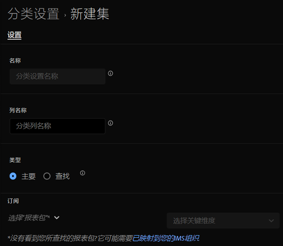

# 创建分类集

您可以使用分类集管理器创建分类集。

**[!UICONTROL 组件]** > **[!UICONTROL 分类集]** > **[!UICONTROL 集]** > **[!UICONTROL 添加]**

创建分类集时，可使用以下字段。

* **[!UICONTROL 名称]**:用于标识分类集的文本字段。 创建时无法编辑此字段，但以后可以重命名此字段。
* **[!UICONTROL 列名称]**:要创建的分类维度的名称。 此字段是Analysis Workspace中使用的维度名称，以及导出分类数据时的列名称。
* **[!UICONTROL 类型]**:指示分类类型的单选按钮。 通常使用主要分类；查找分类表示 [子分类](../c-sub-classifications.md).
* **[!UICONTROL 订阅]** 此分类集所应用的报表包和维度。 计划会支持多个报表包。

如果给定报表包+变量存在分类集，则会将分类添加到架构中。
