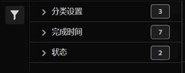

# 查看分类作业并根据作业执行操作

分类作业管理器显示为分类集生成的当前和已完成的分类作业。 您还可以使用管理器下载特定作业的分类数据或模板。

要查看分类作业并对其执行操作，请执行以下操作：

1. 从Adobe Analytics顶部菜单栏中选择&#x200B;**[!UICONTROL 组件]**，然后选择&#x200B;**[!UICONTROL 分类集]**。
1. 在&#x200B;**[!UICONTROL 分类集]**&#x200B;中，选择&#x200B;**[!UICONTROL 作业]**&#x200B;选项卡。

## 分类作业管理器

**[!UICONTROL 分类集 — 作业]**&#x200B;管理器具有以下接口元素：

### 分类作业列表

**[!UICONTROL 分类作业]**&#x200B;列表➊显示分类作业。 该列表具有以下各列：

| 列 | 描述 |
|---|---|
| **[!UICONTROL 作业ID]** | 分类作业的标识符。 |
| **[!UICONTROL 分类集]** | 与分类作业关联的分类集。 |
| **[!UICONTROL 大小]** | 作为分类作业的一部分导出或导入的文件的大小。 |
| **[!UICONTROL 状态]** | 分类作业的状态。 可能的值包括：**[!UICONTROL 已创建]**、**[!UICONTROL 已排队]**、**[!UICONTROL 已验证]**、**[!UICONTROL 已失败的验证]**、**[!UICONTROL 正在处理]**、**[!UICONTROL 已完成处理]**、**[!UICONTROL 已失败的处理]**、**[!UICONTROL 已完成]**&#x200B;或&#x200B;**[!UICONTROL 进度]**。 如果显示，将鼠标悬停在警报上以显示其他信息。 |
| **[!UICONTROL 文件名]** | 标识在分类作业中用于导入或导出文件的名称或功能。 可能的值包括： <ul><li>*没有值*</li><li>分类作业中处理的文件的名称。</li><li>**[!UICONTROL SAINT导出]**：作业是从[旧版分类界面](/help/components/classifications/importer/c-working-with-saint.md)的导出。</li><li>**[!UICONTROL 导出位于&#x200B;_时间戳_的&#x200B;_分类集_]**：作业是从[架构](manage/schema.md#download)界面下载的。</li></ul> |
| **[!UICONTROL 作业类型]** | 分类作业的类型。 可能的值为： **[!UICONTROL Import]**&#x200B;或&#x200B;**[!UICONTROL Export]**。 |
| **[!UICONTROL 来源]** | 分类作业的源。 可能的值为： **[!UICONTROL Web API]**、**[!UICONTROL 直接API上传]**、**[!UICONTROL Adobe]**、**[!UICONTROL SAINT]**&#x200B;或&#x200B;**[!UICONTROL 未知]**。 |
| **[!UICONTROL 已修改的行]** | 分类作业修改的修改行数。 |
| **[!UICONTROL 总行数]** | 分类作业处理的总行数。 |
| **[!UICONTROL 完成时间]** | 分类作业的完成时间。 |
| **[!UICONTROL 文件下载]** | 使用下载与分类作业关联的文件（模板或数据）。 |

要调整分类作业列表中的列大小，您可以：

* 将鼠标悬停在列分隔符上，并将列分隔符拖至所需的列宽。
* 选择并选择&#x200B;**[!UICONTROL 调整列大小]**。 带有调整大小按钮的垂直线允许您使用将列大小调整到所需的大小。

对分类作业列表中的列进行排序

* 选择并选择&#x200B;**[!UICONTROL 升序排序]**&#x200B;或&#x200B;**[!UICONTROL 降序排序]**。 箭头(↑↓)指示哪一列以及该列的排序方式。

### 搜索和按钮

在分类作业列表顶部的➋区域中，您可以：

* 在中搜索分类作业。 结果将显示在分类作业列表中。 选择以清除搜索。
* 删除应用于分类作业列表的任何筛选器。 选择以删除筛选器。
* 选择以加载附加1000分类作业。 最初，分类集列表最多显示1000个分类作业。
* 定义分类集作业列表的列。 选择，然后在&#x200B;**[!UICONTROL 自定义表]**&#x200B;对话框中，选择要在&#x200B;**[!UICONTROL 下显示的列。选择要显示的列]**。 选择&#x200B;**[!UICONTROL 应用]**&#x200B;以应用列设置。

### 过滤器面板

选择以显示筛选器面板➌，该面板允许您筛选分类作业列表。 您可以按以下项过滤：

* **[!UICONTROL 分类集]**。 选择一个或多个分类集以筛选分类作业列表。
* **[!UICONTROL 完成时间]**。 选择一个可能值以在完成时筛选分类作业列表。
* **[!UICONTROL 状态]**。 选择其中一个可能值以按状态筛选分类作业列表。
* **[!UICONTROL 作业类型]**。 选择一个可能值以根据作业类型筛选分类作业列表。
* **[!UICONTROL Source]**。 选择一个可能值以筛选源上的分类作业列表。

选择 **[!UICONTROL 隐藏筛选器]**&#x200B;以隐藏筛选器面板。

请注意，“过滤器”面板中显示的过滤器反映了预加载的分类作业的选项。

<!--

**[!UICONTROL Components]** > **[!UICONTROL Classification sets]** > **[!UICONTROL Jobs]**

You cannot create jobs from this interface. Create jobs by uploading data to a classification set (either manually or through a configured external location), requesting a download file, or requesting a template file.

## Filter classification sets

The left side of the Classification set job manager provides filter settings to locate the desired job. Clicking the filter icon toggles the filter settings visibility. You can filter Classification sets by **[!UICONTROL Classification set]**, **[!UICONTROL Completion time]**, **[!UICONTROL Status]**, **[!UICONTROL Job Type]**, or **[!UICONTROL Source]**.

Additional filter options are available above the Classification set job manager columns:

* **[!UICONTROL Search by title]**: Search for jobs by filename.
* **[!UICONTROL Load more]**: The Classification set job manager initially displays up to 1000 jobs. If more jobs exist, click this button to load 1000 more jobs.
* **Show/Hide columns**: Toggle visibility for any column besides [!UICONTROL Filename] and [!UICONTROL Completion time].

## Classification set job manager columns

The following columns are available in the Classification set job manager:

* **[!UICONTROL Filename]**: The name of the upload or download file.
* **[!UICONTROL Classification set]**: The name of the Classification set that the file applies to. You can click the Classification set name to reach the Classification set's [Settings](manage/settings.md).
* **[!UICONTROL Size]**: The size of the file.
* **[!UICONTROL Status]**: The status of the job processing the file.
  * **[!UICONTROL Created]**: The job was submitted.
  * **[!UICONTROL Queued]**: The file is ready to be processed, and is waiting for a classification server to process the file.
  * **[!UICONTROL Validated]**: The file is valid and is waiting to be processed.
  * **[!UICONTROL Failed validation]**: The file is formatted incorrectly or otherwise invalid. The file does not go through processing.
  * **[!UICONTROL Processing]**: The file is actively being processed by Adobe.
  * **[!UICONTROL Failed processing]**: The file failed processing.
  * **[!UICONTROL Complete]**: Processing is complete. Classification data is visible in reporting.
  * **[!UICONTROL Failed]**: Generic failure not related to validation or processing.
* **[!UICONTROL Job type]**: The type of job.
* **[!UICONTROL Source]**: The job source.
* **[!UICONTROL File download]**: Only applies to download jobs, such as downloading classification data or downloading templates. When a download is ready, this column provides a download link.
* **[!UICONTROL Modified lines]**: The number of modified lines.
* **[!UICONTROL Completed lines]**: The number of completed lines.
* **[!UICONTROL Completion time]**: The date and time that the job completed (or failed).
-->