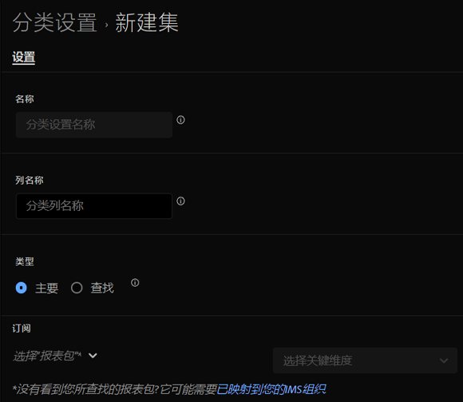

# 创建和编辑分类集

您从分类集管理器[创建](#create-a-classification-set)和[编辑](#edit-a-classification-set)分类集。

## 创建分类集

要创建分类集，请在主界面中：

1. 在主界面中选择&#x200B;**[!UICONTROL 组件]**，然后选择&#x200B;**[!UICONTROL 分类集]**。
1. 在&#x200B;**[!UICONTROL 分类集]**&#x200B;中，选择&#x200B;**[!UICONTROL 分类集]**&#x200B;选项卡。
1. 选择 **[!UICONTROL 新建]**。
1. 在&#x200B;**[!UICONTROL 添加新分类集]**&#x200B;对话框中：

   

   1. 输入&#x200B;**[!UICONTROL 名称]**。 例如：`Classification Set Example`。
   1. 输入&#x200B;**[!UICONTROL 描述（可选）]**。 例如，`Example classification set`。
   1. 在&#x200B;**[!UICONTROL 通知问题]**&#x200B;中输入一个或多个电子邮件地址（以逗号分隔）。 向这些用户发送有关问题的电子邮件通知。
   1. 选择分类集的&#x200B;**[!UICONTROL 类型]**。 可能的类型包括：
      * **[!UICONTROL 主要]**。 主要分类集适用于在Adobe Analytics中收集的维度。 主要分类是一种将粒度维度值分组（分类）为更有意义的数据级别的方法。 例如，您可能希望将内部搜索关键字分组为内部搜索类别，以了解搜索数据中的主题。 或者按颜色或类别对产品SKU进行分类。
         * 输入一个或多个&#x200B;**[!UICONTROL 订阅]**。  您可以为分类集定义多个&#x200B;**[!UICONTROL 报告包]**&#x200B;和&#x200B;**[!UICONTROL Dimension]**&#x200B;组合。

         * 选择以删除&#x200B;**[!UICONTROL 报表包]**&#x200B;和&#x200B;**[!UICONTROL 键Dimension]**&#x200B;组合。

        如果添加的&#x200B;**[!UICONTROL 报告包]**&#x200B;和&#x200B;**[!UICONTROL 键Dimension]**&#x200B;组合已存在于另一个分类集中，则会在组合下看到红色警报。 您可以选择&#x200B;**[!UICONTROL 添加到现有]**&#x200B;以打开另一个分类集，并选择[将分类添加到该另一个分类集的架构](schema.md)，或更改维度。
      * **[!UICONTROL 查找]**。 查找表通常称为子分类或子分类，它是主要分类的分类。 查找是关于分类值的元数据，而不是原始维度。 例如，*Product*&#x200B;维度可能具有&#x200B;*颜色代码*&#x200B;的主要分类。 然后可以将&#x200B;*颜色名称*&#x200B;的查找表附加到&#x200B;*颜色代码*&#x200B;以说明每个颜色代码。
1. 选择&#x200B;**[!UICONTROL 保存]**&#x200B;以保存分类集。 选择&#x200B;**[!UICONTROL 取消]**&#x200B;以取消定义。
1. 要定义分类集的架构，请从&#x200B;**[!UICONTROL 分类集]**&#x200B;管理器中选择新建的分类集以[编辑分类集](#edit-a-classification-set)。

## 编辑分类集

要编辑分类集，请在主界面中：

1. 在主界面中选择&#x200B;**[!UICONTROL 组件]**，然后选择&#x200B;**[!UICONTROL 分类集]**。
1. 在&#x200B;**[!UICONTROL 分类集]**&#x200B;中，选择&#x200B;**[!UICONTROL 分类集]**&#x200B;选项卡。
1. 选择分类集的标题。
1. 在&#x200B;**[!UICONTROL 分类集：_分类集标题_]**&#x200B;对话框中，您可以为分类集定义[设置](settings.md)和[架构](schema.md)。
1. 完成后，选择&#x200B;**[!UICONTROL 保存]**&#x200B;以保存更改。 选择&#x200B;**[!UICONTROL 取消]**&#x200B;即可取消。

<!--

### Schema

In the Schema tab 

You can use the Classification set manager to create a classification set.

**[!UICONTROL Components]** > **[!UICONTROL Classification sets]** > **[!UICONTROL Sets]** > **[!UICONTROL Add]**

When creating a classification set, the following fields are available.

* **[!UICONTROL Name]**: A text field used to identify the classification set. This field cannot be edited upon creation, but can be renamed later.
* **[!UICONTROL Column Name]**: The name of the first classification dimension that you want to create. This field is the dimension name used in Analysis Workspace, and the column name when exporting classification data. You can add more column names after the classification set is created.
* **[!UICONTROL Type]**: Radio buttons that indicate the type of classification.
  * **[!UICONTROL Primary]**: Apply to dimensions collected in Analytics. They are a way to group (classify) granular dimension values into more meaningful levels of data. For example, you might want to group internal search keywords into internal search categories, to better understand themes in your search data.
  * **[!UICONTROL Lookup]**: Commonly referred to as child or subclassifications, a lookup table is a classification of a primary classification. It is metadata about a classification value, rather than the original dimension. For example, the Product variable might have a primary classification of 'Color code'. A lookup table of 'Color name' could then be attached to 'Color code' to further explain what each code means.
* **[!UICONTROL Subscriptions]** The report suites and dimensions that this classification set applies to. You can add multiple report suite and dimension combinations to a classification set.

If a classification set exists for a given report suite + variable, the classification is added to the schema instead. A given report suite + variable combination cannot belong to multiple classification sets.

-->