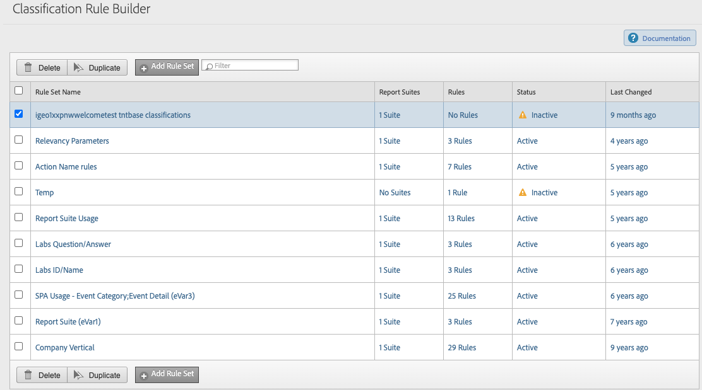

# 分类集规则

使用分类集规则，可根据变量所设置的值自动对值进行分类。 这些规则适用于分类集所有订阅的所有传入变量值。

**[!UICONTROL 组件]** > **[!UICONTROL 分类集]** > **[!UICONTROL 集]** >单击所需的分类集名称> **[!UICONTROL 规则]**

## 规则设置

适用于整个规则集的设置。

* **[!UICONTROL 规则覆盖]**：确定存在分类值时所有规则的行为。
   * **[!UICONTROL 应用于所有值]**：如果规则匹配，则始终覆盖分类值。
   * **[!UICONTROL 仅应用于未设置的值]**：如果规则匹配，则仅写入分类值（如果为空）。 如果存在分类值，则不执行任何操作。
* **[!UICONTROL 回顾窗口]**：激活此规则后，所有规则都将针对此处设置的回顾窗口内显示的所有唯一值运行。

## 规则

为每个唯一值运行的规则列表。

* **[!UICONTROL 搜索]**：允许您按匹配条件筛选规则的搜索框。
* **[!UICONTROL 添加规则]**：向规则表添加一个空白行。
* **[!UICONTROL 测试规则集]**：显示一个允许您验证规则的测试UI。 在左侧，您可以手动键入键值，也可以拖放分类文件以导入许多要作为测试依据的值。 右边的表格显示了激活规则集后分类值的初步结果。 由于此接口仅用于验证，因此不会分类任何值。

单击所需规则旁边的复选框以选择一个或多个规则。 选择规则将显示以下选项：

* **[!UICONTROL 删除]**：从规则表中删除行。
* **[!UICONTROL 复制]**：将选定行复制到规则表的新行中。

## 规则表

规则表垂直分为匹配条件和分类操作两个主要部分。 每一行（一个单独的规则）都包含一个匹配条件和一个分类操作。

* **规则编号**：规则的运行顺序与配置规则表的顺序相同。 如果[!UICONTROL 规则覆盖]设置为[!UICONTROL 应用于所有值]，则最后一个匹配规则将覆盖同一分类维度的任何以前的规则。 如果[!UICONTROL 规则覆盖]设置为[!UICONTROL 仅应用于未设置的值]，则应用设置分类值的第一个规则。
* **[!UICONTROL 选择规则类型]**：规则条件。 选项包括[!UICONTROL 包含]、[!UICONTROL 结尾为]、[!UICONTROL 正则表达式]、[!UICONTROL 正则表达式]和[!UICONTROL 开头为]。
* **[!UICONTROL 输入匹配条件]**：要匹配的文本字符串。 如果选择[!UICONTROL 正则表达式]作为规则类型，则会出现一个覆盖图，您可以在其中输入值、测试正则表达式并提供示例语法。
* **[!UICONTROL 设置分类]**：一个下拉列表，用于设置要为其分配值的分类维度。 有效选项包括[架构](schema.md)中的元素。
* **[!UICONTROL To]**：要将分类值设置为的文本字符串。 如果规则类型为[!UICONTROL 正则表达式]，则可以包含文本和匹配组的组合。
