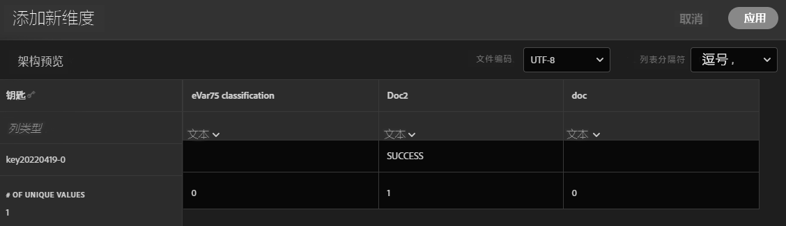
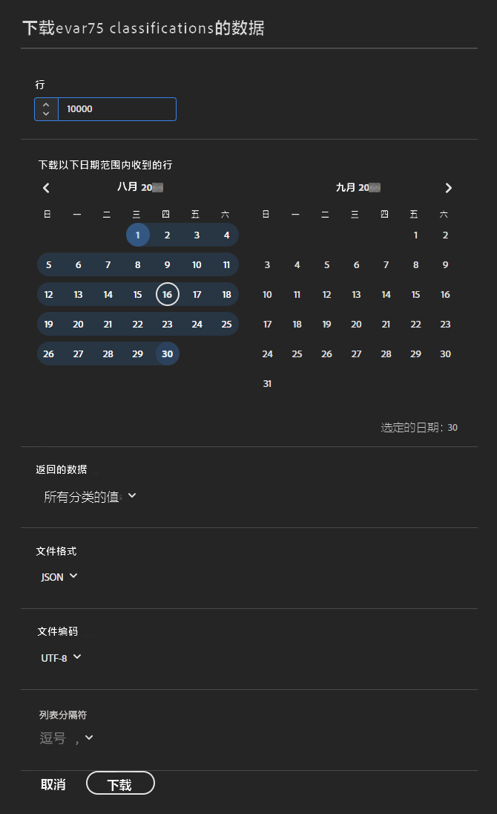
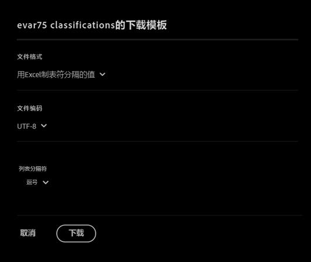

# 架构

查看当前为此分类集配置的分类维度。

**[!UICONTROL 组件]** > **[!UICONTROL 分类集]** > **[!UICONTROL 集]** >单击所需的分类集名称> **[!UICONTROL 架构]**

以下按钮可供使用：

<!--* **[!UICONTROL Add]**: Adds an empty row so that you can add a classification dimension to the schema.-->
* **[!UICONTROL 上载]**：手动上载一个或多个分类维度的分类数据。 `JSON`， `CSV`， `TSV`、和 `TAB` 文件受支持。 上载有效文件会显示要分类的数据的表预览。
   * **[!UICONTROL 文件编码]**：使用此下拉列表选择正确的文件编码。 有效选项包括 [!UICONTROL UTF-8] 和 [!UICONTROL Latin1]。
   * **[!UICONTROL 列表分隔符]**：选择正确的列表分隔符。如果使用下载的文件或模板文件，请确保此处的[!UICONTROL 列表分隔符]与下载文件时的[!UICONTROL 列表分隔符]匹配。
   * **[!UICONTROL 应用]**：将上载的分类数据保存到分类集。

  

* **[!UICONTROL 下载]**：下载键值及其分类列。
   * **[!UICONTROL 行]**：下载文件中包含的最大行数。
   * **[!UICONTROL 下载在报告中出现的键值之间接收的行]**：日历日期选择器，允许您按键值出现的时间筛选键值。如果未在此日期范围内收集键值，则该键值不会显示在下载的文件中。
   * **[!UICONTROL 返回的数据]**：一个下拉列表，允许您根据相关分类数据筛选下载文件中包含的键值。
      * **[!UICONTROL 所有已分类的值]**：包括分类数据至少包含在一列中的行。
      * **[!UICONTROL 所有未分类的值]**：包括至少一列中缺少分类数据的行。
   * **[!UICONTROL 文件格式]**：一个下拉列表，可确定下载文件的文件格式。 选项包括 [!UICONTROL JSON]、[!UICONTROL 逗号分隔的值]和 [!UICONTROL Excel 选项卡分隔的数值]。
   * **[!UICONTROL 文件编码]**：确定文件编码的下拉列表。 选项包括 [!UICONTROL UTF-8] 和 [!UICONTROL Latin1]。 建议使用 UTF-8。

  

* **[!UICONTROL 模板]**：下载模板文件。 此文件类似于[!UICONTROL “下载”]按钮，只是它不包含任何分类数据或键值。
   * **[!UICONTROL 文件格式]**：一个下拉列表，用于确定模板文件的文件格式。 选项包括[!UICONTROL 逗号分隔的值]和 [!UICONTROL Excel 选项卡分隔的数值]。
   * **[!UICONTROL 文件编码]**：确定文件编码的下拉列表。 选项包括 [!UICONTROL UTF-8] 和 [!UICONTROL Latin1]。 建议使用 UTF-8。
   * **[!UICONTROL 列表分隔符]**：一个下拉列表，用于确定分隔每行分类列的列表分隔符。

  

* **[!UICONTROL 作业历史记录]**：一个快捷链接，将您转到 [作业管理器](../job-manager.md)，仅显示此分类集的作业。
* **[!UICONTROL 自动化]**：自动从外部存储位置摄取数据。
   * **[!UICONTROL 位置帐户]**：一个下拉列表，其中显示贵组织配置的现有位置帐户。 如果您的组织尚未配置位置帐户，您可以通过选择 [!UICONTROL **创建新帐户**].

     有关配置位置帐户的信息，请参阅 [配置云导入和导出帐户](/help/components/locations/configure-import-accounts.md).

   * **[!UICONTROL 位置]**：一个下拉列表，其中显示贵组织已配置的现有位置。 如果您的组织尚未配置位置，您可以通过选择 [!UICONTROL **创建新位置**].

     有关配置位置的信息，请参见 [配置云导入和导出位置](/help/components/locations/configure-import-locations.md).

   * **[!UICONTROL 分隔符]**：已上传文件的列分隔符。 选项包括 [!UICONTROL 逗号]， [!UICONTROL 分号]， [!UICONTROL 冒号]， [!UICONTROL 垂直条]， [!UICONTROL 空间]， [!UICONTROL 正斜杠]， [!UICONTROL 反斜杠]， [!UICONTROL 短划线]，或 [!UICONTROL 下划线].

   * **[!UICONTROL 编码]**：确定文件编码的下拉列表。 选项包括 [!UICONTROL UTF-8] 和 [!UICONTROL Latin1]。 建议使用 UTF-8。
