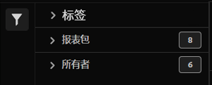

# 分类集管理器

分类集管理器允许您创建、编辑或删除分类集。

**[!UICONTROL “组件”]**>**[!UICONTROL “分类集”]**>**[!UICONTROL “集”]**

分类集包括&#x200B;**订阅**（报表包和维度组合）和&#x200B;**分类名称**（包含分类数据的维度）。 订阅配置在[设置](settings.md)下，而分类名称配置在[架构](schema.md)下。

## 筛选分类集

分类集管理器的左侧提供筛选条件设置以定位所需的分类集。 单击过滤器图标可切换过滤器设置的可见性。 您可以按&#x200B;**[!UICONTROL 标记]**&#x200B;或&#x200B;**[!UICONTROL 报告包]**&#x200B;筛选分类集。

## 分类集管理器列

分类集管理器中有以下列：

* **[!UICONTROL 分类集]**：分类集名称。 单击分类集名称[可编辑其设置](settings.md)。
* **[!UICONTROL 订阅]**：此分类集应用于的订阅数。
* **[!UICONTROL 分类]**：分类集包含的分类维度数。
* **[!UICONTROL 自动]**：确定分类集是否配置为从云位置自动导入数据。 可以在分类集的[架构](schema.md)中配置自动化。
* **[!UICONTROL 上次修改时间]**：上次修改分类集的日期和时间。

## 创建或编辑选项

分类集管理器中有以下按钮：

* **[!UICONTROL 添加]**： [创建](create.md)分类集。
* **[!UICONTROL 按标题搜索]**：按名称搜索分类集。
* **[!UICONTROL 加载更多]**：分类集管理器最初最多显示1000个分类集。 此按钮可加载1000多个分类集。
* **显示/隐藏列**：切换除[!UICONTROL 分类集]之外的任何列的可见性。

通过单击所需分类集旁边的复选框，选择一个或多个分类集。 选择分类集将显示以下选项：

* **[!UICONTROL 标记]**：将一个或多个标记添加到选定的分类集，使您能够梳理或分组分类集，以便将来更容易查找。
* **[!UICONTROL 删除]**：删除分类集。 基于此分类集的分类维度不再可用。 使用已删除分类集的计划项目将继续使用依赖维度，直至您重新保存计划项目。
* **[!UICONTROL 合并]**：开始新的[合并](../consolidations/process.md)。
* **[!UICONTROL 重命名]**：重命名选定的分类集。
