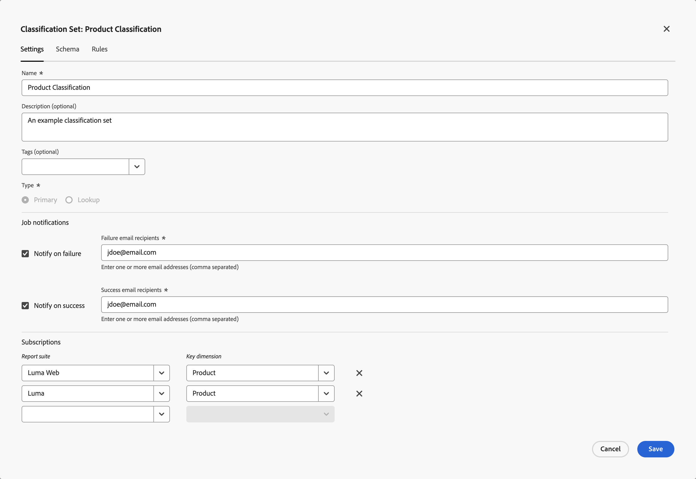

# 分类集设置

您可以编辑分类集的设置，包括名称、描述、通知对象和订阅。

要编辑分类集的设置，请执行以下操作：

1. 从Adobe Analytics顶部菜单栏中选择&#x200B;**[!UICONTROL 组件]**，然后选择&#x200B;**[!UICONTROL 分类集]**。
1. 在&#x200B;**[!UICONTROL 分类集]**&#x200B;中，选择&#x200B;**[!UICONTROL 分类集]**&#x200B;选项卡。
1. 在&#x200B;**[!UICONTROL 分类集]**&#x200B;管理器中，选择要编辑其架构的分类集。
1. 在&#x200B;**[!UICONTROL 分类集： _分类集_]**对话框中，选择&#x200B;**[!UICONTROL 设置]**选项卡以编辑设置：

   

   1. 编辑&#x200B;**[!UICONTROL 名称]**。
   1. 编辑&#x200B;**[!UICONTROL 描述（可选）]**。
   1. 将一个或多个&#x200B;**[!UICONTROL 标记（可选）]**&#x200B;添加到分类集。 从&#x200B;**[!UICONTROL 标记]**&#x200B;下拉菜单中选择现有标记，或输入新标记。 使用删除标记。
   1. 在&#x200B;**[!UICONTROL 作业通知]**&#x200B;部分中，选择分类集作业失败或成功时要通知的人员。
      * 要通知用户发生故障，请执行以下操作：
         1. 启用&#x200B;**[!UICONTROL 失败时通知]**。
         1. 在&#x200B;**[!UICONTROL 失败电子邮件收件人]**&#x200B;中指定一个或多个逗号分隔的电子邮件地址。
      * 要在成功时通知用户，请执行以下操作：
         1. 启用&#x200B;**[!UICONTROL 成功时通知]**。
         1. 在&#x200B;**[!UICONTROL 成功电子邮件收件人]**&#x200B;中指定一个或多个逗号分隔的电子邮件地址。
   1. 编辑&#x200B;**[!UICONTROL 订阅]**。
      * 您可以为分类集定义多个&#x200B;**[!UICONTROL 报告包]**&#x200B;和&#x200B;**[!UICONTROL Dimension]**&#x200B;组合。
      * 选择以删除&#x200B;**[!UICONTROL 报表包]**&#x200B;和&#x200B;**[!UICONTROL 键Dimension]**&#x200B;组合。

      有关详细信息，请参阅[创建分类集](/help/components/classifications/sets/manage-sets.md)。
   1. 选择&#x200B;**[!UICONTROL 保存]**&#x200B;以保存设置。 选择&#x200B;**[!UICONTROL 取消]**&#x200B;即可取消。
