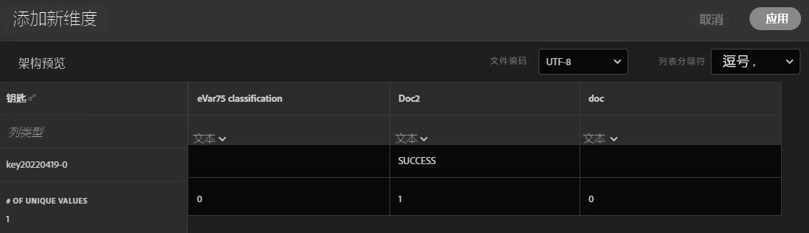

# 分类集设置

配置分类集、上载数据或下载数据。

**[!UICONTROL 组件]** > **[!UICONTROL 分类集]** > **[!UICONTROL 集]** >单击所需的分类集名称

在编辑分类集时，有两个选项卡可用； **[!UICONTROL 架构]** 和 **[!UICONTROL 设置]**.

## 设置

在 [!UICONTROL 设置] 选项卡，并且可以编辑：

* **[!UICONTROL 名称]**:分类集名称。
* **[!UICONTROL 描述]**:分类集的描述。
* **[!UICONTROL 所有者名称]**:所有者名称。
* **[!UICONTROL 所有者电子邮件]**:所有者的电子邮件地址。
* **[!UICONTROL 通知问题]**:此分类集中出现问题的通知的电子邮件地址列表（以逗号分隔）。
* **[!UICONTROL 标记]**:向选定的分类集添加一个或多个标记，以便您组织或分组分类集，以便将来更便于查找。

其他字段可供参考，且无法编辑：

* **[!UICONTROL 类型]**:之间的分类类型 [!UICONTROL 主要] 和 [!UICONTROL 查找]. 通常使用主要分类。
* **[!UICONTROL 订阅]**:分类集所应用的报表包和变量。 当前，给定分类集仅支持一个报表包；计划会支持多个报表包。

## 架构

查看当前为此订阅配置的分类维度。 可以使用以下按钮：

* **[!UICONTROL 上传]**:手动上载一个或多个分类维度的分类数据。 支持JSON、CSV、TSV和TAB文件。 上传有效文件会显示要分类的数据的表预览。
   * **[!UICONTROL 文件编码]**:使用此下拉菜单选择正确的文件编码。 有效选项包括 [!UICONTROL UTF-8] 和 [!UICONTROL Latin1].
   * **[!UICONTROL 列表分隔符]**:选择正确的列表分隔符。 如果使用下载的文件或模板文件，请确保 [!UICONTROL 列表分隔符] 此处匹配 [!UICONTROL 列表分隔符] 文件下载时。
   * **[!UICONTROL 应用]**:将上载的分类数据保存到分类集。

   

* **[!UICONTROL 下载]**:下载键值及其分类列。
   * **[!UICONTROL 行]**:要包含在下载文件中的最大行数。
   * **[!UICONTROL 下载在]**:日历日期选取器允许您按键值在报表中显示时进行筛选。 如果未在此日期范围内收集键值，则该键值不会显示在下载的文件中。
   * **[!UICONTROL 返回的数据]**:一个下拉列表，允许您根据下载的文件中包含的键值及其相关的分类数据来筛选这些键值。
      * **[!UICONTROL 所有分类值]**:包括分类数据包含在至少一列中的行。
      * **[!UICONTROL 所有未分类的值]**:包括至少一列中缺少分类数据的行。
   * **[!UICONTROL 文件格式]**:确定下载文件所在的文件格式的下拉菜单。 选项包括 [!UICONTROL JSON], [!UICONTROL 逗号分隔值]和 [!UICONTROL Excel选项卡分隔值].
   * **[!UICONTROL 文件编码]**:用于确定文件编码的下拉列表。 选项包括 [!UICONTROL UTF-8] 和 [!UICONTROL Latin1]. 建议使用UTF-8。
   * **[!UICONTROL 列表分隔符]**:确定用于分隔每行分类列的列表分隔符的下拉列表。

   

* **[!UICONTROL 模板]**:下载模板文件。 此文件类似于 [!UICONTROL 下载] 按钮，除非它不包含任何分类数据或键值。
   * **[!UICONTROL 文件格式]**:用于确定模板文件所在的文件格式的下拉列表。 选项包括 [!UICONTROL 逗号分隔值]和 [!UICONTROL Excel选项卡分隔值].
   * **[!UICONTROL 文件编码]**:用于确定文件编码的下拉列表。 选项包括 [!UICONTROL UTF-8] 和 [!UICONTROL Latin1]. 建议使用UTF-8。
   * **[!UICONTROL 列表分隔符]**:确定用于分隔每行分类列的列表分隔符的下拉列表。
* **[!UICONTROL 工作历史记录]**:快捷方式链接，可将您引导至 [作业管理器](job-manager.md)，仅显示此分类集的作业。

   
