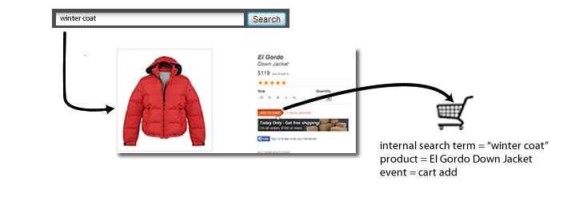

# eVar（推销）

*此帮助页介绍推销eVar如何作为[维度](overview.md)使用。 有关如何实施推销eVar的信息，请参阅《实施用户指南》中的[eVar（促销变量）](/help/implement/vars/page-vars/evar-merchandising.md)。*

有关促销 eVar 如何工作的详细讨论，请参阅[促销 eVar 和产品查找方法](https://experienceleague.adobe.com/docs/analytics/admin/admin-tools/conversion-variables/merchandising-evars.html?lang=zh-hans)。

测量外部促销活动或外部搜索术语的成功程度时，通常需要一个单独的值来对发生的所有成功事件接收信用。例如，如果某个客户单击电子邮件促销活动中的链接访问您的网站，那么该客户因此进行的所有购买都将计入此促销活动中。

当客户查找多个项时，因内部搜索或按类别浏览所促成的事件又该如何呢？例如，某个客户在您的站点中搜索 `"goggles"`，并将其加入购物车中：


在结帐之前，客户又搜索 `"winter coat"`，并将一件羽绒服加入购物车内：



当访客完成此次购买时，您将进行内部搜索 `"winter coat"`，以计入购买一对护目镜（假设 eVar 使用默认的“最新”分配）。虽然这样对 `"winter coat"` 关键字不错，但不利于做出营销决策：

| 内部搜索词 | 收入 |
|---|---|
| 冬衣 | $157 |

## 推销变量如何解决此问题

推销 eVar 允许您在成功事件发生时将 eVar 的当前值分配给某个产品。此值将始终与该产品绑定，即使这个特定的 eVar 以后设置了一个或多个新的值也不例外。

如果前一示例中 eVar 启用了推销，则搜索术语 `"goggles"` 将与“雪地护目镜”绑定，而搜索术语 `"winter coat"` 将与“羽绒服”绑定。推销 eVar 会在产品级别分配收入，所以每个术语都会收到与其关联产品的收入额信用：

| 内部搜索词 | 收入 |
|---|---|
| 冬衣 | $119 |
| 护目镜 | $38 |

有关实施说明，请参阅[推销 eVar](/help/implement/vars/page-vars/evar-merchandising.md)。

## 有关推销变量的实例

不建议将[实例](../metrics/instances.md)量度用于推销变量。

* 对于使用产品语法的推销变量，实例根本不会增加。
* 对于使用转化变量语法的推销变量，每次设置 eVar 时都会计算实例。但是，它归因于维度项目 `"None"`，除非在同一次点击中发生以下所有情况：
   * 为推销 eVar 设置一个值。
   * 使用一个值定义了 `products` 变量。
   * 已设置捆绑事件。

```js
// This merchandising eVar uses conversion variable syntax, and counts an instance.
// However, if the binding event and products variable are not both set, the instance attributes to "None".
s.eVar1 = "Tower defense";

// This merchandising eVar uses product syntax, and does not count an instance.
s.products = "Games;Wizard tower;;;;eVar2=Tower defense";
```

由于转化变量语法的大多数用例需要不同点击上的 eVar 和产品变量，因此，使用“实例”量度是不现实的。
