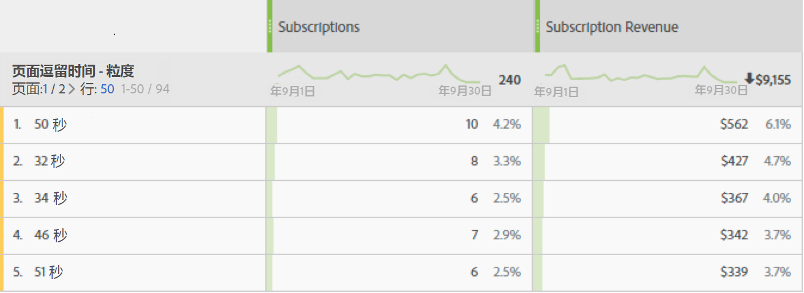

# 页面逗留时间

“页面逗留时间”[维度](overview.md)记录访客在页面上逗留的时间。 它使用以下步骤来衡量计算：

1. 对于给定点击，请查看时间戳。
2. 对比访问中此次点击与下一次点击的时间戳。 页面查看和链接跟踪点击都非常重要。
3. 这两次点击之间经过的时间，即为对应的逗留时间。

如果您想要了解访客与网站上给定量度的交互时间长短，此维度很有价值。

>[!TIP]
>
>不会测量访问的最后一次点击期间的逗留时间，因为没有后续的图像请求来测量经过的时间。 此概念还适用于包含单次点击（跳出）的访问。

此维度是基于点击的，这就意味着每次点击的值都不同。 可将此维度与[每次访问逗留时间](time-spent-per-visit.md)进行比较，后者是一个基于访问的维度。 逗留时间越长，意味着访客在该次点击对应的页面上停留的时间越久。

## 使用数据填充此维度

Adobe根据每次点击与访问中下一次点击之间经过的时间来计算此维度服务器端。 没有变量可供设置；它可开箱即用于所有实施。

| 属性 | 值 |
| --- | --- |
| **AppMeasurement变量** | 无（由Adobe计算） |
| **Web SDK / XDM字段** | 无（由Adobe计算） |
| **查询参数** | 不适用 |
| **XML标记** | 不适用 |
| **字节限制** | 不适用 |
| **持久性** | 点击 |

## 维度项目

页面逗留时间存在多个维度：

* **页面逗留时间 - 分段统计**：分段统计时间。 维度项目介于 `"Less than 15 seconds"` 到 `"More than 30 minutes"` 之间。 点击之间的间隔时间通常不超过30分钟；但是，如果使用带有时间戳的点击或数据源，则点击之间的间隔时间可能会超过30分钟。
* **页面逗留时间 - 粒度**：每个秒数都是一个唯一的维度项目。

有关逗留时间的更多常规信息，请参阅[逗留时间概述](../metrics/time-spent.md)。
