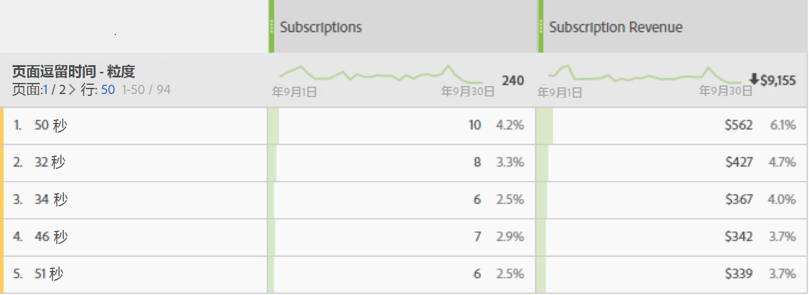

# 页面逗留时间

“页面逗留时间”[维度](overview.md)记录访客在页面上逗留的时间。 它使用以下步骤来衡量计算：

1. 对于给定点击，请查看时间戳。
2. 对比访问中此次点击与下一次点击的时间戳。页面查看和链接跟踪点击都非常重要。
3. 这两次点击之间经过的时间，即为对应的逗留时间。

如果您想要了解访客与网站上给定量度的交互时间长短，此维度很有价值。

>[!TIP]
>
>不会测量访问的最后一次点击期间的逗留时间，因为没有后续的图像请求来测量经过的时间。此概念还适用于包含单次点击（跳出）的访问。

此维度是基于点击的，这就意味着每次点击的值都不同。可将此维度与[每次访问逗留时间](time-spent-per-visit.md)进行比较，后者是一个基于访问的维度。逗留时间越长，意味着访客在页面（点击）上逗留的时间越久。

## 使用数据填充此维度

此维度可开箱即用于所有实施。如果报表包包含数据，则此维度有效。

## 维度项目

页面逗留时间存在多个维度：

* **页面逗留时间 - 分段统计**：分段统计时间。维度项目介于 `"Less than 15 seconds"` 到 `"More than 30 minutes"` 之间。点击之间的间隔时间通常不超过30分钟；但是，如果使用带有时间戳的点击或数据源，则点击之间的间隔时间可能会超过30分钟。
* **页面逗留时间 - 粒度**：每个秒数都是一个唯一的维度项目。

有关逗留时间的更多常规信息，请参阅[逗留时间概述](../metrics/time-spent.md)。
