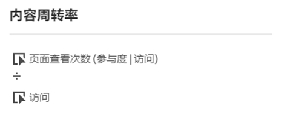
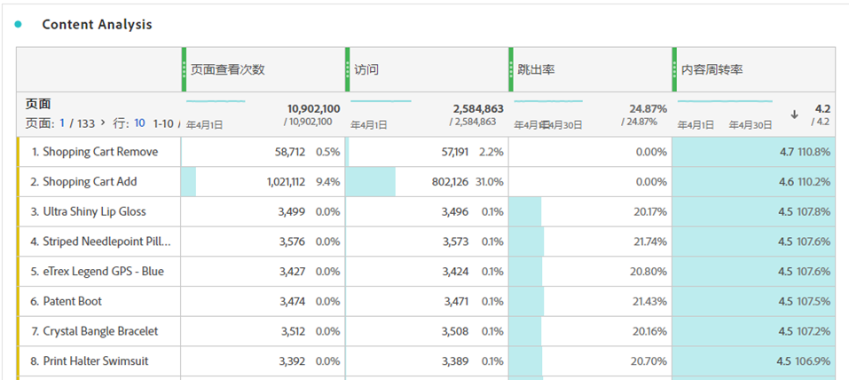

# 内容周转率

“内容周转率”计算量度可帮助您衡量维度(通常 [[!UICONTROL 页面]](/help/components/dimensions/page.md))有助于用户花时间访问您的网站或应用程序。

此量度使用 [参与率归因](/help/analyze/analysis-workspace/attribution/models.md) 在 [页面查看次数](page-views.md) 量度作为其计算的一部分。 利用访问参与率，每次点击页面时，之前在同一次访问期间点击的所有页面都会获得页面查看的点数。 此公式通常意味着在访问期间越早点击页面，它获得的点数越多。 (请参阅 [页面查看次数（参与率） |访问)或“访问参与率”](#page-views-participation--visit-or-visit-participation) 以了解更多信息。)

## 计算

“内容周转率”是默认计算的值 [量度](overview.md) 它使用的公式是 `Page views (Visit participation)` 除以 `Visits`.

## 常见用法

[!UICONTROL 内容周转率]通常与其他关键量度一起用于内容分析，例如[!UICONTROL 页面查看次数]、[!UICONTROL 访问次数]和[!UICONTROL 跳出率]。

## 示例

以下示例划分了Content Velocity的2个部分：“页面查看次数（参与率）” | Visit)”和“Visits”。

### 页面查看次数（参与率） |访问)或“访问参与率”

请思考以下访问参与率如何影响归因的示例：

在网站上，用户按以下顺序访问以下页面：

* 页面 A
* 页面 B
* 页面 C
* 页面 D

在上例中，页面A将接收4次点击的点数，页面B接收3次点击，页面C接收2次点击，页面D接收1次点击。

以下示例说明了相同的原则，但一些页面被多次访问。

* 页面 A
* 页面 B
* 页面 C
* 页面 B
* 页面 D
* 页面 A

在上例中，页面A将接收7次点击的点数，页面B接收8次点击，页面C接收4次点击，页面D接收2次点击。

### 访问次数

计算访问参与率后，结果除以访问次数。
