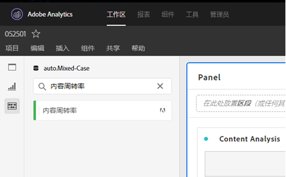

# [!UICONTROL 内容周转率]

[!UICONTROL 内容速度] 是标准的Adobe Analytics指标模板。 [!UICONTROL 内容速度] 定义为[页[!UICONTROL 面视图] |访 [!UICONTROL 问参与]] / [访问]并帮助您衡量特定内容片段（页面、网站部分等）的影响 在下游的内容上。 它可以帮助您了解哪些内容是并且不会保留网站或移动应用程序上的用户。

[!UICONTROL 通过筛选左边栏] (通过搜索或使用标记(#Adobe Template))，可以在分析工作区中找到内容速度。

[!UICONTROL 内容速度] (Content Velocity [!UICONTROL )与其他关键指标(如页面分析]、访问量 和弹 [!UICONTROL 出率)一]起在内容视图中常使用。

