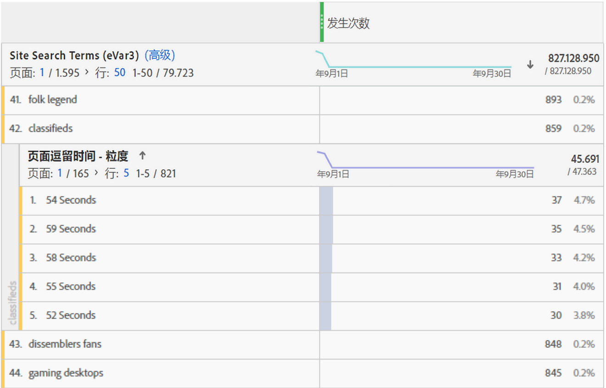

# 逗留时间概述

在Adobe Analytics产品中提供了各种[!UICONTROL 逗留时间] [指标](overview.md)和维度。 此页面有助于消除您在查找的所需维度或量度的混淆。

## “逗留时间”指标

| 指标 | 定义 | 适用的功能领域 |
|---|---|---|
| [[!UICONTROL 所用总秒数]](total-seconds-spent.md) | 表示访客与特定维度项目交互所用的总时间。包括所有后续点击中的值和持久性的实例。对于 prop，也会在后续链接事件中统计逗留时间。 | Analysis Workspace、Report Builder（称为“总逗留时间”）、Data Warehouse |
| [[!UICONTROL 每次访问逗留时间] （秒）](time-spent-per-visit.md) | 大约&#x200B;*所用总秒数/（访问跳出次数）* &#x200B;表示访客在每次访问期间与特定维度项目交互所用的平均时间。 **注意**：此量度无法单独计算，因为此函数的分母是内部量度。 | Analysis Workspace |
| 每位访客逗留时间[&#x200B; （秒）](time-spent-per-visitor.md) | 大约&#x200B;*所用总秒数/独特访客* &#x200B;表示在访客的存留期（访客Cookie的时长）内，访客与特定维度项目交互所用的平均时间。 **注意**：此量度无法单独计算，因为此函数的分母是内部量度。 | Analysis Workspace |
| [!UICONTROL 逗留时间/用户（状态）] | 大约&#x200B;*移动设备应用程序所用总秒数/独特移动设备应用程序访客* &#x200B;表示在访客的存留期（访客Cookie的时长）内，移动设备应用程序访客与特定维度项目交互所用的平均时间。 **注意**：此量度无法单独计算，因为此函数的分母是内部量度。 | Analysis Workspace |
| [[!UICONTROL 网站平均逗留时间] （秒）](average-time-on-site.md) | 表示访客与特定维度项目交互所用的总时间，其中每个序列包含一个维度项目。这不仅仅局限于“站点”平均值（顾名思义）。 有关序列的详细信息，请参阅“‘逗留时间’的计算方式”部分。 **注意**：由于计算中所用的分母不同，因此，此指标很可能会与维度项目级别的“每次访问逗留时间”有所不同。 | Analysis Workspace、Report Builder（以分钟为单位显示） |
| [[!UICONTROL 网站平均逗留时间]](average-time-on-site.md) | 此指标与&#x200B;*网站平均逗留时间（秒）*&#x200B;相同，但采用的时间格式为`hh:mm:ss` | Analysis Workspace |
| [!UICONTROL 页面平均逗留时间] | 已弃用的指标。 如果需要维度项目的平均时间，Adobe建议您使用[[!UICONTROL 网站平均逗留时间]](average-time-on-site.md)。 | Report Builder（当请求中包含维度时） |

## “逗留时间”维度

| 维度 | 定义 | 适用的功能领域 |
| --- | --- | --- |
| [[!UICONTROL 每次访问逗留时间 — 粒度]](../dimensions/time-spent-per-visit.md) | 访问期间的总逗留时间将精确至秒，且应用于访问中的每次点击。这是一个访问级别的维度。 | Analysis Workspace |
| [[!UICONTROL 每次访问逗留时间 — 分段统计]](../dimensions/time-spent-per-visit.md) | 粒度维度分为 9 个不同的范围。这是一个访问级别的维度。这些范围包括：<ul><li>少于 1 分钟</li><li>1-5 分钟</li><li>5-10 分钟</li><li>10-30 分钟</li><li>30-60 分钟</li><li>1-2 小时</li><li>2-5 小时</li><li>5-10 小时</li><li>10-15 小时</li></ul>**注意**：不会有更高的时段，因为一次访问在活动 12 小时后就会过期。 | Analysis Workspace、Report Builder |
| [[!UICONTROL 页面逗留时间 — 粒度]](../dimensions/time-spent-on-page.md) | 每次点击的总逗留时间，精确至秒。这是一个点击级别的维度，包括页面查看次数和链接事件。尽管其名称中包含页面，但它并不限于“页面”维度。 | Analysis Workspace |
| [[!UICONTROL 页面逗留时间 — 分段统计]](../dimensions/time-spent-on-page.md) | 粒度维度分为 10 个不同的范围；但是，分段统计的维度只计算页面查看次数（不包括链接事件）。这是一个点击级别的维度。这些范围包括：<ul><li>少于 15 秒</li><li>15-29 秒</li><li>30-59 秒</li><li>1-3 分钟</li><li>3-5 分钟</li><li>5-10 分钟</li><li>10-15 分钟</li><li>15-20 分钟</li><li>20-30 分钟</li><li>多于 30 分钟</li></ul> | Analysis Workspace |

## ‘逗留时间’的计算方式

Adobe Analytics使用显式值（包括链接事件和视频查看次数）来计算逗留时间。

>[!NOTE]
>
>如果没有[!UICONTROL 视频查看]或[!UICONTROL 退出链接]等链接事件，就无法得知访问的最后一次点击的逗留时间。此外，鉴于类似的原因，[!UICONTROL 跳出访问]（即只包含一次点击的访问）将没有相关的“逗留时间”。

在所有逗留时间的计算中，**分子**&#x200B;都是“所用总秒数”。

在 Adobe Analytics 中，**分母**&#x200B;不可作为单独的指标使用。对于点击级别的“逗留时间”指标，分母即是序列。一个序列是一组连续的点击，其中给定的变量包含相同的值（不论是设置、扩展还是保留的值）。“扩展”是指为了计算逗留时间，而在页面查看事件之间（即在后续链接事件中）持续保留 prop。

* 例如，对于“[!UICONTROL 页面名称]”或点击级别的其他维度，分母主要为[!UICONTROL “实例数”]或[!UICONTROL “页面查看次数”]，但是，重新载入次数和未设置的值（例如，链接事件）将被计为单次交互（一个序列）。

* 由于“逗留时间”无从知晓，因此跳出和退出点击量也会从分母中删除。

## 常见问题解答

+++能否将所有“逗留时间”量度应用于任何维度？

可应用于任何维度的“逗留时间”量度包括：

* [[!UICONTROL 所用总秒数]](total-seconds-spent.md)

* [[!UICONTROL 每次访问逗留时间]（秒）](time-spent-per-visit.md)

* [[!UICONTROL 每位访客逗留时间]（秒）](time-spent-per-visitor.md)

* [[!UICONTROL 网站平均逗留时间]（秒）](average-time-on-site.md)

+++

+++哪个逗留时间维度最适合用于包含其他维度的划分？

[[!UICONTROL 页面逗留时间 — 粒度]](../dimensions/time-spent-on-page.md)维度是点击级别的维度。 按其他维度划分此维度将显示点击持续的秒数，其中也会显示划分维度。在下面的示例中，搜索词“已分类”与54秒、59秒等的点击时间相关联，这可能表示访客正在花时间阅读针对该搜索词返回的内容。

+++

+++对于[!UICONTROL 页面逗留时间 — 粒度]维度，哪个量度较为合适？

任意量度。此维度将显示发生事件的具体点击的逗留时间。逗留时间越长意味着访客在发生事件的页面（点击）中停留的时间越长。

+++

+++“[!UICONTROL 网站平均逗留时间]”与“[!UICONTROL 每次访问逗留时间]”有何不同之处？

这些量度的不同之处在于分母：

* [[!UICONTROL 网站平均逗留时间]](average-time-on-site.md)使用包含一个维度项目的序列作为分母。

* [[!UICONTROL 每次访问逗留时间]](time-spent-per-visit.md)使用访问计数作为分母。

因此，这些量度可能会在访问级别产生相似的结果，但在点击级别则将产生不同的结果。

+++

+++为什么网站平均逗留时间[!UICONTROL 的划分合计与父行项目不匹配？]

因为[!UICONTROL 网站平均逗留时间]取决于维度的未中断序列，而内部报表在计算这些运行时并不依赖于外部报表。

例如，请考虑以下访问。

| 点击# | 1 | 2 | 3 |
|---|---|---|---|
| **所用秒数** | 30 | 100 | 10 |
| **页面名称** | 主页 | 产品 | 主页 |
| **日期** | 1 月 1 日 | 1 月 1 日 | 1 月 1 日 |

当计算在主页的逗留时间时，它将为 (30+10)/2=20，但按天划分此项将得到 (30+10)/1=40，因为仅在 1 月 1 日一天连续逗留。

因此，这些量度可能会在访问级别产生相似的结果，但在点击级别则将产生不同的结果。

+++

## [!UICONTROL 逗留时间]计算示例

假定下面一组服务器调用针对的是单次访问中的单个访客：

| 访问点击次数 | 1 | 2 | 3 | 4 | 5 | 6 | 7 |
|---|---|---|---|---|---|---|---|
| **访问经过的时间（秒）** | 0 | 30 | 80 | 180 | 190 | 230 | 290 |
| **所用秒数** | 30 | 50 | 100 | 10 | 40 | 60 | - |
| **点击类型** | 页面 | 链接 | 页面 | 页面 | 页面 | 页面 | 页面 |
| **页面名称** | 主页 | - | 产品 | 主页 | 主页（重新加载） | 购物车 | 订单确认 |
|  |  |  |  |  |  |  |  |
| **prop1** | A（设置） | A（扩展） | 未设置 | B（设置） | B（设置） | A（设置） | C（设置） |
| **prop1 所用秒数** | 30 | 50 | - | 10 | 40 | 60 | - |
|  |  |  |  |  |  |  |  |
| **eVar1** | 红色（设置） | 红色（已保留） | （过期） | 蓝色（设置） | 蓝色（设置） | 蓝色（已保留） | 红色（设置） |
| **eVar1 所用秒数** | 30 | 50 | - | 10 | 40 | 60 | - |

根据以上表格，逗留时间指标计算如下：

| prop1 | 所用总秒数 | 每次访问逗留时间 | 每位访客逗留时间 | 序列计数 | 网站平均逗留时间 |
|---|---|---|---|---|---|
| 同类群组 | 30+50+60=140 | 140/1=140 | 140/1=140 | 2 | 140/2=70 |
| B | 10+40=50 | 50/1=50 | 50/1=50 | 1 | 50/1=50 |
| C | 0 | 0 | 0 | 0 | 0 |
| 未归类的时间 | 100 | - | - | - | - |

| eVar1 | 所用总秒数 | 每次访问逗留时间 | 每位访客逗留时间 | 序列计数 | 网站平均逗留时间 |
|---|---|---|---|---|---|
| 红色 | 30+50=80 | 80/1=80 | 80/1=80 | 1 | 80/1=80 |
| 蓝色 | 10+40+60=110 | 110/1=110 | 110/1=110 | 1 | 110/1=110 |
| 未归类的时间 | 100 | - | - | - | - |

每次访问逗留时间（粒度）：290
页面逗留时间（粒度）：10、30、40、50、60、100

支持此示例的一些其他注释：

* 所有逗留时间计算都基于访问经过的时间，该时间在访问的首次点击时以零开始统计。

* “所用秒数”是当前点击的时间戳和下次点击的时间戳之间的差值。 因此，访问的最后一次点击（和跳出）没有逗留时间。

* “序列”是一组连续的点击，其中的给定变量包含相同的值（无论是通过设置、扩展还是保留的值）。 例如，prop1“A”包含两个序列：点击1和2以及点击6。 访问的最后一次点击的值不会开始一个新序列，因为最后一次点击没有逗留时间。网站平均逗留时间使用序列作为分母。

   * 仅出于逗留时间的目的，prop从页面点击“扩散”到后续链接点击，如上面显示点击第2次的prop1所示。 这允许点击1(“A”)中为prop1设置的值累计点击2的逗留时间。

   * eVar 可累计任何设置或保留 eVar 的点击的逗留时间。eVar 持久性由“Analytics”>“管理员”中的 eVar 设置定义。
