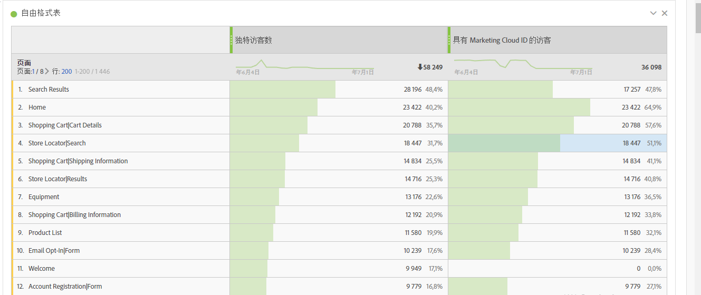
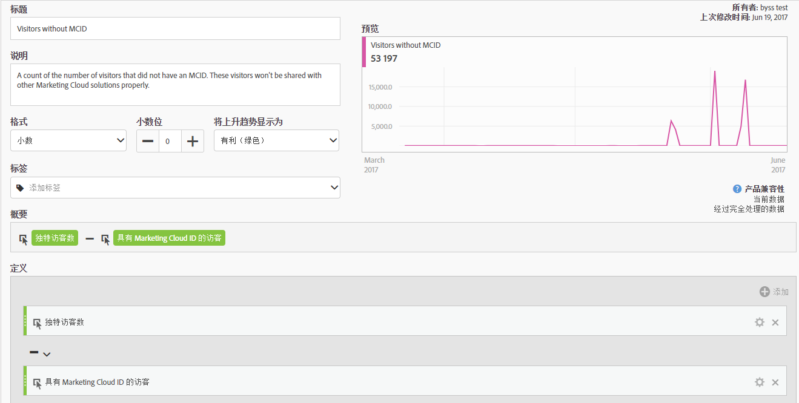
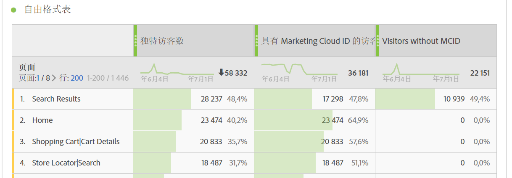

# 具有 Experience Cloud ID 的访客

“具有Experience Cloud ID的访客”指标[指标](overview.md)显示Adobe使用[Experience Cloud ID服务](https://experienceleague.adobe.com/docs/id-service/using/home.html?lang=zh-Hans)识别的独特访客数量。 此指标有助于与[独特访客](unique-visitors.md)指标进行比较，以确保您网站的大多数访客都使用 ID 服务。如果大部分访客不使用 ID 服务 Cookie，则它可能会提示您的实施中存在问题。

>[!NOTE]
>
>如果您使用多种 Experience Cloud 服务（例如 Adobe Target 或 Adobe Audience Manager），此指标对调试活动尤为重要。跨 Experience Cloud 产品共享的访客不包括没有 Experience Cloud ID 的客户。

## 如何计算此指标

此指标基于[独特访客](unique-visitors.md)，只是它仅包含使用 `mid` 查询字符串（基于 [`s_ecid`](https://experienceleague.adobe.com/docs/core-services/interface/ec-cookies/cookies-analytics.html?lang=zh-Hans) Cookie）标识的个人。

## 调试您的 Experience Cloud ID 设置

“具有 Experience Cloud ID 的访客”指标可用于对 Experience Cloud 集成进行故障诊断，或识别未部署 ID 服务的站点区域。

将“具有 Experience Cloud ID 的访客”拖动到“独特访客”的并排位置，对二者进行比较：

在该示例中，请注意每个页面的“独特访客”与“具有 Experience Cloud ID 的访客数”相同。但是，独特访客的总数大于具有 Experience Cloud ID 的访客总数。您可以创建[计算指标](../calculated-metrics/cm-overview.md)，以找出哪些页面未设置 ID 服务。您可以使用以下定义：

通过将计算指标添加到报表，您可以对页面报表进行排序，以便显现无 MCID 的访客数量最高的页面：

请注意，“产品快速视图”维度项目未使用身份标识服务正确实施。您可以与组织内的相应团队合作，以尽快更新这些页面。您可以使用任何类型的维度（例如[浏览器类型](../dimensions/browser-type.md)、[网站区域](../dimensions/site-section.md)或任何 [eVar](../dimensions/evar.md)）构建类似报表。
