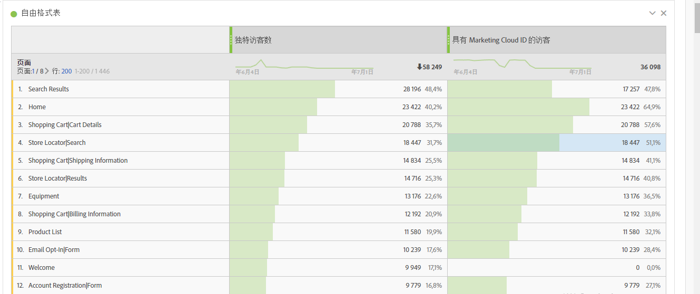
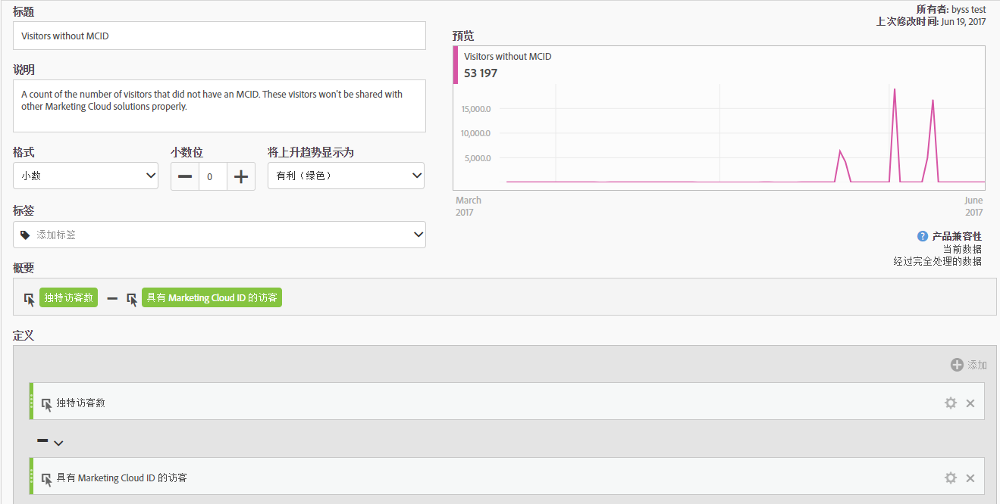
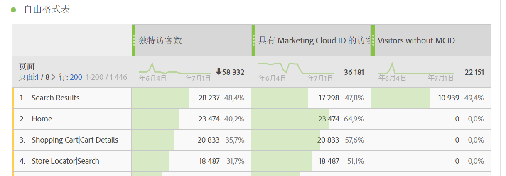

# 具有 Experience Cloud ID 的访客

Experience Cloud ID为]&#39; [metric](overview.md)的“[!UICONTROL 访客”显示Adobe识别的具有ECID （使用[访客ID服务](https://experienceleague.adobe.com/cn/docs/id-service/using/home)或[Experience Platform Identity服务](https://experienceleague.adobe.com/zh-hans/docs/experience-platform/identity/home)）的独特访客数。 此量度有助于与[独特访客](unique-visitors.md)量度进行比较，以确保您网站的大多数访客都使用ECID。 如果大部分访客不使用此标识符，则它可能会指示您的实施中存在问题。

>[!NOTE]
>
>如果您使用多个CX Enterprise服务（如Adobe Target或Adobe Audience Manager），此指标对调试活动尤为重要。 跨CX Enterprise产品共享的区段不包括没有ECID的访客。

## 如何计算此指标

此指标基于[独特访客](unique-visitors.md)，只是它仅包含使用 `mid` 查询字符串（基于 [`s_ecid`](https://experienceleague.adobe.com/en/docs/core-services/interface/data-collection/cookies/analytics) Cookie）标识的个人。

## 调试您的ECID设置

“[!UICONTROL Experience Cloud ID为]”的访客量度可用于对CX Enterprise集成进行故障诊断，或识别未部署访客ID服务或Experience Platform Identity服务的站点区域。

将Experience Cloud ID为]的“[!UICONTROL 访客”拖动到“独特访客”的并排位置，以比较它们：

在此示例中，请注意每个页面的“[!UICONTROL 独特访客]”数与“[!UICONTROL 个Experience Cloud ID为]的访客数相同。 但是，“[!UICONTROL 独特访客]”的总数大于Experience Cloud ID为]的“[!UICONTROL 访客”的总数。 您可以使用以下定义创建一个[计算量度](../calculated-metrics/cm-overview.md)，以找出哪些页面未使用ECID：

通过将计算量度添加到报表，您可以对页面报表进行排序，以便显现无ECID的访客数量最高的页面：

请注意，“产品快速视图”维度项未使用ECID正确实施。 您可以与组织内的相应团队合作，以尽快更新这些页面。 您可以使用任何类型的维度（例如[浏览器类型](../dimensions/browser-type.md)、[网站区域](../dimensions/site-section.md)或任何 [eVar](../dimensions/evar.md)）构建类似报表。
