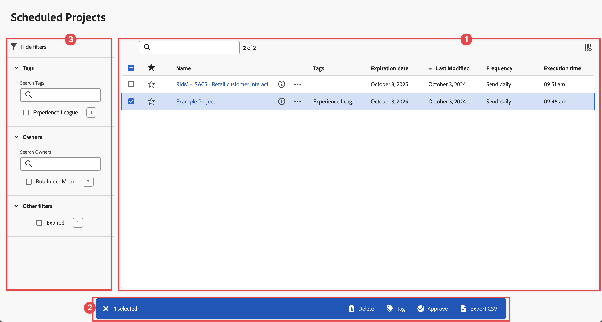

# 计划的项目

可以在Adobe Analytics中使用&#x200B;**[!UICONTROL 组件]** > **[!UICONTROL 计划项目]**&#x200B;管理计划的Analysis Workspace项目。

在&#x200B;**[!UICONTROL 计划项目]**&#x200B;中，您可以编辑和删除重复的项目计划。  [计划项目列表](#scheduled-project-list)显示特定用户已创建的项。 如果应用程序中禁用该用户帐户，则将停止所有计划的提交。

## 计划项目列表

计划项目列表➊显示以下项目的列：

| 列 | 描述 |
| --- | --- |
|  | 选择一个或多个计划项目时，“计划项目”界面的底部会显示一个蓝色操作栏。 有关更多详细信息，请参阅[操作](#actions)。 |
|  | 选择支持或取消支持计划项目。 |
| **[!UICONTROL 计划 ID]** | 主要用于调试的ID。 |
| **[!UICONTROL 名称]** | 此项目的名称。 选择以查看计划项目的更多详细信息。 选择打开上下文菜单。 通过此菜单，您可以：<ul><li> **[!UICONTROL 删除]**&#x200B;计划项目。</li><li> **[!UICONTROL 标记]**&#x200B;计划项目。</li><li> **[!UICONTROL 批准]**&#x200B;计划项目。</li><li> **[!UICONTROL 导出CSV]**：将计划项目导出到CSV文件。</li></ul> |
| **[!UICONTROL 所有者]** | 创建并拥有此项目的人。 |
| **[!UICONTROL 标记]** | （可选）标记是一种用于排列项目的好方法。所有用户均可创建标记，并将一个或多个标记应用到项目。但是，您只能查看自己拥有或者与您共享的项目的标记。 |
| **[!UICONTROL 已传送至]** | 此计划项目的收件人。 |
| **[!UICONTROL 过期日期]** | 无论计划频率如何，您都可以将过期日期设置为最长一年。 |
| **[!UICONTROL 频率]** | 您希望将此计划项目发送给一个或多个收件人的频率。 |
| **[!UICONTROL 执行时间]** | 在一天中发送此计划项目的时间。 |
| **[!UICONTROL 查询次数]** | 查询此项目的次数。 |
| **[!UICONTROL 最长日期范围]** | 为计划项目定义的最长日期范围。 该值可能与调查性能问题相关。 有关详细信息，请参阅[报告活动管理器](/help/admin/tools/reporting-activity-manager/reporting-activity-overview.md)。 |
| **[!UICONTROL 查询次数]** | 为计划项目执行的查询数。 该值可能与调查性能问题相关。 有关详细信息，请参阅[报告活动管理器](/help/admin/tools/reporting-activity-manager/reporting-activity-overview.md)。 |

您可以使用来配置要显示的列。

使用搜索计划项目。 您还可以查看是否从“筛选器”面板应用了任何筛选器。 要删除筛选器，请为筛选器选择。 要删除所有筛选器，请选择&#x200B;**[!UICONTROL 全部清除]**。

要编辑计划项目，请选择计划项目的标题。 使用&#x200B;**[!UICONTROL 编辑计划项目]**&#x200B;对话框更新计划详细信息。 有关详细信息，请参阅[将文件发送给其他](../analyze/analysis-workspace/curate-share/t-schedule-report.md)。

选择&#x200B;**[!UICONTROL 更新]**&#x200B;以更新计划。

## 操作

以下是计划项目管理器中的常见操作。选择一个或多个计划项目时，您可以从上下文菜单或蓝色操作栏中选择操作。

| 图标 | 操作 | 描述 |
|:---:|---|---|
|  | **[!UICONTROL *x *已选择]** | 选择以取消选择您选择的计划项目。 |
|  | **[!UICONTROL 删除]** | 为项目删除选定的计划项目；不会删除这些项目。 
有关删除项目的信息，请参阅[项目概述](/help/analyze/analysis-workspace/build-workspace-project/freeform-overview.md)。
 |
|  | **[!UICONTROL 标记]** | 标记所选的计划项目。 在&#x200B;**[!UICONTROL 标记计划项目]**&#x200B;中选择标记并选择&#x200B;**[!UICONTROL 保存]**&#x200B;以进行保存。 |
|  | **[!UICONTROL 批准]** | 批准所选的计划项目。 |
|  | **[!UICONTROL 导出至 CSV]** | 将所选计划项目导出到名为`Export Scheduled Projects List.csv`的文件。 |

## 过滤器

您可以使用筛选器面板[筛选计划项目](#scheduled-project-list)计划项目列表➌。 要显示或隐藏过滤器面板，请使用。

过滤器面板由以下部分组成。

### 标记

| 标记 | 描述 |
|---|---|
| {width="300"} | 您可以使用&#x200B;**[!UICONTROL 标记]**&#x200B;部分按标记进行过滤。 <ul><li>您可以使用  **[!UICONTROL 搜索标记]**&#x200B;来搜索您想要用于过滤的标记。</li><li>您可以选择多个标记。可用的标记取决于在过滤器面板中对其他部分的选择。</li><li>这些数字表明：<ul><li>⃣7︎：与特定标记关联的计划项目数。</li></ul></li></ul> |

### 所有者

| 所有者 | 描述 |
|---|---|
| {width="300"} | **[!UICONTROL 所有者]**&#x200B;部分允许您过滤所有者。 <ul><li>您可以使用  *搜索所有者*&#x200B;来搜索您想要用于过滤的所有者。</li><li>您可以选择多个所有者。可用的所有者取决于在过滤器面板中对其他部分的选择。</li><li>这些数字表明：<ul><li>⃣4︎：与特定所有者关联的计划项目数。</li></ul></li></ul> |

### 其他过滤器

| 其他过滤器 | 描述 |
|---|---|
| {width="300"} | 您可以使用&#x200B;**[!UICONTROL 其他过滤器]**&#x200B;部分按其他预定义过滤器进行过滤。<ul><li>您可以选择以下一个或多个选项：<ul><li> **[!UICONTROL 已过期]**：筛选已过期的计划项目。</li><li>**[!UICONTROL 失败]**：筛选计划失败的计划项目。</li></ul>您可以选择的内容取决于您的角色和权限。</li><li>您可以选择多个其他过滤器。可用的其他过滤器取决于在过滤器面板中对其他部分的选择。</li><li>这些数字表明：<ul><li>⃣4︎：与特定其他过滤器关联的计划项目数。</li></ul></li></ul> |

<!--
# Scheduled projects

Scheduled Analysis Workspace projects can be managed under **Analytics > Components > Scheduled Projects**.

When you manage scheduled projects, you can edit and delete recurring project schedules:

*  Change the file type (.csv or PDF)
*  Update the project description
*  Add or remove recipients
*  Change the frequency

To modify a scheduled project

1.  Select **Analytics > Components > Scheduled Projects**.
1.  Search for a schedule in the search bar or by using the filter options in the left rail. You can filter by [!UICONTROL Tags], [!UICONTROL Owners], [!UICONTROL Favorites], and more.

## Available columns

| Field | Description |
| --- | --- |
| [!UICONTROL Favorites] | Selecting the star icon makes this schedule a favorite. |
| [!UICONTROL Schedule ID] | This ID is used mainly for debugging purposes. |
| [!UICONTROL Title and description] | Title and description of this project. |
| [!UICONTROL Owner] | The person who created and owns the project. |
| [!UICONTROL Tags] | (optional) Tagging is a good way to organize projects. All users can create tags and apply one or more tags to a project. However, you can see tags only for those projects that you own or that have been shared with you.  |
| [!UICONTROL Delivered to] | The recipient(s) of this scheduled project. |
| [!UICONTROL Expiration date] | For any scheduled project frequency, you can set the expiration date for up to one year in the future. |
| [!UICONTROL Frequency] | How often you want to have this schedule project sent to the recipient(s). |
| [!UICONTROL Execution time] | At what time of day this scheduled project gets sent. |
| [!UICONTROL Number of queries] | The number of queries against this project. |

## Common actions

The following are common actions in the Scheduled Projects manager:

|Action|Description|
|---|---|
|**[!UICONTROL Edit]**|Select the title of the schedule to update its delivery settings.|
|**[!UICONTROL Delete]**|Select the scheduled project in the list and then click Delete from the menu. This will delete the selected schedule for the project; the project itself will not be deleted.|
|**[!UICONTROL Tag]**|Select the scheduled project in the list and then choose "Tag" or "Approve" to organize your schedules and make them easier to search for.|
|**[!UICONTROL View failed schedules]**|Navigate to the left rail > Other filters > Failed to see schedules that have failed.|
|**[!UICONTROL View expired schedules]**|Navigate to the left rail > Other filters > Expired to see schedules that have expired. Click the title of the schedule to setup a new delivery schedule.|
|**[!UICONTROL View schedule ID]**|Navigate to column options in the top right and add the Schedule ID column to the table. The scheduled ID is often useful for debugging.|

The Scheduled Projects manager shows the items that a specific user created. If the user account is disabled in the application, all scheduled deliveries stop. Scheduled project ownership can be transferred to a new user under **Admin** > **Analytics Users & Assets** > **Transfer Assets**.
-->