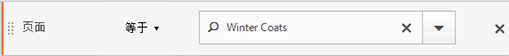

# 区段容器

区段会设置条件，以根据访客的属性或与网站的交互来筛选访客。 要在区段内设置条件，可根据访客的特征和/或导航特性来设置规则以过滤访客。要进一步划分访客数据，可以根据每个访客的特定访问和/或页面查看点击来进行过滤。区段生成器提供了一个简单的架构来生成这些子集，并将规则应用为嵌套的分层“访客”、“访问”或“点击”容器。

区段生成器中使用的容器架构定义

-  **[!UICONTROL 访客]** 作为最外部的容器，包含所有访问和页面查看中特定于该访客的一切数据。
-  嵌套 **[!UICONTROL 访问]** 容器允许您设置规则，以根据访问划分访客的数据，并且
-  嵌套 **[!UICONTROL 点击]** 通过容器，可根据各个页面查看对访客信息进行划分。

通过每个容器都可以跨访客的历史记录和按访问划分的交互进行报告，或者对各个点击进行划分。

<table style="table-layout: fixed; border: none;">

<tr>
<td style="background-color: #FFFFFF; border: 0; " colspan="5">
</tr>

<tr style="border: none;">
<td style="background-color: #FFFFFF; border: 0;"></td>
<td style="background-color: #E5E4E2;" colspan="3" width="200" height="100"> 访客</td>
<td></td>
</tr>

<tr>
<td></td>
<td style="background-color: #E5E4E2;" width="200"></td>
<td style="background-color: #D3D3D3;" colspan="2" width="200" height="100"> 访问</td>
<td></td>
</tr>

<tr>
<td></td>
<td style="background-color: #E5E4E2;" width="200" height="100"></td>
<td style="background-color: #D3D3D3;" width="200" height="100"></td>
<td style="background-color: #C0C0C0;" width="200" height="100" colspan="1"> 点击量</td>
<td></td>
</tr>

<tr>
<td colspan="5">
<tr>
</table>


下面是区段容器的视频概述：

>[!VIDEO](https://video.tv.adobe.com/v/25401/?quality=12)

## 访客容器

访客容器包含指定时间段内访客的每次访问和页面查看。访客级别的区段会返回满足条件的页面，以及访客查看的所有其他页面（只受定义的日期范围的约束）。作为定义最为广泛的容器，在访客容器级别生成的报表将返回跨所有访问的页面查看数，并允许您生成多访问分析。 因此，根据定义的日期范围，访客容器最容易发生更改。

访客容器可以包含以访客总体历史记录为基础的值：

- 首次购买间隔天数
- 原始登录页面
- 原始反向链接域名

## 访问容器

通过访问容器可以确定页面交互、促销活动或针对特定 Web 会话的转化。访问级别的区段会返回满足条件的页面，以及被视为访问会话一部分的所有其他页面（并且仅受定义的日期范围的约束）。 访问容器是最常使用的容器，因为它会在满足规则后捕获整个访问会话的行为。 通过访问容器，可定义在生成和应用区段时要包含或排除的访问。 访问容器可帮助您了解同一访问中有多少访客查看了“新闻和体育”部分。或者有多少页面归因于向销售的成功转化。

访问容器包含的值以每次访问的发生次数为基础：

- 访问量
- 登录页面
- 回访频度
- 参与率指标
- 线性分配的指标

## 点击容器

点击容器定义要在区段中包含或排除的页面点击。“点击”容器是可用容器中最窄的容器，可用于识别条件为真的特定点击和页面查看。 您可以查看单个跟踪代码，或隔离网站特定部分中的行为。 当出现某个行为时，您也可能需要准确查明某个特定值，比如下订单时的市场营销渠道。

点击容器包含的值以单个页面划分为基础：

- 产品
- 列表属性
- 列表 eVar
- 促销 eVar（在事件背景下）

   >[!NOTE]
   >
   >如果对某个保持不变的值（如evar）使用此容器，则该容器会拉入该值保持不变的每次点击。 如果存在一周后过期的跟踪代码，则该值可能会跨多次访问持续存在。

## 逻辑组容器

通过使用逻辑组容器，您可以在区段规则中提供独立的容器，进而能够不按照层次结构过滤实体。例如，您可能想要提供一个嵌套于区段且按照访客进行过滤的容器。此类型的逻辑要求您划分层级（因为您已使用顶级访客容器）以仅筛选选定的访客。 参见 [逻辑组示例](/help/components/segmentation/segmentation-workflow/seg-sequential-build.md) 以获取其他信息。

## 嵌套容器 {#nest-containers}

在其他容器内创建区段容器时，实际上是在区段内创建区段。以下逻辑将用于嵌套的容器：

1. 确定使用最外部的容器包含哪些数据。不符合此外部规则的所有数据都将在分段报表中被放弃。
1. 将嵌套的规则应用到余下的数据。嵌套的规则不会应用于首个规则抛出的任何点击。
1. 重复操作，直到所有嵌套的容器规则都计算完后为止。随后，余下的数据会包含到结果报表中。

您可以在容器之间和容器内的规则之间使用嵌套。 以下是每个容器中可以嵌套的内容：

| 容器名称 | 可在其中嵌套的内容 |
|---|---|
| 点击 | 仅事件 |
| 访问 | 点击容器、事件 |
| 访客 | 访问容器、点击容器、事件 |
| 逻辑组 | 访客容器、访问容器、点击容器 |

### 在单个定义内包含多个容器

在新的复合区段中包含多个区段可更进一步优化数据。过滤访客时将两个现有的区段一起拖动相当于“OR”语句。画布中的所有容器都将根据全部数据进行审查，所有符合这些容器中任何一个的数据都将包含在报表中。

例如，将“国家”=“美国”的访问容器和“订单”= True 的访问容器一起拖动、

```
Country = United States + Order = True
```

构建按以下顺序执行的区段：

1. 此区段首先会查看您的全部数据并确定美国国内的所有访客。
2. 然后，区段会再次查看您的所有数据，搜索以查看是否有任何访客下了订单。
3. 接着，这两个数据集都将应用到报表中。

## 顺序区段的容器 {#containers-sequential}

顺序区段采用同样的基本容器，包括分层嵌套的[!UICONTROL 访客]、[!UICONTROL 访问]和[!UICONTROL 点击]容器（包括页面查看或其他维度）。

<table style="table-layout:fixed;">
<tr>
<td style="background-color: #FFFFFF; " colspan="5">
<tr>
<tr style="border: 0;">
<td style="background-color: #FFFFFF; border: 0;"></td>
<td style="background-color: #E5E4E2;" colspan="3" width="200" height="100"> 访客</td>
<td></td>
</tr>
<tr>
<td></td>
<td style="background-color: #E5E4E2;" width="200"></td>
<td style="background-color: #D3D3D3;" colspan="2" width="200" height="100"> 访问</td>
<td></td>
</tr>
<tr>
<td></td>
<td style="background-color: #E5E4E2;" width="200" height="100"></td>
<td style="background-color: #D3D3D3;" width="200" height="100"></td>
<td style="background-color: #C0C0C0;" width="200" height="100" colspan="1"> 点击量</td>
<td></td>
</tr>
<tr>
<td colspan="5">
<tr>
</table>


[!UICONTROL 访客]构成顺序区段中的最高顺序容器，[!UICONTROL 访问]包含在[!UICONTROL 访客]容器中，而[!UICONTROL 点击]包含在[!UICONTROL 访客]或[!UICONTROL 访问]容器中。必须保持这种[容器层次结构](/help/components/segmentation/seg-overview.md#section_7FDF47B3C6A94C38AE40D3559AFFAF70)以生成秩序井然的顺序区段。

**生成顺序区段**，使用嵌套和顺序逻辑联接容器 [!UICONTROL 则] 要求每个容器为 `true` 基于访客的顺序。

<table style="table-layout:fixed;">
<tr>
<td style="background-color: #FFFFFF; " colspan="5">
<tr>
<tr style="border: 0;">
<td style="background-color: #FFFFFF; border: 0;"></td>
<td style="background-color: #E5E4E2;" colspan="3" width="200" height="100"> 访客</td>
<td></td>
</tr>
<tr>
<td></td>
<td style="background-color: #E5E4E2;" width="200"></td>
<td style="background-color: #D3D3D3;" colspan="2" width="200" height="100"> 访问</td>
<td></td>
</tr>
<tr>
<td></td>
<td style="background-color: #E5E4E2;" width="200" height="100"></td>
<td style="background-color: #D3D3D3;" width="200" height="100"></td>
<td style="background-color: #C0C0C0;" width="200" height="100" colspan="1"> 点击量</td>
<td></td>
</tr>
<tr><td ></td><td style="background-color: #E5E4E2;"></td><td colspan="2">THEN</td></td><td></td></tr>
<tr>
<td></td>
<td style="background-color: #E5E4E2;" width="200"></td>
<td style="background-color: #D3D3D3;" colspan="2" width="200" height="100"> 访问次数</td>
<td></td>
</tr>
<tr>
<td></td>
<td style="background-color: #E5E4E2;" width="200" height="100"></td>
<td style="background-color: #D3D3D3;" width="200" height="100"></td>
<td style="background-color: #C0C0C0;" width="200" height="100" colspan="1"> 点击量</td>
<td></td>
</tr>
<tr>
<td colspan="5">
<tr>
</table>


此容器层次结构的唯一例外是使用 [逻辑组容器](/help/components/segmentation/segmentation-workflow/seg-sequential-build.md). 通过使用[!UICONTROL 逻辑组]容器，您可以按任意顺序将点击嵌套在容器中以捕获事件和维度，而不按照特定的顺序。

<table style="table-layout:fixed;">
<tr>
<td style="background-color: #FFFFFF; " colspan="5">
<tr>
<tr style="border: 0;">
<td style="background-color: #FFFFFF; border: 0;"></td>
<td style="background-color: #E5E4E2;" colspan="3" width="200" height="100"> 访客</td>
<td></td>
</tr>
<tr>
<td></td>
<td style="background-color: #E5E4E2;" width="200"></td>
<td style="background-color: #D3D3D3;" colspan="2" width="200" height="100"> 访问</td>
<td></td>
</tr>
<tr>
<td></td>
<td style="background-color: #E5E4E2;" width="200" height="100"></td>
<td style="background-color: #D3D3D3;" width="200" height="100"></td>
<td style="background-color: #C0C0C0;" width="200" height="100" colspan="1"> 点击量</td>
<td></td>
</tr>
<tr><td ></td><td style="background-color: #E5E4E2;"></td><td colspan="2">THEN</td></td><td></td></tr>
<tr>
<td></td>
<td style="background-color: #E5E4E2;" width="200"></td>
<td style="background-color: #D3D3D3;" colspan="2" width="200" height="100"> 群组</td>
<td></td>
</tr>
<tr>
<td></td>
<td style="background-color: #E5E4E2;" width="200" height="100"></td>
<td style="background-color: #D3D3D3;" width="200" height="100"></td>
<td style="background-color: #C0C0C0;" width="200" height="100" colspan="1"> 点击量</td>
<td></td>
</tr>
<tr>
<td></td>
<td style="background-color: #E5E4E2;" width="200" height="100"></td>
<td style="background-color: #D3D3D3;" width="200" height="100"></td>
<td style="background-color: #C0C0C0;" width="200" height="100" colspan="1"> 访问次数</td>
<td></td>
</tr>
<tr>
<td colspan="5">
<tr>
</table>


## 基于容器数据的报表 {#reports}

容器允许您在划分区段并应用到报表中时根据报表值以不同的方式过滤不同的数据。

“访客”>“访问”>“点击”容器层次结构的每一级别中捕获的数据会影响您生成区段的方式。如果您使用相同的数据集将相同的区段应用于同一报表，则会根据生成报表的容器获得不同的值。 容器报告级别和值跨点击的持久性等因素，可能意味着报告准确性会发生重大变化。

### 容器数据基础 {#container-data}

例如，下面展示的访客在首次访问中访问了一个站点，登录了站点主页，然后访问了三个其他页面并将此次访问转化为销售。在另一次访问中，该访客这次登录了产品页，然后转到主页，接着回到产品页，在浏览过冬帽后结束会话。根据为区段每个容器捕获的数据，报表中会显示不同的值。

下面的&#x200B;*页面 =“冬季外套”*&#x200B;区段将应用到&#x200B;**页面报表**&#x200B;中。



根据所选的容器，报表显示不同结果。

<table style="table-layout:fixed;">
<tr>
<td style="background-color: #FFFFFF; " colspan="7">
</tr>
<tr>
<td></td>
<td style="background-color: #E5E4E2;"></td>
<td style="background-color: #E5E4E2;"colspan="5"><b>访问1</b></td>
</tr>
<tr>
<tr style="border: 0;">
<td style="background-color: #FFFFFF; border: 0;"></td>
<td style="background-color: #E5E4E2;">

</td>
<td style="background-color: #FFFFFF; "><br/>主页</td>
<td style="background-color: #FFFFFF;"><br/>冬季服装</td>
<td style="background-color: #FFFFFF;"><br/>Winter Coat</td>
<td style="background-color: #FFFFFF;"><br/>购买$100</td>
<td></td>
</tr>
<tr>
<td colspan="7">
</tr>
<tr>
<td></td>
<td style="background-color: #E5E4E2;"></td>
<td style="background-color: #E5E4E2;"colspan="5"><b>访问2</b></td>
</tr>
<tr>
<tr style="border: 0;">
<td style="background-color: #FFFFFF; border: 0;"></td>
<td style="background-color: #E5E4E2;">

</td>
<td style="background-color: #FFFFFF; "><br/>冬季服装</td>
<td style="background-color: #FFFFFF;"><br/>冬靴</td>
<td style="background-color: #FFFFFF;"><br/>冬季服装</td>
<td style="background-color: #FFFFFF;"><br/>冬季帽子</td>
<td></td>
</tr>
<tr>
<td colspan="7">
</tr>
</table>


### 从点击容器报告

当此条件位于点击容器内时，报表将只列出&#x200B;*页面 =“冬季外套”*&#x200B;的页面。因为在只包含一个页面的容器中只有一个页面满足此条件，所以只显示“冬季外套”页面。

| 页面 | 页面查看次数 |
|---|--:|
| Winter Coat | 1 |


通过点击容器生成报表，您可以了解不同容器中的报表对整体报表值有何影响。 查看区段报表时，请注意页面查看次数大致相当于访问次数（在一次访问中，约有2,000位访客看到了重复页面，这增加了页面查看的总数）。独特访客数大致相当于访问次数（约2,000位独特访客访问了一次以上）。


>[!IMPORTANT]
>
>无论您以何种方式查看数据（从“点击”、“访问”或“访客”容器查看），它们的访客数都相同，在本例中为63,541。 无论如何生成报表，初始访客条件（查看冬季外套页面的访客）保持不变。 此为您在不同级别报告所使用的数据子集。

### 从访问容器报告

如果访问容器中存在同样的条件，则报表会列出访问中&#x200B;*页面 =“冬季外套”*&#x200B;的所有页面。系统将过滤出“冬季外套”页面，同时也会针对满足此条件的访问捕获所有其他页面。由于访客还在访问期间访问了“主页”、“产品”和“购买”页面，因此，当使用访客容器数据报告时，这些附加页面会在报表中列出。

| 页面 | 页面查看次数 |
|---|--:|
| 主页 | 1 |
| 产品 | 1 |
| Winter Coat | 1 |
| 采购 | 1 |


通过显示访问容器的区段值可以看到，页面查看数显著增加。此增加是由于访问容器中的报表标识了满足条件的所有页面，以及在访问中查看的所有其他页面（在每个访问容器中捕获了所有页面查看）。


### 从访客容器报告

如果访客容器中存在同样的条件，则报表会列出查看了&#x200B;*页面 =“冬季外套”*&#x200B;的任何访客的所有页面。此条件意味着，如果访客查看了冬季外套页面，则会列出访客容器中的所有页面（包括其他访问中的页面查看次数）。 因此，不符合条件的页面也会列在报表中，因为访客之前查看过这些页面。 报表中将列出访客容器中的所有页面，即使这些页面以前发生并且不专门满足条件，也是如此。

| 访问1<br/>页面 | <br/>页面查看次数 |
|---|--:|
| 主页 | 1 |
| 冬季服装 | 1 |
| Winter Coat | 1 |
| 采购 | 1 |

| 访问2<br/>页面 | <br/>页面查看次数 |
|---|--:|
| 冬季服装 | 2 |
| 冬靴 | 1 |
| 冬季帽子 | 1 |

| 访问1 +访问2<br/>页面 | <br/>页面查看次数 |
|---|--:|
| 冬季服装 | 3 |
| 主页 | 1 |
| Winter Coat | 1 |
| 采购 | 1 |
| 冬靴 | 1 |
| 冬季帽子 | 1 |


通过显示访客容器的区段可以看到，页面查看数和访问数都增加了。此增加的原因是，从访客级别来看，如果访客仅访问过一次冬季外套页面（将条件设为true），则所有其他页面查看次数以及为该访客捕获的所有其他访问次数。


总之，了解区段针对不同数据划分的工作情况是解读其返回数据的关键。

## 以容器为基础报告 {#reporting}

区段数据的每个划分都有一个应用范围。大多数划分基于&#x200B;*页面查看*，但是很多有用的区段基于&#x200B;*访问*&#x200B;容器，少量基于&#x200B;*访客*&#x200B;容器。所以，以容器范围为基础了解报表非常关键。

使用 *页面=冬季外套* 区段示例，以下是此区段结果的示例，这些结果基于容器数据的应用方式以及数据范围与区段类型的匹配方式。

### 以匹配区段规则为基础的区段容器

将区段容器应用到数据的自然范围可获得行项目与区段规则相匹配的期望结果。

- **页面 =“冬季外套”的点击容器***：查看使用此区段的页面报表将只返回等于“冬季外套”的值。*&#x200B;所有其他页面将被排除在报表之外。
- **登录页面 =“冬季服装”的访问容器***：查看使用此区段的登录页面报表将只返回第二次访问，因为其登录页面与区段规则相匹配。*
- **访问数为 1 的访问容器**：报表中包含查看第一次访问中的“访问所有”页面查看，因为其与区段规则相匹配。

### 访问容器级别的页面查看

许多区段规则会确定每次访问的页面查看。进行此标识时，如果只有一次点击与规则匹配，则应用整个访客容器。 此区段报表非常有价值，因为基于访问的页面查看提供了以每次访问的页面查看为基础的分析。

- **页面 =“冬季外套”的访问容器**：在访客容器级别的页面报表中，显示包含“冬季外套”页面查看的访问的所有页面查看。如果某个页面匹配区段规则，那么与该访问关联的所有页面查看都会包含在报表中。
- **页面等于“主页”页面的访问容器**：在包含此区段的页面报表中，仅显示来自第一次访问的数据，因为访客在第二次访问时未查看“主页”页面。
- **页面 =“冬季服装”的访客容器**：在页面报表中，此区段检索两次访问的所有数据，因为访客在这两次访问中均查看了“冬季服装”页面。

### 确定点击数少于页面查看数的区段容器

对小于划分范围的容器使用区段将返回异常数据。使用较小的划分仍会加入该数据范围内的所有点击。

- **登录页面 =“产品”页面的点击容器**：每一页都与访问的登录页面关联，从而使其以访问为基础进行划分。使用此区段不仅会拉入登入页面产品页面，还会拉入该访问中的所有点击。
- **列表变量包含值 A 的点击容器**：如果同一点击上有多个值被定义为列表变量，那么所有变量值都将包含在区段中。无法将同一页面查看中的值分开，因为点击容器是划分点击的最小区段容器。
- **页面 =“购买”的点击容器**：如果将页面查看用作指标，那么只显示“购买”页面（预期）。如果使用“收入参与”报表，那么首次访问中的所有页面都将收到 $100，因为参与指标是以访问为基础的。
- **页面 =“冬季外套”的点击容器**：如果将页面查看用作指标，那么只显示“冬季外套”页面（预期）。如果使用“收入参与”报表，那么没有页面会收到信用，因为此维度需要一个保持不变的维度。实际执行购买（“购买”页面）的页面查看不会包含在点击容器内，所以不会对任何项目提供收入参与。但是，从访问容器运行报表将包含该访问内所有的页面查看，也将为会话内查看的所有页面分配收入参与 ($100)。

## 跨容器持续性 {#persistence}

按跨某个页面范围持续存在的维度(例如促销活动eVar或反向链接维度)进行筛选，会影响在容器级别收集的数据，因此必须了解这些维度以确保报表的准确性。

根据某个维度的持续性，或者所选页面中应用的变量，区段数据可能会有所变化。包括页面维度在内的某些维度会在页面级别提供唯一值，并根据点击容器的数据进行过滤。（请参阅[以容器数据为基础的报表](/help/components/segmentation/seg-overview.md)示例）。反向链接域名维度等其他维度在一次访问的多个页面上均保持不变。某些维度或应用的变量（如访问持续时间）会持续访客的整个历史记录。


与页面维度不同，反向链接域名值会附加到此访问的每个页面。例如，下面的访客从一个反向链接站点到达主页。因此，该访问中的所有页面都会被分配相同的反向链接域值。

下面的&#x200B;*反向链接域名 = aol.com* 区段将应用到&#x200B;**页面报表**。

<table style="table-layout:fixed;">
<tr>
<td style="background-color: #FFFFFF; " colspan="7">
</tr>
<tr>
<td></td>
<td style="background-color: #E5E4E2;"></td>
<td style="background-color: #E5E4E2;"colspan="5"><b>访问1</b></td>
</tr>
<tr>
<tr style="border: 0;">
<td style="background-color: #FFFFFF; border: 0;"></td>
<td style="background-color: #E5E4E2;">
<br/>aol.com
</td>
<td style="background-color: #FFFFFF; "><br/>主页</td>
<td style="background-color: #FFFFFF;"><br/>冬季服装</td>
<td style="background-color: #FFFFFF;"><br/>Winter Coat</td>
<td style="background-color: #FFFFFF;"><br/>购买$100</td>
<td></td>
</tr>
<tr>
<td colspan="7">
</tr>
<tr>
<td></td>
<td style="background-color: #E5E4E2;"></td>
<td style="background-color: #E5E4E2;"colspan="5"><b>访问2</b></td>
</tr>
<tr>
<tr style="border: 0;">
<td style="background-color: #FFFFFF; border: 0;"></td>
<td style="background-color: #E5E4E2;">
<br/>weather.com
</td>
<td style="background-color: #FFFFFF; "><br/>冬季服装</td>
<td style="background-color: #FFFFFF;"><br/>冬靴</td>
<td style="background-color: #FFFFFF;"><br/>冬季服装</td>
<td style="background-color: #FFFFFF;"><br/>冬季帽子</td>
<td></td>
</tr>
<tr>
<td colspan="7">
</tr>
</table>

<!---->

在新的访问中，访客从其他站点被引荐过来。因此，新访问中的所有页面都会为每个页面查看分配新的反向链接域值。

### 从点击容器报告

因为同一访问内的所有页面查看都分配了同样的反向链接域名值，所以点击容器级别中&#x200B;*反向链接域名 =“aol.com”*&#x200B;的报表会返回下表中列出的所有页面。

| 反向链接域= &#39;aol.com&#39; | 页面查看次数 |
|----|---:|
| 主页 | 1 |
| 冬季服装 | 1 |
| Winter Coat | 1 |
| 采购 | 1 |


显示点击容器的数据，超过 32,000 位访客在超过 33,000 次访问期间查看了 92,000 次页面。平均来说，每次访问有 3 次页面查看，几乎每次的访问都是由一位独特访客完成。


### 从访问容器报告

如果在页面报表的访问容器中过滤同一条件，那么访问中所有&#x200B;*反向链接域名 =“aol.com”*&#x200B;的页面都满足。因为反向链接域名的值在访问级别设置，所以页面查看和访问级别的报表是一样的。

| 反向链接域= &#39;aol.com&#39; | 页面查看次数 |
|----|---:|
| 主页 | 1 |
| 冬季服装 | 1 |
| Winter Coat | 1 |
| 采购 | 1 |


由于所有页面基于访问的反向链接域值都相同，因此访问容器级别的报表与页面查看容器级别的报表（几乎）相同。 由于数据异常，略有偏移（98,234对98,248）。


### 从访客容器报告

在访客容器中，页面报表会列出任何访客查看过的所有&#x200B;*反向链接域名 =“aol.com”*&#x200B;的页面。因此，如果访客拥有 *“aol.com”* 作为反向链接域，在历史记录中的任意时间（在定义的时间段内），访客容器中的所有页面（包括其他访问中的页面查看次数）都会列出。 即使页面与主要条件不匹配，也会列在报表中，因为这些页面包含在访客容器中。 “访客”容器中的所有页面都会列在报表中，即使这些页面以前发生并且不专门满足条件。

在反向链接域名报表中，四个页面查看内&#x200B;*反向链接域名 =“aol.com”*，但是访客点击的其他页面中&#x200B;*反向链接域名 =“weather.com”*。从“访客”容器中，您将获得一个“aol.com”为true的访客列表。但它也会向您提供反向链接域为“weather.com”的页面，而不是与区段中的初始请求匹配的值。

| 访问1<br/>反向链接域= &#39;aol.com&#39; | <br/>页面查看次数 |
|----|---:|
| 主页 | 1 |
| 冬季服装 | 1 |
| Winter Coat | 1 |
| 采购 | 1 |

| 访问2<br/>反向链接域= &#39;weather.com&#39; | <br/>页面查看次数 |
|----|---:|
| 冬季服装 | 2 |
| Winter Coat | 1 |
| 采购 | 1 |

| 访客容器<br/>反向链接域= &#39;aol.com&#39; | 页面查看次数 |
|----|---:|
| 冬季服装<br/>反向链接域= &#39;aol.com&#39; | 1 |
| 冬季服装<br/>反向链接域= &#39;weather.com&#39; | 1 |
| 主页 <br/>反向链接域= &#39;aol.com&#39; | 1 |
| Winter Coat <br/>反向链接域= &#39;aol.com&#39; | 1 |
| 购买<br/>反向链接域= &#39;aol.com&#39; | 1 |
| 冬靴<br/>反向链接域= &#39;weather.com&#39; | 1 |
| 冬季帽子<br/>反向链接域= &#39;weather.com&#39; | 1 |


当您查看访客容器中的数据时，请注意页面查看数会显著增加（从 98,248 增加到 112,925）。此增加是因为访客的所有页面查看次数（包括那些在访客容器级别保存了其他反向链接域值的页面）都已列出。 该访客的额外访问量从33,203次增加到43,448次。


## 概要

- “访客”容器返回访客看到的所有页面，其中至少有一个页面符合标准。 因此，如果某个页面仅在第1天的访问1中出现，则访客跨多次访问查看的所有页面都将包含在数据中。
- 访问容器将返回访问中查看的所有页面，其中至少有一个页面符合条件。 所以，如果某个页面只在第 1 天的第 1 次访问时查看，那么整个访问期间查看的所有页面都会包含在该数据内。
- 请注意使用于分段条件基于eVar或其他类型的持久变量。 例如，您可以使用条件“where campaign contains email”，该条件在7天后过期。 因此，如果促销活动设置为首次访问，则会再持续7天。 即使促销活动仅在首次访问时设置，每次访问都包括在内。 其他访问也包括在内（只要这些访问位于报表的日期范围内）。 如果您希望将持续值排除出去，请使用事件“实例”，或者使用等效的 Prop 变量（可用时）。
