# 区段容器

区段会设置条件，以根据访客的属性或与网站的交互来筛选访客。 要在区段中设置条件，您可以设置规则以根据访客特征和/或导航特征筛选访客。 要进一步划分访客数据，可以根据每个访客的特定访问和/或页面查看点击来进行过滤。区段生成器提供了一个简单的架构来生成这些子集，并将规则应用为嵌套的分层“访客”、“访问”或“点击”容器。

[区段生成器](/help/components/segmentation/segmentation-workflow/seg-build.md)中使用的容器架构定义：

-  **[!UICONTROL 访客]**&#x200B;作为最外部的容器，包含所有访问和页面查看中特定于该访客的一切数据。
- 嵌套的&#x200B;**[!UICONTROL 访问]**&#x200B;容器可用于设置规则，允许您根据访问划分访客的数据，
- 嵌套的&#x200B;**[!UICONTROL 点击]**&#x200B;容器允许您根据各个页面查看划分访客信息。

通过每个容器都可以跨访客的历史记录和按访问划分的交互进行报告，或者对各个点击进行划分。

<table style="table-layout: fixed; border: none;">

<tr>
<td style="background-color: #E5E4E2;" colspan="3" width="200" height="100"> 访客</td>
</tr>

<tr>
<td style="background-color: #E5E4E2;" width="200"></td>
<td style="background-color: #D3D3D3;" colspan="2" width="200" height="100"> 访问次数</td>
</tr>

<tr>
<td style="background-color: #E5E4E2;" width="200" height="100"></td>
<td style="background-color: #D3D3D3;" width="200" height="100"></td>
<td style="background-color: #C0C0C0;" width="200" height="100" colspan="1"> 点击量</td>
</tr>
</table>

<!--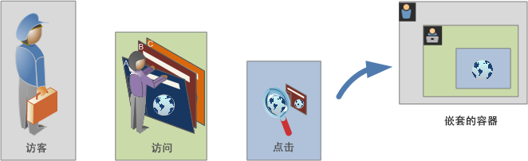-->


>[!BEGINSHADEBOX]

请参阅  [区段容器](https://video.tv.adobe.com/v/3429103?captions=chi_hans&quality=12&learn=on){target="_blank"}以观看演示视频。

>[!ENDSHADEBOX]


## 访客容器

访客容器包含指定时间段内访客的每次访问和页面查看。 访客级别的区段会返回满足条件的页面，以及访客查看的所有其他页面（仅受定义的日期范围的约束）。 作为定义最为广泛的容器，访客容器级别生成的报表将返回跨所有访问的页面查看并允许您生成多访问分析。因此，根据定义的日期范围，访客容器是最容易更改的。

访客容器可以包含基于访客总体历史记录的值：

- 首次购买间隔天数
- 原始登录页面
- 原始反向链接域名

## 访问容器

通过访问容器可以确定页面交互、促销活动或针对特定 Web 会话的转化。访问级别的区段会返回满足条件的页面，以及作为访问会话的一部分查看的所有其他页面（只受定义的日期范围的约束）。访问容器是最常使用的容器，因为每当符合规则，访问容器便会立即捕获整个访问会话的行为。访问容器可让您定义在生成和应用区段时要包含或排除的访问。它可以帮助您解答以下问题：在同一次访问中，有多少访客查看了“新闻与体育”部分？ 还是成功转化为销售的页面？

访问容器包括基于每次访问发生次数的值：

- 访问量
- 登录页面
- 回访频率
- 参与率指标
- 线性分配的指标

## 点击容器

点击容器定义要在区段中包含或排除的页面点击。点击容器是范围最窄的可用容器，允许您确定符合条件的特定点击和页面查看。您可以查看单个跟踪代码，或者将行为隔离在站点的特定部分内。您可能还希望在发生操作时查明特定值，例如下订单时的营销渠道。

“点击”容器包含的值以单个页面划分为基础：

- 产品
- 列表属性
- 列出eVar
- 促销eVar（在事件背景下）

  >[!NOTE]
  >
  >如果您对一个保持不变的值（例如 evar）使用此容器，那么此容器将加入该值保持不变的每次点击。如果跟踪代码在一周后过期，该值可以在多次访问时保持不变。

## 逻辑组容器

利用逻辑组容器，可在区段规则中提供一个单独的容器，以筛选不基于层次结构的实体。 例如，您可能需要提供嵌套在区段中的容器，用于根据访客进行过滤。 这一类型的逻辑要求您打破层次结构（因为您已经使用一个顶级访客容器），从而只过滤选定的访客。请参阅[逻辑组示例](/help/components/segmentation/segmentation-workflow/seg-sequential-build.md)以了解其他信息。

## 嵌套容器 {#nest-containers}

在其他容器中创建区段容器时，实际上是在区段中创建区段。 嵌套容器使用以下逻辑：

1. 确定使用最外部的容器包含哪些数据。在分段报表中，任何与此外部规则不匹配的数据都将被丢弃。
1. 将嵌套规则应用于其余数据。 嵌套规则不适用于第一个规则引发的任何点击。
1. 重复以上操作直到计算完所有嵌套的容器规则为止。 剩余的数据随后将包含在结果报表中。

>[!NOTE]
>
>在区段内嵌套区段时（例如，将区段从“组件”面板拖动到区段定义上），将创建一个包含拖动区段规则的副本（而非引用）的容器。

您可以在容器之间使用嵌套，也可以在容器内的规则之间使用嵌套。以下是您可以嵌套在每个容器中的内容：

| 容器名称 | 你可以在里面筑巢的东西 |
|---|---|
| 点击 | 仅限事件 |
| 访问 | 点击容器，事件 |
| 访客 | 访问容器、点击容器、事件 |
| 逻辑组 | 访客容器、访问容器、点击容器 |

### 在单个定义内包含多个容器

在一个新的复合区段中包含多个区段可让您进一步优化数据。 过滤访客时，将两个现有区段拖动到一起充当“OR”语句。 系统会根据所有数据审核画布中的所有容器，并且与任何容器匹配的任何数据都会包含在报表中。

例如，将“国家”=“美国”的访问容器和“订单”= True 的访问容器一起拖动，

```
Country = United States + Order = True
```

可生成一个区段，此区段的行为顺序如下：

1. 此区段首先会查看您的全部数据并确定美国国内的所有访客。
2. 然后，此区段会再次查看您的全部数据，搜索是否有访客下了订单。
3. 接着，这两个数据集都将应用到报表中。

## 顺序区段的容器 {#containers-sequential}

顺序区段采用同样的基本容器，包括分层嵌套的[!UICONTROL 访客]、[!UICONTROL 访问]和[!UICONTROL 点击]容器（包括页面查看或其他维度）。

<table style="table-layout:fixed; border: none;">

<tr>
<td style="background-color: #E5E4E2;" colspan="3" width="200" height="100"> 访客</td>
</tr>

<tr>
<td style="background-color: #E5E4E2;" width="200"></td>
<td style="background-color: #D3D3D3;" colspan="2" width="200" height="100"> 访问次数</td>
</tr>

<tr>
<td style="background-color: #E5E4E2;" width="200" height="100"></td>
<td style="background-color: #D3D3D3;" width="200" height="100"></td>
<td style="background-color: #C0C0C0;" width="200" height="100" colspan="1"> 点击量</td>
</tr>
</table>

<!---->

[!UICONTROL 访客]构成顺序区段中的最高顺序容器，[!UICONTROL 访问]包含在[!UICONTROL 访客]容器中，而[!UICONTROL 点击]包含在[!UICONTROL 访客]或[!UICONTROL 访问]容器中。必须保持这种[容器层次结构](/help/components/segmentation/seg-overview.md#section_7FDF47B3C6A94C38AE40D3559AFFAF70)以生成秩序井然的顺序区段。

**要生成顺序区段**，请嵌套容器并使用 [!UICONTROL THEN] 运算符联接顺序逻辑，根据访客序列，这要求每个容器都为 `true`。

<table style="table-layout:fixed; border: none;">

<tr>

<td style="background-color: #E5E4E2;" colspan="3" width="200" height="100"> 访客</td>
</tr>

<tr>
<td style="background-color: #E5E4E2;" width="200"></td>
<td style="background-color: #D3D3D3;" colspan="2" width="200" height="100"> 访问次数</td>
</tr>

<tr>
<td style="background-color: #E5E4E2;" width="200" height="100"></td>
<td style="background-color: #D3D3D3;" width="200" height="100"></td>
<td style="background-color: #C0C0C0;" width="200" height="100" colspan="1"> 点击量</td>
</tr>

<tr>
<td style="background-color: #E5E4E2;"></td><td colspan="2">那么</td></td>
</tr>

<tr>
<td style="background-color: #E5E4E2;" width="200"></td>
<td style="background-color: #D3D3D3;" colspan="2" width="200" height="100"> 访问次数</td>
</tr>

<tr>
<td style="background-color: #E5E4E2;" width="200" height="100"></td>
<td style="background-color: #D3D3D3;" width="200" height="100"></td>
<td style="background-color: #C0C0C0;" width="200" height="100" colspan="1"> 点击量</td>
</tr>
</table>

<!---->

这种容器层次结构的唯一例外是在使用[逻辑组容器](/help/components/segmentation/segmentation-workflow/seg-sequential-build.md)。通过使用[!UICONTROL 逻辑组]容器，您可以按任意顺序将点击嵌套在容器中以捕获事件和维度，而不按照特定的顺序。

<table style="table-layout:fixed; border: none;">

<tr>
<td style="background-color: #E5E4E2;" colspan="3" width="200" height="100"> 访客</td>
</tr>

<tr>
<td style="background-color: #E5E4E2;" width="200"></td>
<td style="background-color: #D3D3D3;" colspan="2" width="200" height="100"> 访问次数</td>
</tr>

<tr>
<td style="background-color: #E5E4E2;" width="200" height="100"></td>
<td style="background-color: #D3D3D3;" width="200" height="100"></td>
<td style="background-color: #C0C0C0;" width="200" height="100" colspan="1"> 点击量</td>
</tr>

<tr>
<td style="background-color: #E5E4E2;"></td><td colspan="2">那么</td></td>
</tr>

<tr>
<td style="background-color: #E5E4E2;" width="200"></td>
<td style="background-color: #D3D3D3;" colspan="2" width="200" height="100"> 组</td>
</tr>

<tr>
<td style="background-color: #E5E4E2;" width="200" height="100"></td>
<td style="background-color: #D3D3D3;" width="200" height="100"></td>
<td style="background-color: #C0C0C0;" width="200" height="100" colspan="1"> 点击量</td>
</tr>

<tr>
<td style="background-color: #E5E4E2;" width="200" height="100"></td>
<td style="background-color: #D3D3D3;" width="200" height="100"></td>
<td style="background-color: #C0C0C0;" width="200" height="100" colspan="1"> 访问次数</td>
</tr>

</table>

<!---->

## 基于容器数据的报表 {#reports}

通过容器，您可以在划分区段并将它们应用于报表时，根据报表值以不同方式筛选不同的数据。

在访客>访问>点击容器层次结构的每个级别捕获的数据会影响您构建区段的方式。 如果您将同一区段应用到使用相同数据集的同一报表，获得的值将根据生成报表的容器而有所不同。容器报表级别和跨点击的值的持续性等因素可能对报表的准确性产生重大影响。

### 容器数据基础 {#container-data}

例如，下面描述的访客在第一次访问时访问了一个网站，登陆了主页，然后又访问了三个其他页面，并将访问转化为促销。 在另一次访问中，访客这次通过产品页面，然后到达主页，返回到产品页面，然后在查看冬季功能后关闭会话。 根据每个容器为该区段捕获的数据，报表中将显示不同的值。

下面的 `Pages equals Winter Coat` 区段适用于&#x200B;**页面报表**。


根据选定容器，报表显示访客的以下访问和页面查看的不同结果。

<table style="table-layout:auto; border: 0;">

<tr>
<td style="background-color: #E5E4E2;"></td>
<td style="background-color: #E5E4E2;" colspan="4"><b>访问 1</b></td>
</tr>
<tr>
<tr>
<td style="background-color: #E5E4E2;">

</td>
<td style="background-color: #FFFFFF; "><br/>主页</td>
<td style="background-color: #FFFFFF;"><br/>冬季服装</td>
<td style="background-color: #FFFFFF;"><br/>冬衣</td>
<td style="background-color: #FFFFFF;"><br/>采购 100 美元</td>
</tr>
<tr>
<td colspan="5">
</tr>
<tr>
<td style="background-color: #E5E4E2;"></td>
<td style="background-color: #E5E4E2;"colspan="4"><b>访问 2</b></td>
</tr>
<tr>
<tr style="border: 0;">

<td style="background-color: #E5E4E2;">

</td>
<td style="background-color: #FFFFFF; "><br/>冬季服装</td>
<td style="background-color: #FFFFFF;"><br/>冬靴</td>
<td style="background-color: #FFFFFF;"><br/>冬季服装</td>
<td style="background-color: #FFFFFF;"><br/>冬帽</td>

</table>


<!--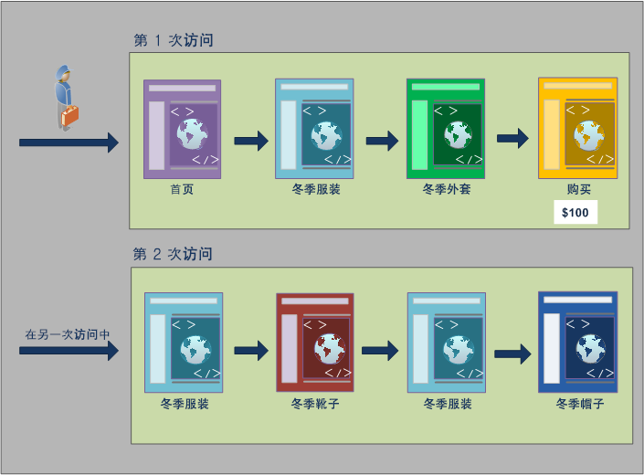-->

### 从点击容器报告

当此条件位于点击容器中时，报表将仅列出&#x200B;*Page = Winter Coats*&#x200B;为true的页面。 由于在一个仅包含一页的容器中只有一个页面与此条件匹配，因此只显示“冬季外套”页面。

| 页面 | 页面查看次数 |
|---|--:|
| 冬衣 | 1 |

<!--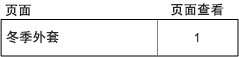-->

通过从点击容器报告可以看到从不同的容器报告会对总体报告值产生什么影响。通过查看区段报表可以注意到，页面查看次数大致与访问次数相同（约 2,000 名访客在一次访问中查看了重复页面，而此数量计入了页面查看总数中）。并且独特访客数大致与访问次数相同（约 2,000 名独特访客的访问次数超过一次）。

|  | 量度 | # | % |
|---|---|--:|--:|
| | 页面查看次数：<br/>查看次数：<br/>独特访客数： | **69,252**，共 351,292 <br/>**67,554**，共 165,175 <br/>**63,541**，共 113,169 | **19%**<br/>**40%**<br/>**56%** |


<!---->

>[!IMPORTANT]
>
>不管您是从点击、访问还是访客容器查看数据，它们的访客数都是一样的，本例中为 63,541。不管您如何生成报表，初始的访客条件（即查看了“冬季外套”页面的访客数）始终不变。此为您在不同级别报告所使用的数据子集。

### 从访问容器报告

如果访问容器中存在相同条件，则报表会列出访问中&#x200B;*页面= Winter Coats*&#x200B;为true的所有页面。 它会筛选“冬季外套”页面，但也会捕获访问中条件为true的所有其他页面。 由于访客也在访问中访问了“主页”、“产品”和“购买”页面，因此，在使用访客容器数据报告时，其他这些页面也将在报表中列出。

| 页面 | 页面查看次数 |
|---|--:|
| 主页 | 1 |
| 产品 | 1 |
| 冬衣 | 1 |
| 采购 | 1 |

<!--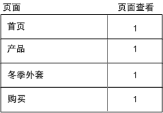-->

通过显示访问容器的区段值可以看到，页面查看数显著增加。之所以出现增加情况，是因为从访问容器报告可以确定所有满足相应条件的页面，以及该访问中查看的所有其他页面（捕获每个访问容器中的所有页面查看）。

|  | 量度 | # | % |
|---|---|--:|--:|
| | 页面查看次数：<br/>查看次数：<br/>独特访客数： | **226,193**，共 351,292 <br/>**67,554**，共 165,175 <br/>**63,541**，共 113,169 | **64%**<br/>**40%**<br/>**56%** |

<!---->

### 从访客容器报告

如果访客容器中存在同样的条件，则报表会列出查看了&#x200B;*页面 =“冬季外套”*&#x200B;的任何访客的所有页面。此条件意味着，如果某个访客查看了“冬季外套”页面，那么该访客容器中所有的页面（包括其他访问中的页面查看）都会列出。因此，不满足条件的页面也将在报表中列出，因为该访客在之前查看了这些页面。访客容器中的所有页面都会在报表中列出，即使它们之前出现但并未满足条件也不例外。

| 访问 1<br/>页面 | <br/>页面查看次数 |
|---|--:|
| 主页 | 1 |
| 冬季服装 | 1 |
| 冬衣 | 1 |
| 采购 | 1 |

| 访问 2<br/>页面 | <br/>页面查看次数 |
|---|--:|
| 冬季服装 | 2 |
| 冬靴 | 1 |
| 冬帽 | 1 |

| 访问 1 + 访问 2<br/>页面 | <br/>页面查看次数 |
|---|--:|
| 冬季服装 | 3 |
| 主页 | 1 |
| 冬衣 | 1 |
| 采购 | 1 |
| 冬靴 | 1 |
| 冬帽 | 1 |

<!--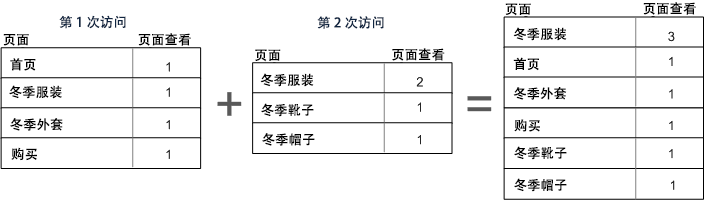-->

通过显示访客容器的区段可以看到，页面查看次数和访问次数都增加了。之所以出现增加情况，是因为在访客级别中，如果访客只访问了一次“冬季外套”页面（使条件生效），那么将捕获该访客的所有其他页面查看和访问。

|  | 量度 | # | % |
|---|---|--:|--:|
| | 页面查看次数：<br/>查看次数：<br/>独特访客数： | **240,094**，共 351,292 <br/>**83,823**，共 165,175 <br/>**63,541**，共 113,169 | **68%**<br/>**50%**<br/>**56%** |

<!---->

总之，了解区段针对不同数据划分的工作情况是解读其返回数据的关键。

## 以容器为基础报告 {#reporting}

区段数据的每个划分都有一个应用范围。大多数划分基于&#x200B;*页面查看*，但是很多有用的区段基于&#x200B;*访问*&#x200B;容器，少量基于&#x200B;*访客*&#x200B;容器。所以，以容器范围为基础了解报表非常关键。

使用 `Page equals Winter Coats` 区段示例，此区段结果的以下示例根据容器数据的应用方式，以及数据范围与区段类型的匹配方式。

### 以匹配区段规则为基础的区段容器

将区段容器应用到数据的自然范围可获得行项目与区段规则相匹配的期望结果。

- **页面 =“冬季外套”的点击容器***：查看使用此区段的页面报表将只返回等于“冬季外套”的值。*&#x200B;所有其他页面将被排除在报表之外。
- **登录页面 =“冬季服装”的访问容器***：查看使用此区段的登录页面报表将只返回第二次访问，因为其登录页面与区段规则相匹配。*
- **访问数为 1 的访问容器**：报表中包含查看第一次访问中的“访问所有”页面查看，因为其与区段规则相匹配。

### 访问容器级别的页面查看

许多区段规则会确定每次访问的页面查看。出现此识别时，只有当单个点击符合此规则时，才会应用整个访客容器。此区段报表特别有价值，因为基于访问的页面查看次数可提供基于每次访问的页面查看次数的insight。

- **页面=“冬季外套”页面的访问容器**：在“访客”容器级别的“页面”报表中，显示包含“冬季服饰”页面视图的访问的所有页面视图。 如果页面与区段规则匹配，则与该访问关联的所有页面查看都将包含在报表中。
- **页面 =“主页”的访问容器**：在包含此区段的页面报表中，只显示首次访问的数据，因为在第二次访问中，访客没有查看“主页”。
- **页面 =“冬季服装”的访客容器**：在页面报表中，此区段检索两次访问的所有数据，因为访客在这两次访问中均查看了“冬季服装”页面。

### 确定点击数少于页面查看数的区段容器

如果区段包含的容器小于划分范围，则将返回意外数据。 使用较小的划分仍会拉入该数据范围内的所有点击。

- **登入页面等于产品页面时的点击容器**：每个页面都与该访问的登入页面关联，使其成为基于访问的细分。 使用此区段不仅将登录页面加为“产品”页面，而且加入该访问中的所有点击。
- **列表变量1包含ValueA**&#x200B;的点击容器：如果与该列表变量相同的点击上定义了多个值，则所有变量值都将包含在该区段中。 无法分隔同一页面查看中出现的值，因为点击容器是划分点击的最小区段容器。
- **页面 =“购买”的点击容器**：如果将页面查看用作指标，那么只显示“购买”页面（预期）。如果使用“收入参与”报表，那么首次访问中的所有页面都将收到 $100，因为参与指标是以访问为基础的。
- **页面 =“冬季外套”的点击容器**：如果将页面查看用作指标，那么只显示“冬季外套”页面（预期）。如果使用收入参与报表，则页面不会收到积分，因为此维度需要永久性维度。 实际进行购买的页面视图（“购买”页面）未包含在“点击”容器中，因此任何项目都没有收入参与率。 但是，从访问容器运行报告将包括该访问中的所有页面查看，并将收入参与率（100美元）分配给会话中查看的所有页面。

## 跨容器持续性 {#persistence}

如果维度在一些页面上保持不变（例如促销活动 eVar 或反向链接维度），按这样的维度进行过滤会影响容器级别收集的数据，必须对此有深入了解来确保报表的准确性。

区段数据可能会因维度或应用的变量在选定页面上的持久性而异。 某些维度（例如页面维度）在页面级别提供唯一值，并根据点击容器中的数据进行了过滤。 （请参阅[以容器数据为基础的报表](/help/components/segmentation/seg-overview.md)示例）。反向链接域维度等其他维度在一次访问的多个页面上均保持不变。例如：`Referring Domain equals aol.com`。某些维度或应用的变量（如访问持续时间）跨越访客的整个历史记录。

<!--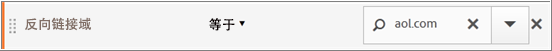-->

与页面维度相反，反向链接域值会附加到此访问中的每个页面。 例如，下面的访客从引用的网站访问主页。 因此，该访问内的所有页面都会分配同一个反向链接域值。

下面的 `Referring Domain equals aol.com` 区段适用于&#x200B;**页面报表**。

<table style="table-layout:fixed; border: 0;">

<tr>
<td style="background-color: #E5E4E2;"></td>
<td style="background-color: #E5E4E2;" colspan="4"><b>访问 1</b></td>
</tr>
<tr>
<tr>
<td style="background-color: #E5E4E2;">
<br/>aol.com
</td>
<td style="background-color: #FFFFFF; "><br/>主页</td>
<td style="background-color: #FFFFFF;"><br/>冬季服装</td>
<td style="background-color: #FFFFFF;"><br/>冬衣</td>
<td style="background-color: #FFFFFF;"><br/>采购 100 美元</td>
</tr>
<tr>
<td colspan="5">
</tr>
<tr>
<td style="background-color: #E5E4E2;"></td>
<td style="background-color: #E5E4E2;"colspan="4"><b>访问 2</b></td>
</tr>
<tr>
<tr style="border: 0;">

<td style="background-color: #E5E4E2;">
<br/>weather.com
</td>
<td style="background-color: #FFFFFF; "><br/>冬季服装</td>
<td style="background-color: #FFFFFF;"><br/>冬靴</td>
<td style="background-color: #FFFFFF;"><br/>冬季服装</td>
<td style="background-color: #FFFFFF;"><br/>冬帽</td>

</table>

<!--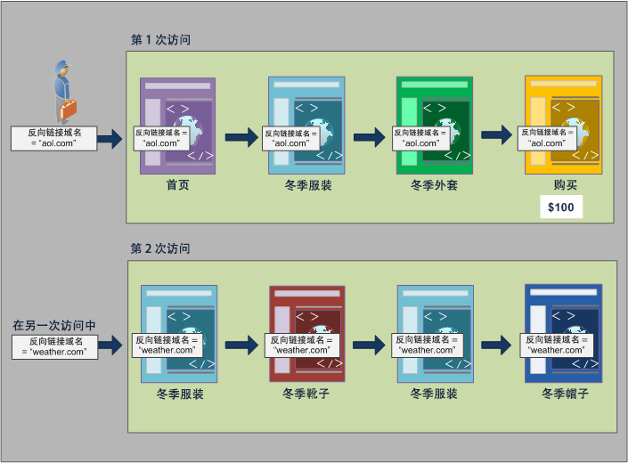-->

在新的访问中，访客从其他站点被引荐过来。因此，新访问中所有页面会针对每个页面查看分配新的反向链接域值。

### 从点击容器报告

因为同一访问内的所有页面查看都分配了同样的反向链接域值，所以点击容器级别中 `Referring Domain equsls 'aol.com'` 的报表会返回下表中列出的所有页面。

| 反向链接域等于“aol.com” | 页面查看次数 |
|----|---:|
| 主页 | 1 |
| 冬季服装 | 1 |
| 冬衣 | 1 |
| 采购 | 1 |

<!--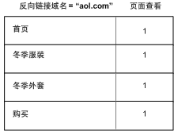-->

显示点击容器中的数据，仅略超过32,000名访客在33,000次访问中查看了92,000次页面查看。 平均而言，每次访问中有三次页面查看，而且几乎所有访问都是由独特访客进行。

|  | 量度 | # | % |
|---|---|--:|--:|
| | 页面查看次数：<br/>查看次数：<br/>独特访客数： | **98,234**，共 351,165 <br/>**33,203**，共 165,173 <br/>**32,269**，共 113,110 | **27%**<br/>**20%**<br/>**28%** |

<!--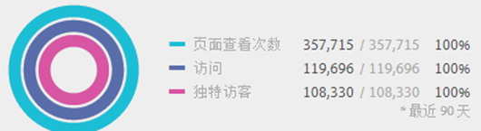-->

### 从访问容器报告

如果在页面报表的访问容器中过滤同一条件，那么访问中所有 `Referring Domain equals 'aol.com'` 的页面都满足。因为反向链接域的值在访问级别设置，所以页面查看和访问级别的报表是一样的。

| 反向链接域等于“aol.com” | 页面查看次数 |
|----|---:|
| 主页 | 1 |
| 冬季服装 | 1 |
| 冬衣 | 1 |
| 采购 | 1 |

<!---->

由于所有页面的反向链接域值都是一样的，都以该访问为基础，因此访问容器级别的报表（几乎）与页面查看容器的报表一样。由于数据异常导致存在细微偏差（98,234 和 98,248）。

|  | 量度 | # | % |
|---|---|--:|--:|
| | 页面查看次数：<br/>查看次数：<br/>独特访客数： | **98,248**，共 351,165 <br/>**33,203**，共 165,173 <br/>**32,269**，共 113,110 | **27%**<br/>**20%**<br/>**28%** |

<!---->

### 从访客容器报告

在访客容器中，页面报表会列出任何访客查看过的所有 `Referring Domain equals 'aol.com'` 的页面。因此，如果某个访客在历史记录中的任意时刻（定义的时间段内）将&#x200B;*“aol.com”*&#x200B;作为反向链接域，那么访客容器中的所有页面（包括其他访问中的页面查看）都将被列出。即使是不符合主要条件的页面也将在报表中列出，因为这些页面包含在访客容器中。访客容器中的所有页面都将在报表中列出，即使它们之前出现但并未满足条件也不例外。

在反向链接域报表中，四个页面查看内 `Referring Domain equals 'aol.com'`，但是访客点击的其他页面中 `Referring Domain equals "weather.com"`。在访客容器中，您会获取反向链接域为“aol.com”的访客列表。但也提供了反向链接域为“weather.com”的页面，而不是与您在区段中的初始请求相匹配的值。

| 访问 1<br/>反向链接域 =“aol.com” | <br/>页面查看次数 |
|----|---:|
| 主页 | 1 |
| 冬季服装 | 1 |
| 冬衣 | 1 |
| 采购 | 1 |

| 访问 2<br/>反向链接域 =“weather.com” | <br/>页面查看次数 |
|----|---:|
| 冬季服装 | 2 |
| 冬衣 | 1 |
| 采购 | 1 |

| 访客容器<br/>反向链接域 =“aol.com” | 页面查看次数 |
|----|---:|
| 冬季服装<br/>反向链接域：“aol.com” | 1 |
| 冬季服装<br/>反向链接域：“weather.com” | 1 |
| 主页<br/>反向链接域：“aol.com” | 1 |
| 冬衣<br/>反向链接域：“aol.com” | 1 |
| 采购<br/>反向链接域：“aol.com” | 1 |
| 冬靴<br/>反向链接域：“weather.com” | 1 |
| 冬帽<br/>反向链接域：“weather.com” | 1 |


<!--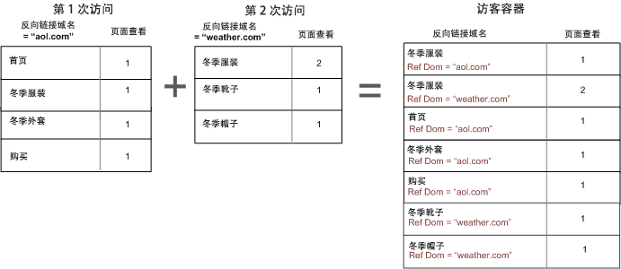-->

当您查看访客容器中的数据时，请注意页面查看次数会显著增加（从 98,248 增加到 112,925）。之所以出现增加情况，是因为访客的所有页面查看（包括在访客容器级别保存的其他反向链接域值的页面查看）均已列出。还有该访客的其他访问，让访问次数从 33,203 增加到 43,448。

|  | 量度 | # | % |
|---|---|--:|--:|
| | 页面查看次数：<br/>查看次数：<br/>独特访客数： | **112,925**，共 351,165 <br/>**43,448**，共 165,173 <br/>**32,269**，共 113,110 | **32%**<br/>**26%**<br/>**28%** |

<!--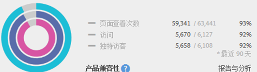-->

## 概要

- 只要一个访客至少有一个页面满足条件，访客容器会返回该访客查看的所有页面。所以，如果某个页面只在第 1 天的第 1 次访问时查看，那么访客在多次访问期间查看的所有页面都会包含在该数据内。
- 只要一次访问至少有一个页面满足条件，访问容器会返回该访问查看的所有页面。所以，如果某个页面只在第 1 天的第 1 次访问时查看，那么整个访问期间查看的所有页面都会包含在该数据内。
- 请注意将用于分段的条件建立在 eVar 或其他类型的持续变量上。例如，您可能使用条件“促销活动包含电子邮件”，该条件在七天后过期。因此，如果此促销活动在首次访问时设置，那么将再持续七天时间。即使促销活动只在首次访问中设置，也会将每个访问包含进来。其他访问也会包含进来（只要在报表的日期范围内）。如果您希望将持续值排除出去，请使用事件“实例”，或者使用等效的 Prop 变量（可用时）。
