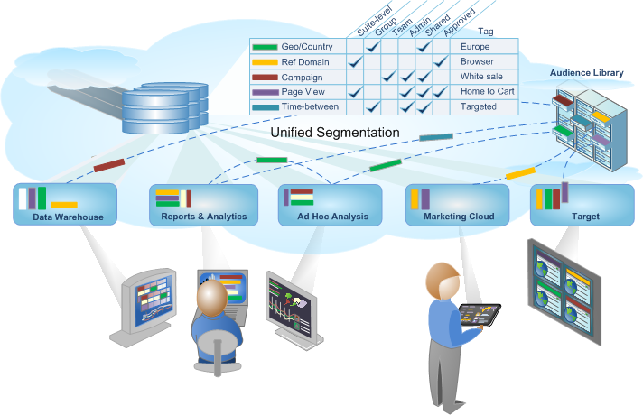

# Analytics 分段

Adobe Analytics 允许您使用各种 Analytics 功能、Adobe Experience Cloud、Adobe Target 和其他集成的 Adobe 产品生成、管理和共享强大而集中的受众区段并将它们应用到您的报表中。

Analytics 区段包括[区段生成器](/help/components/segmentation/segmentation-workflow/seg-workflow.md)和[区段管理器](/help/components/segmentation/segmentation-workflow/seg-workflow.md)，前者用于构建区段并运行预测试，后者用于在您的组织内收集、标记、批准、设置安全和共享区段。

数据科学人员和市场营销分析人员可以采用、扩展和优化区段，以便特定于其需求进行分析，然后保存区段供其他用户进行扩展和优化，以及作为新区段保存到库中。开始后，将作为一个设计和管理周期，将受众见解整理为[统一的区段工作流程](/help/components/segmentation/segmentation-workflow/seg-workflow.md)。

## 开始使用

有关简要概述，请参阅[关于区段](/help/components/segmentation/seg-overview.md)。然后转到[设置分段工作流程](/help/components/segmentation/segmentation-workflow/seg-workflow.md)或[生成区段](/help/components/segmentation/segmentation-workflow/seg-build.md)。
