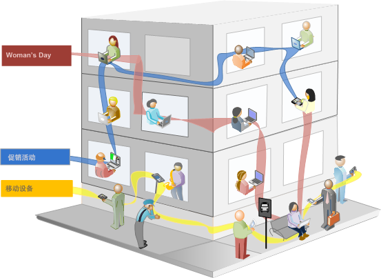

# 关于区段

通过区段，可根据特性或网站交互标识访客的子集。区段被设计为受众见解，您可根据自己的特定需求生成区段，然后验证、编辑区段和与其他团队成员共享区段或在其他 Adobe 产品和 Analytics 功能中使用区段。

区段基于使用嵌套容器模型的[!UICONTROL 访客]、[!UICONTROL 访问]和[!UICONTROL 点击]级别层次结构。您可以使用嵌套容器根据各容器之间和容器内的规则定义访客属性和操作。可在 [!DNL Adobe Experience Cloud] 的多个产品和功能中生成、批准、共享、保存和运行 Analytics 区段。区段可通过报告生成、可内建于功能板报告中，或添加书签以便快速访问。

可在 Segment Builder 中构建和保存区段，也可从流失报告（在 [!UICONTROL Analysis Workspace] 中）生成区段。还可以根据嵌套容器之间的特定规则采用和扩展预建区段，从而可以过滤结果并应用于报告。此外，区段可以一起用作[堆叠区段](/help/components/segmentation/segmentation-workflow/seg-workflow.md)。

区段可确定

- 访客的身份（国家/地区、性别、咖啡店）、
- 使用的设备和服务（浏览器、搜索引擎、移动设备）、
- 导航自何处（搜索引擎、上一个退出页面、免费搜索）
- 及更多信息。

<!---->

区段可以基于以下值：

- 基于属性的访客：浏览器类型、设备、访问次数、国家/地区、性别。
- 基于交互的访客：促销活动、关键词搜索、搜索引擎。
- 基于退出和登录的访客：来自 Facebook、定义的登陆页面、反向链接域名的访客。
- 基于自定义变量的访客：表单字段、定义的类别、客户 ID。

当您在区段生成器中生成受众区段时，可通过在容器之间使用 [!UICONTROL AND] 和 [!UICONTROL OR] 运算符来定义条件。

<table style="table-layout:fixed; border: none;">

<tr>

<td style="background-color: #E5E4E2;" colspan="3" width="200" height="100"> 访客</td>
</tr>

<tr>
<td style="background-color: #E5E4E2;" width="200"></td>
<td style="background-color: #D3D3D3;" colspan="2" width="200" height="100"> 访问次数</td>
</tr>

<tr>
<td style="background-color: #E5E4E2;" width="200" height="100"></td>
<td style="background-color: #D3D3D3;" width="200" height="100"></td>
<td style="background-color: #C0C0C0;" width="200" height="100" colspan="1"> 点击量</td>
</tr>

<tr>
<td style="background-color: #E5E4E2;"></td><td colspan="2">并且</td></td>
</tr>

<tr>
<td style="background-color: #E5E4E2;" width="200"></td>
<td style="background-color: #D3D3D3;" colspan="2" width="200" height="100"> 访问次数</td>
</tr>

<tr>
<td style="background-color: #E5E4E2;" width="200" height="100"></td>
<td style="background-color: #D3D3D3;" width="200" height="100"></td>
<td style="background-color: #C0C0C0;" width="200" height="100" colspan="1"> 点击量</td>
</tr>
</table>

<table style="table-layout:fixed; border: none;">

<tr>

<td style="background-color: #E5E4E2;" colspan="3" width="200" height="100"> 访客</td>
</tr>

<tr>
<td style="background-color: #E5E4E2;" width="200"></td>
<td style="background-color: #D3D3D3;" colspan="2" width="200" height="100"> 访问次数</td>
</tr>

<tr>
<td style="background-color: #E5E4E2;" width="200" height="100"></td>
<td style="background-color: #D3D3D3;" width="200" height="100"></td>
<td style="background-color: #C0C0C0;" width="200" height="100" colspan="1"> 点击量</td>
</tr>

<tr>
<td style="background-color: #E5E4E2;"></td><td colspan="2">或者</td></td>
</tr>

<tr>
<td style="background-color: #E5E4E2;" width="200"></td>
<td style="background-color: #D3D3D3;" colspan="2" width="200" height="100"> 访问次数</td>
</tr>

<tr>
<td style="background-color: #E5E4E2;" width="200" height="100"></td>
<td style="background-color: #D3D3D3;" width="200" height="100"></td>
<td style="background-color: #C0C0C0;" width="200" height="100" colspan="1"> 点击量</td>
</tr>
</table>

<!---->

此类型的区段根据使用 [!UICONTROL AND] 和 [!UICONTROL OR] 运算符联接的特性过滤数据集。

- 您可以[将多个区段应用于一个报告或项目](/help/components/segmentation/segmentation-workflow/t-seg-apply.md)。
- 区段对于所有报告包都是通用的。
- [区段生成器](/help/components/segmentation/segmentation-workflow/seg-build.md)简化了区段的创建过程。
- 您可以通过[区段管理器](/help/components/segmentation/segmentation-workflow/seg-manage.md)中的区段共享、标记、验证和批准功能，来设置[工作流程](/help/components/segmentation/segmentation-workflow/seg-workflow.md)。
- 您可以通过[为区段添加标签](/help/components/segmentation/segmentation-workflow/seg-tag.md)来整理和搜索区段，而无需使用文件夹。
- 您可以创建[顺序区段](/help/components/segmentation/segmentation-workflow/seg-sequential-build.md)。
- [!UICONTROL 页面浏览量]容器现在改名为[!UICONTROL 点击]容器，以表明该容器可用于细分所有类型的数据，而不仅限于页面浏览量。例如，链接跟踪调用以及来自移动 SDK 的操作跟踪调用，都会被点击容器包含或排除在外。

## Analysis Workspace 中的分段

Analysis Workspace 包含以下附加功能：

- 您可以[比较区段](../../analyze/analysis-workspace/c-panels/c-segment-comparison/segment-comparison.md)。
- 在自由格式表可视化中将区段用作维度。
- 在[流失分析](../../analyze/analysis-workspace/visualizations/fallout/compare-segments-fallout.md)中使用区段。

## Adobe 提供的区段

组件左侧栏显示由您本人、您的公司创建的区段，以及 Adobe 提供的开箱即用区段。当您单击&#x200B;**[!UICONTROL 显示所有]**&#x200B;时，一般将在列表的底部出现这些区段，并通过  标识这些区段。

## 顺序区段 {#sequential}

通过使用顺序区段，您可以根据站点中的导航和页面查看识别访客，为定义的操作和交互提供了一个区段。顺序区段可帮助您识别访客喜欢和避开的内容。生成顺序区段时，使用 [!UICONTROL THEN] 运算符来定义和排序访客导航。

| 访问一 | 访问二 | 访问三 |
|---|---|---|
| 在第一次访问中，访客转到主登录页面 A，排除促销活动页面 B，然后查看产品页面 C。 | 在第二次访问中，访客再次转到主登录页面 A，排除促销活动页面 B，再次转到产品页面 C，然后转到新页面 D。 | 在第三次访问中，访客进入并按照第一和第二次访问中的相同路线操作，然后排除页面 F，直接转到目标产品页面 G。 |

顺序区段可基于以下点击值：

- 基于页面点击顺序的访客：单次访问中的页面查看、跨各单独访问的页面查看、排除页面查看的访问。
- 基于页面查看之间和之后时间的访客：时间限制之后、两次点击之间、事件之后。

<table style="table-layout:fixed; border: none;">

<tr>

<td style="background-color: #E5E4E2;" colspan="3" width="200" height="100"> 访客</td>
</tr>

<tr>
<td style="background-color: #E5E4E2;" width="200"></td>
<td style="background-color: #D3D3D3;" colspan="2" width="200" height="100"> 访问次数</td>
</tr>

<tr>
<td style="background-color: #E5E4E2;" width="200" height="100"></td>
<td style="background-color: #D3D3D3;" width="200" height="100"></td>
<td style="background-color: #C0C0C0;" width="200" height="100" colspan="1"> 点击量</td>
</tr>

<tr>
<td style="background-color: #E5E4E2;"></td><td colspan="2">那么</td></td>
</tr>

<tr>
<td style="background-color: #E5E4E2;" width="200"></td>
<td style="background-color: #D3D3D3;" colspan="2" width="200" height="100"> 访问次数</td>
</tr>

<tr>
<td style="background-color: #E5E4E2;" width="200" height="100"></td>
<td style="background-color: #D3D3D3;" width="200" height="100"></td>
<td style="background-color: #C0C0C0;" width="200" height="100" colspan="1"> 点击量</td>
</tr>
</table>

<table style="table-layout:fixed; border: none;">

<tr>

<td style="background-color: #E5E4E2;" colspan="3" width="200" height="100"> 访客</td>
</tr>

<tr>
<td style="background-color: #E5E4E2;" width="200"></td>
<td style="background-color: #D3D3D3;" colspan="2" width="200" height="100"> 访问次数</td>
</tr>

<tr>
<td style="background-color: #E5E4E2;" width="200" height="100"></td>
<td style="background-color: #D3D3D3;" width="200" height="100"></td>
<td style="background-color: #C0C0C0;" width="200" height="100" colspan="1"> 点击量</td>
</tr>

<tr>
<td style="background-color: #E5E4E2;"></td><td style="background-color: #D3D3D3;"></td><td>并且</td></td>
</tr>

<tr>
<td style="background-color: #E5E4E2;" width="200" height="100"></td>
<td style="background-color: #D3D3D3;" width="200" height="100"></td>
<td style="background-color: #C0C0C0;" width="200" height="100" colspan="1"> 点击量</td>
</tr>

<tr>
<td style="background-color: #E5E4E2;"></td><td colspan="2">那么</td></td>
</tr>

<tr>
<td style="background-color: #E5E4E2;" width="200"></td>
<td style="background-color: #D3D3D3;" colspan="2" width="200" height="100"> 访问次数</td>
</tr>

<tr>
<td style="background-color: #E5E4E2;" width="200" height="100"></td>
<td style="background-color: #D3D3D3;" width="200" height="100"></td>
<td style="background-color: #C0C0C0;" width="200" height="100" colspan="1"> 点击量</td>

<tr>
<td style="background-color: #E5E4E2;"></td><td style="background-color: #D3D3D3;"></td><td>或者</td></td>
</tr>

<tr>
<td style="background-color: #E5E4E2;" width="200" height="100"></td>
<td style="background-color: #D3D3D3;" width="200" height="100"></td>
<td style="background-color: #C0C0C0;" width="200" height="100" colspan="1"> 点击量</td>
</tr>
</tr>
</table>

<!---->

顺序区段根据使用 [!UICONTROL THEN] 运算符联接的用户操作过滤数据集。

## 分段操作方法视频 {#segment-video}

本视频简要概述了区段容器及其使用方法。

>[!BEGINSHADEBOX]

请参阅  [区段容器](https://video.tv.adobe.com/v/25401?quality=12&learn=on){target="_blank"}以观看演示视频。

>[!ENDSHADEBOX]

## 权限 {#permissions}

+++ **需要哪些权限才能使用、创建和管理区段？**

默认情况下，所有用户都可以创建和编辑个人区段。但是，管理员可以决定哪些用户应拥有[创建区段的权限](/help/admin/admin-console/home.md)，然后将这些用户分配到特定的组。这些区段可以直接与任何其他 Analytics 用户共享。

管理员可以编辑任何区段，并且可以与组织中的组和每个人共享区段。[按角色划分区段权限](/help/components/segmentation/seg-reference/seg-rights.md)

+++

+++ **我可以看到公司的所有区段吗？**

可以，管理员可以在 [!DNL Analysis Workspace] 用户界面中看到所有区段。

Report Builder 显示您拥有的区段以及与您共享的区段。

+++

+++ **能否在区段管理器中管理所有 Analytics 区段？**

是的，可以在区段管理器中管理所有区段。区段管理器显示对所有者（创建区段的用户）、共享用户和管理员用户可见的区段。区段选择器显示用户拥有的区段及与其共享的区段。

管理员可以在 Analysis Workspace 用户界面中看到所有区段。

Report Builder 仅显示由您构建的区段或已特意与您共享的区段。

+++

+++ **为什么我无法删除区段？**

如果区段已[发布到 Experience Cloud](/help/components/segmentation/segmentation-workflow/seg-workflow.md)，则无法删除或编辑该区段。但您可以复制该区段，并对复制版本进行编辑。

+++
