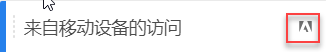

# 旧版区段常见问题解答

本文回答了有关管理旧版区段（在2014年之前创建的区段）的最佳实践的常见问题。

## 管理旧式区段 {#legacy}

+++ **我的现有区段有什么变化？**

您的现有区段将继续和以前一样使用。已应用了这些区段的任何报表将仍可正常使用。

大多数之前预定义的和包区段将作为区段模板迁移到区段生成器中。 使用区段模板可以快速生成适合一般受众的自定义区段。区段模板无法直接应用于报表，但可以轻松保存到自定义区段。

区段模板在区段生成器中带有特殊图标：

+++

+++ **已经应用区段的计划报表有什么变化？**

计划报表会继续以您所定义的区段正常运行。

删除区段后，应用该区段的计划报表和功能板可继续正常使用，即区段或功能板继续使用删除的区段。

编辑具有相同名称的区段时，计划报表不会更新。例如，假定您在不同报表包中有 2 个使用相同名称的区段：

您的书签引用 mainprod 报表包的区段。然后，由于该区段是重复项，您删除该区段。书签将继续运行，仍引用已删除区段的定义。如果更改 maindev 区段的区段定义以包括卡特琳娜岛和墨西哥的提华纳，则应用于书签的区段将不会发生更改。仍将使用旧定义。要修复此问题，请更新书签以引用新定义。如果不确定书签、功能板或计划报表是否在使用删除的区段，可以更改剩余区段的名称，这样可以更加明确书签是否在使用剩余的区段。

+++

+++ **Data Warehouse 区段有何变化？**

仍可在 Data Warehouse 中使用所有现有的 Data Warehouse 区段。大多数 Data Warehouse 区段在 Analysis Workspace 等其他组件中将也可正常使用。

您可以在区段生成器/管理器中创建或编辑新的 Data Warehouse 区段。区段生成器中的产品兼容性机制会自动确定区段是否与Data Warehouse兼容。

+++

+++ **预配置区段有何变化？**

* **单页面访问量**
* **来自移动设备的访问量**
* **来自免费搜索的访问量**
* **来自付费搜索的访问量**
* **使用访客 ID Cookie 的访问量**

这些区段将作为区段模板迁移到区段生成器中。 应用了这些区段的现有报表将继续正常工作。

+++

+++ **Experience Cloud（包）区段有何变化：**

* 非顾客
* 顾客
* 第一次访问
* 社交网站访问次数
* 访问时间超过 10 分钟的访问量*
* 之前访问次数超过 5 次的访问量*
* Facebook 访问量*

这些区段中的大部分（带有星号 * 标记的区段除外）已作为区段模板迁移到区段生成器中。此外，还添加了多个新区段模板。

应用了这些区段的现有报表可继续正常工作。

+++

+++ **管理员区段（又称为“全局”区段）有何变化？**

**管理员**&#x200B;区段将迁移到新的区段界面中，并将显示为与每个人共享的区段。

这些区段的所有者被设置为使用登录公司管理员用户列表中最旧帐户的管理员，但所有管理员都可以删除、编辑和共享这些区段。

管理控制台中管理员创建和管理这些全局区段的区段管理界面不再可用。管理员应使用新的区段生成器创建区段，并将其与相应组、个人或每个人共享。

对于现有区段，如果使用的逻辑已发生更改（如本文档中所述），它们仍可正常使用，但必须更新之后才能再次保存。例如，如果您的现有区段中美国包含“纽约”，则该区段仍可正常使用，但在下一次编辑该区段时，将需要更新该区段才能在等式条件中使用枚举类型。

+++

+++ **我应该怎样处理具有相同名称，但可能有不同定义的重复区段？**&#x200B;由于区段在多个报表包中使用，您可能会发现有多个区段具有相同的名称。我们建议您

* 重命名名称相同但定义不同的区段，或者
* 删除不再需要的区段。

+++

+++ **Adobe 针对区段清理方面有何建议？**

* 使用原有标记对所有区段添加标记。
* 审查您拥有的区段。
* 将区段添加到区段库（如果适用）。
* 批准符合规范的区段。
* 根据[最佳实践](/help/components/segmentation/segmentation-workflow/seg-workflow.md)标记区段。

+++

### 迁移提示

以下提示将可帮助您迁移一些常用维度：

* 地域（市、州/省、国家/地区）– 搜索并选择特定的城市、州/省或国家/地区，而不是使用部分匹配。
* 浏览器 – 使用浏览器类型维度来获取某种类型的所有浏览器，如 Google Chrome。
* 操作系统 – 使用操作系统类型维度来获取某种类型的所有操作系统，如 Microsoft Windows。
* 请参阅“新维度和重命名的维度”（见下文）

## 新维度和重命名的维度 {#renamed}

下表包含在区段生成器中重命名的维度列表。

| 新维度名称 | 以前名称 | 注释 |
|--- |--- |--- |
| 操作系统类型 | 新建 | 在 2015 年春季版中添加。 |
| 浏览器宽度 — 分段统计 | 浏览器宽度 | 该维度与所有界面兼容，根据范围划分成枚举列表，而不是具体的整数值。如果需要分段具体的值，请在 Data Warehouse 区段中使用此维度的粒度版本。 |
| 浏览器高度 — 分段统计 | 浏览器高度 | 该维度与所有界面兼容，根据范围划分成枚举列表，而不是具体的整数值。如果需要分段具体的值，请在 Data Warehouse 区段中使用此维度的粒度版本。 |
| 浏览器宽度 — 粒度 | 浏览器宽度 | 该维度已重命名，现在仅与 Data Warehouse 兼容。在定义与所有界面兼容的区段时，使用枚举类型“浏览器宽度 — 分段统计”。 |
| 浏览器高度 — 粒度 | 浏览器高度 | 该维度已重命名，现在仅与 Data Warehouse 兼容。在定义与所有界面兼容的区段时，使用枚举类型“浏览器高度 — 分段统计”。 |
| Cookie 支持 | Cookie | - |
| 颜色深度 | 显示器颜色深度 | - |
| - | &quot;应用程序 — *&quot; | 许多维度类型的“应用程序 -”前缀已经删除。由于移动设备应用程序数据通常是在不包含 Web 数据的报表包中捕获的，因此没有必要保留这些前缀。 |
| 原始登入页面 | 原始登录页面 | - |
| 启用 Java | Java | - |
| 移动设备浏览器 URL 最大长度 | 移动设备浏览器 URL 长度 | - |
| 移动设备邮件修饰 | 移动设备修饰邮件支持 | - |
| 移动设备 | 移动设备名称 | - |
| 移动设备书签最大长度 | 移动设备书签 URL 最大长度 | - |
| 移动设备电子邮件最大长度 | 移动设备邮件 URL 最大长度 | - |
| 移动设备操作系统（已弃用） | 移动设备操作系统 | 使用操作系统维度，但应用来自移动设备区段的访问量。 |
| 移动设备按键通话 | 移动设备 PTT | - |
| 调查查看 | 调查查看总次数 | - |
| 调查响应 | 调查响应总数 | - |
| 访问深度 | 路径长度 | - |
| 邮政编码 | ZIP/邮政编码 | - |

{style="table-layout:auto"}

## 更改具有已知值的基于字符串的维度 {#string-based-dims}

具有已知值集的字符串维度已更改为枚举类型。在使用这些维度创建区段时，将使用所有已知值预填充该列表，而支持的运算符只有等于。这让您可以在使用限制较少的匹配条件时，快速分段查找的确切值，而不会选择非预期的值。

以下维度已更改为枚举列表：

| 维度名称 | 维度名称 | 维度名称 |
| --- | --- | --- |
| 移动设备制造商 | 移动设备电子邮件长度 | 颜色深度 |
| 移动设备屏幕大小 | 移动设备数 | 显示器分辨率 |
| 移动设备屏幕高度 | 移动设备按键通话 | 插件 |
| 移动设备 Cookie 支持 | 移动设备邮件修饰 | 操作系统 |
| 移动设备图像支持 | 移动设备信息服务 | 反向链接类型 |
| 移动设备颜色深度 | 移动设备类型 | 搜索引擎 |
| 移动设备音频支持 | 浏览器类型 | 状态 |
| 移动设备视频支持 | 浏览器 | 地域（国家/地区） |
| 移动设备 DRM | 连接类型 | 地理区域 |
| 移动设备网络协议 | 移动设备运营商 | 地域（市） |
| 移动设备操作系统 | Cookie | 地域 DMA |
| 移动设备 Java VM | 客户忠诚度 | 持久 Cookie |
| 移动设备书签长度 | 启用 Java | 付费搜索 |
| 移动设备 URL 长度 | 语言 |  |

## 更改具有已知值的基于整数的维度 {#integer-based-dims}

具有已知值集的整数维度（如浏览器宽度）已被拆分为多个枚举范围，因此您可以快速定义特定范围的区段。这些枚举列表会在维度名称后附加“- 分段统计”。以下屏幕演示了如何使用以前的区段生成器界面和新区段生成器界面来分段这些维度：

小于、大于和类似运算符现在只与“Data Warehouse”区段兼容。如果区段要与所有报表界面兼容，应使用指标的“桶式”版本以及等于运算符。
