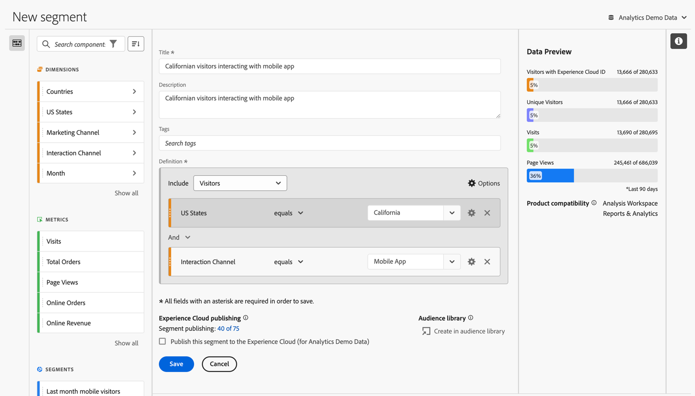
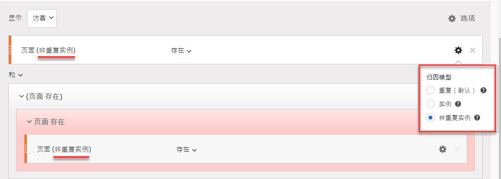
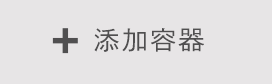
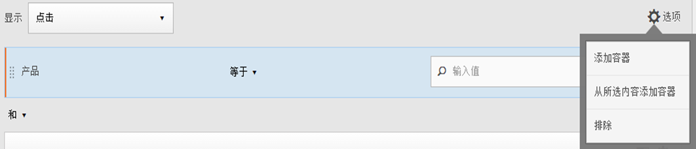
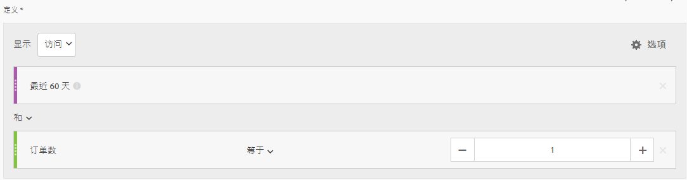
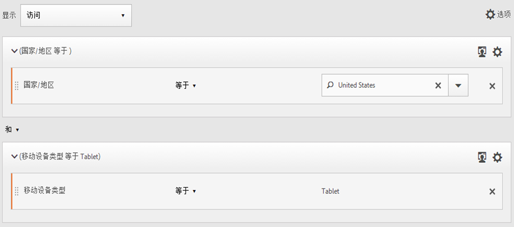

# 生成区段 {#build-segments}

>[!CONTEXTUALHELP]
>id="components_segments_productcompatibility"
>title="产品兼容性"
>abstract="少数可用的区段标准并非与所有 Adobe Analytics 工具兼容。此列表中列出了与相应区段兼容的工具。要使区段与所有 Adobe Analytics 工具兼容，请编辑您的标准。"

>[!CONTEXTUALHELP]
>id="components_filters_createaudience"
>title="创建受众"
>abstract="可以从区段创建受众，与 Adobe Experience Platform 共享受众以将其激活。"

>[!CONTEXTUALHELP]
>id="components_filters_datapreview"
>title="数据预览"
>abstract="将该区段的数据与报告包的数据进行对比。预览百分比基于&#x200B;**过去 90 天内**&#x200B;的总数计算。  如果预览未加载，可能是您的连接仍在进行数据回填。"

**[!UICONTROL 区段生成器]**&#x200B;对话框可用于创建新区段或编辑现有区段。对于您通过[[!UICONTROL 区段]管理器](/help/components/segmentation/segmentation-workflow/seg-manage.md)创建或管理的区段，该对话框的标题为&#x200B;**[!UICONTROL 新区段]**&#x200B;或&#x200B;**[!UICONTROL 编辑区段]**。

>[!BEGINTABS]

>[!TAB 区段生成器]

>[!TAB 创建或编辑区段]

>[!ENDTABS]

1. 指定以下详细信息（为必要项）：

   | 元素 | 描述 |
   | --- | --- |
   | **[!UICONTROL 报告包]** | 您可以为该区段选择报告包。 |
   | **[!UICONTROL 仅限项目的区段]** | 信息框用于解释该区段仅在创建它的项目中可见。并且该区段不会添加到您的组件列表中。启用&#x200B;**[!UICONTROL 提供此区段给您的所有项目，并将其添加到组件列表中]**，以更改该设置。此信息框仅在您创建[快速区段](seg-quick.md)，并通过[!UICONTROL 快速区段]界面中的&#x200B;**[!UICONTROL 打开生成器]**&#x200B;将此快速区段转换为常规区段时可见。 |
   | **[!UICONTROL 标题]** | 命名该区段，例如，`Last month mobile visitors`。 |
   | **[!UICONTROL 描述]** | 提供关于该区段的描述，例如，`Segment to define the mobile customers for the last month`。 |
   | **[!UICONTROL 标记]** | 通过创建或应用一个或多个标记来组织区段。开始键入，以查找您可以选择的现有标记。或者按&#x200B;**[!UICONTROL 输入]**&#x200B;键添加新的标记。选择  以移除标记。 |
   | **[!UICONTROL 定义]** | 使用[定义生成器](#definition-builder)来定义区段。 |

   {style="table-layout:auto"}

1. 要验证您的区段定义是否正确，请使用右上角不断更新的区段结果预览。
1. 要将您的区段发布到 Experience Cloud，请选择&#x200B;**[!UICONTROL 将此区段发布到 Experience Cloud（适用于&#x200B;*报告包*）]**。有关详细信息，请参阅[将区段发布到 Experience Cloud](/help/components/segmentation/segmentation-workflow/seg-publish.md)。
1. 选择：
   * **[!UICONTROL 保存]**&#x200B;可以保存区段。
   * **[!UICONTROL 另存为]**&#x200B;可以保存区段的副本。
   * **[!UICONTROL 删除]**&#x200B;可以删除区段。
   * **[!UICONTROL 取消]**&#x200B;可以取消对区段所做的任何更改，或取消创建新区段。

## 定义生成器

您可以使用定义生成器来构建区段定义。在该构造中，您可以使用组件、容器、运算符和逻辑。

您可以配置定义的类型和范围：

1. 要指定定义的类型，请指定是否要生成包含或排除定义。选择**[!UICONTROL 选项]**&#x200B;并从下拉菜单中&#x200B;**[!UICONTROL 包括]**&#x200B;或&#x200B;**[!UICONTROL 排除]**。
1. 要指定定义的范围，请从&#x200B;**[!UICONTROL 包含]**&#x200B;或&#x200B;**[!UICONTROL 排除]**&#x200B;下拉菜单中选择您希望定义的范围是&#x200B;**[!UICONTROL 点击次数]**、**[!UICONTROL 访问次数]**&#x200B;还是&#x200B;**[!UICONTROL 访客人数]**。

您稍后可以随时更改这些设置。

### 组件

构建区段定义的一个重要部分是使用维度、量度、现有区段和日期范围。所有这些组件都可以从区段生成器中的组件面板中获得。

{width=100%}

要添加组件，请执行以下操作：

1. 将一个组件从组件面板拖放到 **[!UICONTROL 将量度、区段和/或维度拖放到此处]**。您可以使用组件栏中的来搜索特定组件。
1. 指定组件的详细信息。例如，从&#x200B;**[!UICONTROL 选择值]**&#x200B;中选择一个值。或输入一个值。指定一个或多个值的内容和方式取决于组件和运算符。
1. 可选择修改默认运算符。例如，从&#x200B;**[!UICONTROL 等于]**&#x200B;到&#x200B;**[!UICONTROL 等于任意一个]**。请参阅 [运算符](../seg-reference/seg-operators.md)，了解可用运算符的详细概述。

要编辑组件，请执行以下操作：

* 从运算符下拉菜单中为组件选择一个新的运算符。
* 如果合适，为运算符选择或指定不同的值。
* 如果组件类型是维度，则可以定义归因模型。有关更多信息，请参阅[归因模型](#attribution)。

要删除组件：

* 在组件中选择 。

### 容器

您可以将多个组件分组到一个或多个容器中，并定义容器内和容器之间的逻辑。容器允许您为区段构建复杂的定义。

{Width=100%}

* 要添加容器，请从&#x200B;**[!UICONTROL 设置]**&#x200B;选项**[!UICONTROL 添加容器]**。
* 要将现有组件添加到容器中，请将该组件拖放到容器中。
* 要向容器添加另一个组件，请将组件从组件面板拖放到容器中。使用蓝色插入线作为指南。
* 要在容器外部添加另一个组件，请将组件从组件面板拖放到容器外部、主定义容器内部。使用蓝色插入线作为指南。
* 要修改容器内组件之间、容器之间或容器与组件之间的逻辑，请选择相应的 **[!UICONTROL And]**、**[!UICONTROL Or]**、**[!UICONTROL Then]**。当您选择 **[!UICONTROL Then]** 时，该区段就会变成一个顺序区段。有关更多信息，请参阅[创建顺序区段](seg-sequential-build.md)。
* 要切换容器级别，请选择  **[!UICONTROL 点击次数]**、 **[!UICONTROL 访问次数]**&#x200B;或  **[!UICONTROL 访客人数]**。

您可以在容器中使用来执行以下操作：

| 容器操作 | 描述 |
|---|---|
| **[!UICONTROL 添加容器]** | 向容器中添加嵌套容器。 |
| **[!UICONTROL 排除]** | 在区段定义中排除容器中的结果。左侧的细红色条身份标识排除容器。 |
| **[!UICONTROL 包含]** | 在区段定义中包含容器中的结果。默认为包含。左侧的细灰色条身份标识了包含容器。 |
| **[!UICONTROL 为容器命名]** | 根据容器的默认描述重命名容器。在文本字段中输入名称。如果您未提供任何输入内容，则会使用默认描述。 |
| **[!UICONTROL 删除容器]** | 从定义中删除容器。 |

## 日期范围

您可以构建包含滚动日期范围的区段。这样，您就可以回答有关正在进行的营销活动或事件的问题。例如，您可以构建一个包含&#x200B;*过去 60 天中在线购买过产品的用户*&#x200B;的区段。

>[!BEGINSHADEBOX]

请参阅  [区段中的滚动日期范围](https://video.tv.adobe.com/v/25403/?quality=12&learn=on){target="_blank"}以获取演示视频。

>[!ENDSHADEBOX]

## 堆叠区段 {#stack}

您可以使用若干区段来构建一个区段。在一个区段中使用若干区段时，您可以优化该区段，降低复杂性。

假设您想要根据互动渠道（5）和美国联邦州（50）的组合进行分段。您可以创建 250 个区段，分别对应设备类型（手机或平板）与美国各州之间的唯一组合。要获取加利福尼亚州的平板用户，您可以使用这 250 个区段中的一个：

或者，您也可以定义 55 个区段：其中 50 个用于美国各州，5 个用于可能的互动渠道。然后通过堆叠区段来获得相同的结果。要获取加利福尼亚州的移动应用用户，您可以叠加使用两个区段：

## 归因 {#attribution}

>[!CONTEXTUALHELP]
>id="components_filters_attribution_repeating"
>title="重复"
>abstract="包括维度的实例及持续值。"

>[!CONTEXTUALHELP]
>id="components_filters_attribution_instance"
>title="实例"
>abstract="包括维度的实例。"

>[!CONTEXTUALHELP]
>id="components_filters_attribution_nonrepeatinginstance"
>title="非重复实例"
>abstract="包括维度的独特（非重复）实例"

如果您在区段生成器中使用维度，可以选择指定该维度的归因模型。您选择的归因模型决定了数据是否符合您为维度组件指定的条件。

选择维度组件中的，并从弹出窗口中选择其中一个归因模型：

| 模型 | 描述 |
|---|---|
| **[!UICONTROL 重复模型（默认）]** | 包含维度的实例值和持久值以确定资格。 |
| **[!UICONTROL 实例]** | 仅包含维度的实例值以确定资格。 |
| **[!UICONTROL 非重复实例]** | 包括维度的唯一实例（非重复）值以确定资格。 |

### 示例

作为区段定义的一部分，您指定了以下条件：页面名称等于女性。与上面的例子类似。您使用另外两个归因模型重复这个区段定义。这样您就有三个区段，每个区段都有自己的归因模型：

* 女性页面 - 归因 - 重复（默认）
* 女性页面 - 归因 - 实例
* 女性页面 - 归因 - 非重复实例

下表针对每种归因模型，解释了哪些传入事件符合  该条件。

| 女性页面 - 归因 -  *归因模型* | 事件 1： 页面名称等于 女性 | 事件 2： 页面名称等于 男性 | 事件 3： 页面名称等于 女性 | 事件 4： 页面名称等于 女性 （持久） | 事件 5： 页面名称等于 结账 | 事件 6： 页面名称等于 女性 | 事件 7： 页面名称等于 主页 |
|---|:---:|:---:|:---:|:---:|:---:|:---:|:--:|
| 重复（默认） |  |  |  |  |  |  |  |
| 实例 |  |  |  |  |  |  |  |
| 非重复实例 |  |  |  |  |  |  |  |

使用这三个区段的事件报告示例如下：

<!--

The [!UICONTROL Segment builder] lets you build simple or complex segments that identify visitor attributes and actions across visits and page hits. It provides a canvas to drag and drop metric dimensions, events, or other segments in order to segment visitors based on hierarchy logic, rules, and operators.

There are several ways to access the Segment builder:

* **Analytics top navigation**: Click **[!UICONTROL Analytics]** > **[!UICONTROL Components]** > **[!UICONTROL Segments]**.
* **[!UICONTROL Analysis Workspace]**: Click **[!UICONTROL Analytics]** > **[!UICONTROL Workspace]**, open a project and click **[!UICONTROL + New]** > **[!UICONTROL Create Segment]**.
* **[!UICONTROL Report Builder]**: [Add or edit segments in Report Builder](https://experienceleague.adobe.com/zh-hans/docs/analytics/analyze/report-builder/work-with-segments).

## Builder criteria {#section_F61C4268A5974C788629399ADE1E6E7C}

You can add rule definitions and containers to define your segments.

1. **[!UICONTROL Title]**: Name the segment.
1. **[!UICONTROL Description]**: Provide a description for the segment. 
1. **[!UICONTROL Tags]**: [Tag the segment](/help/components/segmentation/segmentation-workflow/seg-workflow.md) you are creating by picking from a list of existing tags or creating a new tag.
1. **[!UICONTROL Definitions]**: This is where you [build and configure segments](/help/components/segmentation/segmentation-workflow/seg-workflow.md), add rules, and nest and sequence containers. 
1. **[!UICONTROL Show]**: (Top Container selector.) Lets you select the top-level [container](/help/components/segmentation/seg-overview.md) ( [!UICONTROL Visitor], [!UICONTROL Visit], [!UICONTROL Hit]). The default top-level container is the Hit container.
1. **[!UICONTROL Options]**: (gear) icon

   * **[!UICONTROL + Add container]**: Lets you add a new container (below the top-level container) to the segment definition.
   * **[!UICONTROL Exclude]**: Lets you define the segment by excluding one or more dimensions, segments, or metrics.

1. **[!UICONTROL Dimensions]**: Components are dragged and dropped from the Dimensions list (orange sidebar).
1. **[!UICONTROL Operator]**: You can compare and constrain values using selected operators.
1. **[!UICONTROL Value]**: The value you entered or selected for the dimension or segment or metric.
1. **[!UICONTROL Attribution Models]**: Available for dimensions only, these models determine what values in a dimension to segment for. Dimension models are particularly useful in sequential segmentation.

   * **[!UICONTROL Repeating]** (default): Includes instances and persisted values for the dimension.
   * **[!UICONTROL Instance]**: Includes instances for the dimension.
   * **[!UICONTROL Non-repeating instance]**: Includes unique instances (non-repeating) for the dimension. This is the model applied in Flow when repeat instances are excluded.

   

   **Example: Hit segment where eVar1 = A** 

   |  Example  | A  | A  |  A (persisted) | B  | A  | C  |
   |---|---|---|---|---|---|---|
   |  Repeating  | X  | X  | X  | -  | X  | -  |
   |  Instance  | X  | X  | - | - | X | - |
   |  Non-repeating instance  | X | - | - | -  | X  | -  |

1. **[!UICONTROL And/Or/Then]**: Assigns the [!UICONTROL AND/OR/THEN] operators between containers or rules. The THEN operator lets you [define sequential segments](/help/components/segmentation/segmentation-workflow/seg-sequential-build.md).
1. **[!UICONTROL Metric]**: (Green sidebar) Metric that was dragged and dropped from the Metrics list.
1. **[!UICONTROL Comparison]** operator: You can compare and constrain values using selected operators.
1. **[!UICONTROL Value]**: The value you entered or selected for the dimension or segment or metric.
1. **[!UICONTROL X]**: (Delete) Lets you delete this part of the segment definition.
1. **[!UICONTROL Experience Cloud publishing]**: Publishing an Adobe Analytics segment to the Experience Cloud lets you use the segment for marketing activity in [!DNL Audience Manager] and in other activation channels. [Learn more...](/help/components/segmentation/segmentation-workflow/seg-publish.md)
1. **[!UICONTROL Audience library]**: Adobe's audience services manage the translation of visitor data into audience segmentation. As such, creating and managing audiences is similar to creating and using segments, with the added ability to share the audience segment to the Experience Cloud. [Learn more...](https://experienceleague.adobe.com/docs/core-services/interface/audiences/audience-library.html?lang=zh-Hans)
1. **[!UICONTROL Search]**: Searches the list of dimensions, segments, or metrics.
1. **[!UICONTROL Dimensions]**: (List) Click the header to expand.
1. **[!UICONTROL Metrics]**: Click the header to expand.
1. **[!UICONTROL Segments]**: Click the header to expand.
1. **[!UICONTROL Report suite selector]**: Lets you select the report suite that this segment will be saved under. You can still utilize the segment in all report suites.
1. **[!UICONTROL Segment Preview]**: Lets you preview the key metrics to see whether you have a valid segment and how broad the segment is. Represents the breakdown of the data set you can expect to see if you apply this segment. Shows 3 concentric circles and a list to show the number and percentage of matches for [!UICONTROL Hits], [!UICONTROL Visits], and [!UICONTROL Visitors] for a segment run against a data set. This chart is updated immediately after you create or make changes to your segment definition.
1. **[!UICONTROL Product Compatibility]**: Provides a list of which Adobe Analytics products (Analysis Workspace, Data Warehouse) with which the segment you created is compatible. Most segments are compatible with all products. However, not all operators and dimensions are compatible with all Analytics products, especially [Data Warehouse](/help/components/segmentation/seg-reference/seg-compatibility.md). This chart is updated immediately after you make changes to your segment definition.
1. **[!UICONTROL Save]** or **[!UICONTROL Cancel]**: Saves or cancels the segment. After clicking **[!UICONTROL Save]**, you are taken to the Segment manager where you can manage the segment.

## Build segments {#build-segments}

1. Simply drag a Dimension, Segment, or Metric Event from the left pane to the [!UICONTROL Definitions] field.

   

   The default top-level [!UICONTROL Hit] container is shown after dragging an element to [!UICONTROL Definitions]. You can change the container type to Visit or Visitor from the **[!UICONTROL Show]** drop-down menu.

1. Set the [operator](/help/components/segmentation/seg-reference/seg-operators.md) from the drop-down menu.
1. Enter or select a value for the item selected.
1. Add additional containers if needed, using **[!UICONTROL And]**, **[!UICONTROL Or]**, or **[!UICONTROL Then]** rules.
1. After placing the containers and setting the rules, see the results of the segment in the validation chart at the top right. The validator indicates the percentage and absolute number of page views, visits, and unique visitors that match the segment you created.
1. Under **[!UICONTROL Tags]**, [tag](/help/components/segmentation/segmentation-workflow/seg-tag.md) the container by selecting an existing tag or creating a new one.
1. Click **[!UICONTROL Save]** to save the segment.

You are now taken to the [Segment manager](/help/components/segmentation/segmentation-workflow/seg-manage.md), where you can tag, share, and manage your segment in multiple ways.

## Add containers {#section_1C38F15703B44474B0718CEF06639EFD}

You can [build a framework of containers](/help/components/segmentation/seg-overview.md) and then place logic rules and operators between.

1. Click **[!UICONTROL Options > Add Container]**.

   

   A new [!UICONTROL Hit] container opens without a [!UICONTROL Hit] (Page View) identified.

   

1. Change the container type as needed.
1. Drag a Dimension, Segment, or Event from the left pane to the container.
1. Continue to add new containers from the top-level **[!UICONTROL Options]** > **[!UICONTROL Add container]** button at the top of the definition, or add containers from within a container to nest logic.

   **OR**

   Select one or more rules and then click **[!UICONTROL Options]** > **[!UICONTROL Add container from selection]**. This turns your selection into a separate container.

## Use date ranges {#concept_252A83D43B6F4A4EBAB55F08AB2A1ACE}

You can build segments that contain rolling date ranges in order to answer questions about ongoing campaigns or events.

For example, you can easily build a segment that includes "everyone who has made a purchase over the past 60 days".

You create a Visit container and within it, add the [!UICONTROL Last 60 days] time range and the metric [!UICONTROL Orders is greater than or equal to 1], with an AND operator:

>[!BEGINSHADEBOX]

See  [Rolling date ranges in segments](https://video.tv.adobe.com/v/25403?quality=12&learn=on){target="_blank"} for a demo video.

>[!ENDSHADEBOX]

## Stack segments {#task_58140F17FFD64FF1BC30DC7B0A1B0E6D}

Stacking segments works by combining the criteria in each segment using an 'and' operator, and then applying the combined criteria. This can be done in a Workspace project directly or in segment builder. 

For example, stacking a "mobile phone users" segment and a "US geography" segment would return data only for mobile phone users in the US.

Think of these segments as building blocks or modules that you can include in a segment library, for users to use as they see fit. That way, you can dramatically reduce the number of segments needed. For example, assume you have 40 segments:

* 20 for mobile phone users in different countries (US_mobile, Germany_mobile, France_mobile, Brazil_mobile, etc.) 
* 20 for tablet users in different countries (US_tablet, Germany_tablet, France_tablet, Brazil_tablet, etc.)

By using segment stacking, you can reduce your segment count to 22 and stack them as needed. You would need to create these segments:

* one segment for mobile users 
* one segment for tablet users 
* 20 segments for the different geographies

>[!NOTE]
>
>When stacking two segments, they are by default joined by an AND statement. This cannot be changed to an OR statement.

1. Go to the Segment builder.
1. Provide a title and description for the segment.

   Step Result 1. Click **[!UICONTROL Show Segments]** to bring up the list of segments in the left navigation.

   Step Result 1. Drag and drop the segments you want to stack to the segment definition canvas. Here is an example of a segment that stacks the existing segments "Visits from Tablets" and "US Geo":

   

1. Save the segment.

   Step Result 

-->

## 区段模板 {#concept_5098446CC78D441E93B8E4D1D1EA6558}

系统提供了一些常见分段使用情境的区段模板，例如&#x200B;**[!UICONTROL 首次访问]**&#x200B;或&#x200B;**[!UICONTROL 来自移动设备的访问]**。这些模板可在 Workspace 项目中以及区段构建器中使用，作为新建区段的构建基块。

带有 Adobe 标志  的即为区段模板。以下列出部分可用的区段模板示例：

<table id="table_98B87D807E9344C9BEBF072C65D87B1B"> 
 <thead> 
  <tr> 
   <th colname="col1" class="entry"> 模板名称 </th> 
   <th colname="col2" class="entry"> 定义 </th> 
  </tr> 
 </thead>
 <tbody> 
  <tr> 
   <td colname="col1"> 放弃购物车 </td> 
   <td colname="col2">查看向购物车添加了物品但没有订购任何货物的访客的数据。在该区段定义中，容器为“访问”。 </td> 
  </tr> 
  <tr> 
   <td colname="col1"> 第一次访问 </td> 
   <td colname="col2">查看最多访问一 [1] 次的访客的数据。在该区段定义中，容器为“访问”。 
 </td> 
  </tr> 
  <tr> 
   <td colname="col1"> 非顾客 </td> 
   <td colname="col2">查看未参与订购事件的访客的数据。 </td> 
  </tr> 
  <tr> 
   <td colname="col1"> 非单页面访问（非跳出） </td> 
   <td colname="col2">查看多次访问的访客的数据。
 </td> 
  </tr> 
  <tr> 
   <td colname="col1"> 付费搜索 </td> 
   <td colname="col2">查看源自付费搜索的访客的数据。  </td> 
  </tr> 
  <tr> 
   <td colname="col1"> 顾客 </td> 
   <td colname="col2">查看参与订购事件的访客的数据。  </td> 
  </tr> 
  <tr> 
   <td colname="col1"> 回访 </td> 
   <td colname="col2">查看至少访问一次的访客的数据。  </td> 
  </tr> 
  <tr> 
   <td colname="col1"> 单页面访问次数 </td> 
   <td colname="col2"> 查看包含某个页面值的访问数据，可以提交该次访问过程中的多个页面查看。该区段包含具有退出链接事件的单页面访问。  </td> 
  </tr> 
  <tr> 
   <td colname="col1"> 查看的产品未添加到购物车 </td> 
   <td colname="col2">查看浏览了产品但未在购物车加货的访客的数据。  </td> 
  </tr> 
  <tr> 
   <td colname="col1"> 来自促销活动的访问次数 </td> 
   <td colname="col2">查看通过促销活动引荐的访客的数据。 </td> 
  </tr> 
  <tr> 
   <td colname="col1"> 来自移动设备的访问次数 </td> 
   <td colname="col2">查看使用移动设备的访客的数据。 </td> 
  </tr> 
  <tr> 
   <td colname="col1"> 来自免费搜索的访问次数 </td> 
   <td colname="col2">查看非源自付费搜索的访客的数据。  </td> 
  </tr> 
  <tr> 
   <td colname="col1"> 来自非移动设备的访问次数 </td> 
   <td colname="col2">查看非使用移动设备的访客的数据。 </td> 
  </tr> 
  <tr> 
   <td colname="col1"> 来自手机的访问次数 </td> 
   <td colname="col2">查看使用手机的访客的数据。  </td> 
  </tr> 
  <tr> 
   <td colname="col1"> 来自搜索引擎的访问次数 </td> 
   <td colname="col2">查看通过搜索引擎引荐的访客的数据。</td> 
  </tr> 
  <tr> 
   <td colname="col1"> 社交网站访问次数 </td> 
   <td colname="col2">查看通过社交网站反向链接的访客的数据。</td> 
  </tr> 
  <tr> 
   <td colname="col1"> 来自平板电脑的访问次数 </td> 
   <td colname="col2">查看使用平板电脑的访客的数据。</td> 
  </tr> 
  <tr> 
   <td colname="col1"> 使用访客 ID Cookie 的访问次数 </td> 
   <td colname="col2">查看需要永久性 Cookie 的网站上访客的数据。</td> 
  </tr> 
 </tbody> 
</table>

要查看每个区段的定义，请使用 。例如，对于 **[!UICONTROL iOS]** 模板：

