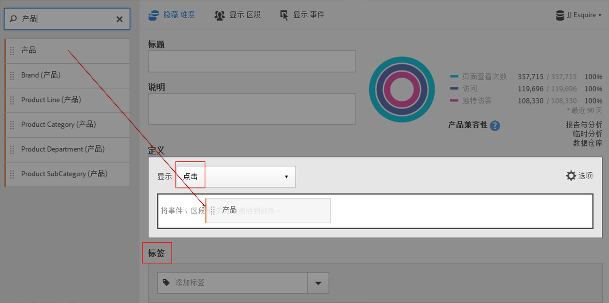

# 区段生成器 {#segment-builder}

<!-- markdownlint-disable MD034 -->

>[!CONTEXTUALHELP]
>id="components_filters_createaudience"
>title="创建受众"
>abstract="可以从区段创建受众，与 Adobe Experience Platform 共享受众以将其激活。"

<!-- markdownlint-enable MD034 -->

<!-- markdownlint-disable MD034 -->

>[!CONTEXTUALHELP]
>id="components_filters_datapreview"
>title="数据预览"
>abstract="将此区段的数据与数据视图的数据进行比较。预览百分比基于&#x200B;**过去 90 天**&#x200B;数据视图中的总数。  如果未加载预览，则您的连接有可能仍在进行回填。"

<!-- markdownlint-enable MD034 -->

<!-- markdownlint-disable MD034 -->

>[!CONTEXTUALHELP]
>id="components_filters_attribution_repeating"
>title="重复"
>abstract="包括维度的实例及持续值。"

<!-- markdownlint-enable MD034 -->

<!-- markdownlint-disable MD034 -->

>[!CONTEXTUALHELP]
>id="components_filters_attribution_instance"
>title="实例"
>abstract="包括维度的实例及持续值。"

<!-- markdownlint-enable MD034 -->

<!-- markdownlint-disable MD034 -->

>[!CONTEXTUALHELP]
>id="components_filters_attribution_nonrepeatinginstance"
>title="非重复实例"
>abstract="包括维度的独特（非重复）实例"

<!-- markdownlint-enable MD034 -->

通过使用[!UICONTROL 区段生成器]，您可以生成和保存简单或复杂的区段，以确定跨访问和页面点击的访客归因和操作。它提供了一个画布以将量度维度、事件或其他区段拖放到其中，从而根据层次结构逻辑、规则和运算符分段访客。

访问区段生成器的方法有以下几种：

* **Analytics 顶部导航**：单击 **[!UICONTROL Analytics]** > **[!UICONTROL 组件]** > **[!UICONTROL 区段]**。
* **[!UICONTROL Analysis Workspace]**：单击 **[!UICONTROL Analytics]** > **[!UICONTROL Workspace]**，打开一个项目，然后单击 **[!UICONTROL + 新建]** > **[!UICONTROL 创建区段]**。
* **[!UICONTROL Report Builder]**：[在 Report Builder 中添加或编辑区段](https://experienceleague.adobe.com/zh-hans/docs/analytics/analyze/report-builder/work-with-segments)。

## 生成器条件 {#section_F61C4268A5974C788629399ADE1E6E7C}

您可以通过添加规则定义和容器来定义区段。

1. **[!UICONTROL 标题]**：命名区段。
1. **[!UICONTROL 描述]**：提供对区段的描述。
1. **[!UICONTROL 标记]**：通过从现有标记列表中选取标记或创建新标记来[标记您创建的区段](/help/components/segmentation/segmentation-workflow/seg-workflow.md)。
1. **[!UICONTROL 定义]**：您可以在此处[生成并配置区段](/help/components/segmentation/segmentation-workflow/seg-workflow.md)，添加规则，以及嵌套和排列容器。
1. **[!UICONTROL 展示]**：（顶部容器选择器。）用于选择顶级[容器](/help/components/segmentation/seg-overview.md)（[!UICONTROL 访客]、[!UICONTROL 访问]、[!UICONTROL 点击]）。默认的顶级容器为“点击”容器。
1. **[!UICONTROL 选项]**：（齿轮）图标

   * **[!UICONTROL + 添加容器]**：用于向区段定义添加新容器（在顶级容器下）。
   * **[!UICONTROL 排除]**：用于通过排除一个或多个维度、区段或量度来定义区段。

1. **[!UICONTROL 维度]**：从维度列表中拖放的组件（橙色侧栏）。
1. **[!UICONTROL 运算符]**：您可以使用选定的运算符比较和约束值。
1. **[!UICONTROL 值]**：为维度、区段或量度输入或选择的值。
1. **[!UICONTROL 归因模型]**：这些模型仅可用于维度，它们确定要划分区段的维度值。维度模型在连续分段中特别有用。

   * **[!UICONTROL 重复]**（默认）：包含维度的实例和保留值。
   * **[!UICONTROL 实例]**：包含维度的实例。
   * **[!UICONTROL 非重复实例]**：包含维度的唯一实例（非重复）。这是排除重复实例时在流量中应用的模型。

   

   **示例：eVar1 = A 的点击区段**

   | 示例 | A | A | A（保留） | B | A | C |
   |---|---|---|---|---|---|---|
   | 重复 | X | X | X | - | X | - |
   | 实例 | X | X | - | - | X | - |
   | 非重复实例 | X | - | - | - | X | - |

1. **[!UICONTROL And/Or/Then]**：在容器或规则之间分配 [!UICONTROL AND/OR/THEN] 运算符。通过使用 THEN 运算符，您可以[定义顺序区段](/help/components/segmentation/segmentation-workflow/seg-sequential-build.md)。
1. **[!UICONTROL 量度]**：（绿色侧栏）从量度列表中拖放的量度。
1. **[!UICONTROL 比较]**&#x200B;运算符：您可以使用选定的运算符比较和约束值。
1. **[!UICONTROL 值]**：为维度、区段或量度输入或选择的值。
1. **[!UICONTROL X]**：（删除）用于删除此部分区段定义。
1. **[!UICONTROL Experience Cloud 发布]**：将 Adobe Analytics 区段发布到 Experience Cloud 后，您可以将该区段用于 [!DNL Audience Manager] 和其他活动渠道中的营销活动。[了解详情...](/help/components/segmentation/segmentation-workflow/seg-publish.md)
1. **[!UICONTROL 受众库]**：Adobe 的受众服务可管理访客数据到受众区段的转换。因此，创建和管理受众与创建和使用区段类似，只是前者增加了一项将受众区段共享到 Experience Cloud 的功能。[了解详情...](https://experienceleague.adobe.com/docs/core-services/interface/audiences/audience-library.html?lang=zh-hans)
1. **[!UICONTROL 搜索]**：搜索维度、区段或量度列表。
1. **[!UICONTROL 维度]**：（列表）单击标题可展开。
1. **[!UICONTROL 量度]**：单击标题可展开。
1. **[!UICONTROL 区段]**：单击标题可展开。
1. **[!UICONTROL 报告包选择器]**：用于选择保存此区段的报告包。您仍可以在所有报告包中使用该区段。
1. **[!UICONTROL 区段预览]**：用于预览关键量度，以确定是否具有有效的区段以及区段的广泛程度。表示应用此区段时预期的数据集划分。显示 3 个同心圆和一个列表，以显示针对数据集运行的区段的[!UICONTROL 点击]、[!UICONTROL 访问]和[!UICONTROL 访客]的匹配项数量和百分比。在创建区段定义或对区段定义做出更改之后，将立即更新此图表。
1. **[!UICONTROL 产品兼容性]**：列出与您创建的区段兼容的 Adobe Analytics 产品（Analysis Workspace、Data Warehouse）。大多数区段与所有产品都兼容。但是，并非所有运算符和维度都与 Analytics 的任何产品兼容，特别是 [Data Warehouse](/help/components/segmentation/seg-reference/seg-compatibility.md)。在对区段定义做出更改之后，将立即更新此图表。
1. **[!UICONTROL 保存]**&#x200B;或&#x200B;**[!UICONTROL 取消]**：保存或取消区段。单击&#x200B;**[!UICONTROL 保存]**&#x200B;之后，将转到区段管理器，您可以在此处管理区段。

## 生成区段 {#build-segments}

1. 只需将维度、区段或量度事件从左侧窗格拖动到[!UICONTROL 定义]字段。

   

   将元素拖动到[!UICONTROL 定义]中之后，将显示默认的顶级[!UICONTROL 点击]容器。您可以从“显示”****&#x200B;下拉菜单中将容器类型更改为“访问”或“访客”。

1. 从下拉菜单中，设置[运算符](/help/components/segmentation/seg-reference/seg-operators.md)。
1. 输入或选择所选项目的值。
1. 如果需要，可以使用“**[!UICONTROL And]**”、“**[!UICONTROL Or]**”或“**[!UICONTROL Then]**”规则添加其他容器。
1. 在放置容器并设置规则之后，可以在右上方的验证图表中看到区段的结果。验证器将指示与所创建区段匹配的页面查看、访问和独特访客的百分比和绝对数。
1. 在&#x200B;**[!UICONTROL 标记]**&#x200B;下，通过选择现有标记或创建新标记来[标记](/help/components/segmentation/segmentation-workflow/seg-tag.md)容器。
1. 单击&#x200B;**[!UICONTROL 保存]**&#x200B;以保存区段。

此时您将转到[区段管理器](/help/components/segmentation/segmentation-workflow/seg-manage.md)，在此处，可以通过多种方式标记、共享和管理区段。

## 添加容器 {#section_1C38F15703B44474B0718CEF06639EFD}

您可以[生成容器框架](/help/components/segmentation/seg-overview.md)，然后在其中放置逻辑规则和运算符。

1. 单击&#x200B;**[!UICONTROL 选项 > 添加容器]**。

   

   将打开新的[!UICONTROL 点击]容器，不包含确定的[!UICONTROL 点击]（页面查看）。

   

1. 根据需要更改容器类型。
1. 将维度、区段或事件从左侧窗格拖动到容器中。
1. 继续通过定义顶部的顶级“**[!UICONTROL 选项]** > **[!UICONTROL 添加容器]**”按钮添加新容器，或者从容器中添加容器以嵌套逻辑。

   **或**

   选择一个或多个规则，然后单击“**[!UICONTROL 选项]** > **[!UICONTROL 通过选择添加容器]**”。这会将您的选择转换为单独的容器。

## 使用日期范围 {#concept_252A83D43B6F4A4EBAB55F08AB2A1ACE}

您可以生成包含滚动日期范围的区段，以获取有关持续促销活动或事件问题的解答。

例如，您可以轻松生成一个区段，包含“过去 60 天中购买过产品的用户”。

您可以创建一个访问容器，并在其中添加“[!UICONTROL 最近 60 天]”时间范围和量度“[!UICONTROL 订单大于或等于 1]”，以及一个 AND 运算符：

>[!BEGINSHADEBOX]

请参阅  [区段中的滚动日期范围](https://video.tv.adobe.com/v/25403?quality=12&learn=on){target="_blank"}以获取演示视频。

>[!ENDSHADEBOX]

## 堆叠区段 {#task_58140F17FFD64FF1BC30DC7B0A1B0E6D}

堆叠区段通过使用“and”运算符组合每个区段中的条件，然后应用该组合条件来进行工作。可以直接在 Workspace 项目中或在区段生成器中完成此操作。

例如，堆叠“移动电话用户”区段和“美国地区”区段将只返回美国的移动电话用户的数据。

将这些区段看作是区段库内包含的积木或模块，用户看到合适时就能使用。通过这种方式可以显著减少所需的区段数量。例如，假设您有 40 个区段：

* 20 个用于不同国家/地区的移动电话用户（US_mobile、Germany_mobile、France_mobile、Brazil_mobile 等）
* 20 个用于不同国家/地区的平板电脑用户（US_tablet、Germany_tablet、France_tablet、Brazil_tablet 等）

通过使用区段堆叠，您可以将区段数量减少到 22 个，然后根据需要进行堆叠。您需要创建以下区段：

* 一个用于移动电话用户的区段
* 一个用于平板电脑用户的区段
* 20 个用于不同国家/地区的区段

>[!NOTE]
>
>堆叠两个区段时，默认使用 AND 语句联接。无法更改为 OR 语句。

1. 转到区段生成器。
1. 提供区段的标题和描述。

   步骤结果 1. 单击&#x200B;**[!UICONTROL 显示区段]**&#x200B;可在左侧导航中显示区段列表。

   步骤结果 1. 将要堆叠的区段拖放到区段定义画布上。下面是堆叠现有的“来自平板电脑的访问”和“美国地区”区段的区段示例：

   

1. 保存该区段。

   步骤结果

## 区段模板 {#concept_5098446CC78D441E93B8E4D1D1EA6558}

区段模板可用于常见的分段使用案例，例如“首次访问”或“从移动设备访问”。它们在 Workspace 项目和区段生成器中都可用作新区段的构件块。

模板由 Adobe“A”徽标表示。以下列出了模板示例：

<table id="table_98B87D807E9344C9BEBF072C65D87B1B"> 
 <thead> 
  <tr> 
   <th colname="col1" class="entry"> 模板名称 </th> 
   <th colname="col2" class="entry"> 定义 </th> 
  </tr> 
 </thead>
 <tbody> 
  <tr> 
   <td colname="col1"> 放弃购物车 </td> 
   <td colname="col2">查看向购物车添加了物品但没有订购任何货物的访客的数据。在区段定义中，容器为访问。此顺序区段的规则为 
 购物车加货不为空 
 
Then 
 
订单等于 0。 
 </td> 
  </tr> 
  <tr> 
   <td colname="col1"> 第一次访问 </td> 
   <td colname="col2">查看最多访问一 [1] 次的访客的数据。在区段定义中，容器为访问。规则为 
访问次数等于 1。 
 </td> 
  </tr> 
  <tr> 
   <td colname="col1"> 非顾客 </td> 
   <td colname="col2">查看未参与订购事件的访客的数据。在区段定义中，容器为访客。此区段使用排除逻辑。规则为 
订单不为空。 
 </td> 
  </tr> 
  <tr> 
   <td colname="col1"> 非单页面访问（非跳出） </td> 
   <td colname="col2">查看多次访问的访客的数据。在区段定义中，容器为访客。此区段使用排除逻辑。规则为 
单次访问不为空。 
 </td> 
  </tr> 
  <tr> 
   <td colname="col1"> 付费搜索 </td> 
   <td colname="col2">查看源自付费搜索的访客的数据。在区段定义中，容器为访问。规则为 
付费搜索等于 1。 
 </td> 
  </tr> 
  <tr> 
   <td colname="col1"> 顾客 </td> 
   <td colname="col2">查看参与订购事件的访客的数据。在区段定义中，容器为访客。规则为 
订单不为空。 
 </td> 
  </tr> 
  <tr> 
   <td colname="col1"> 回访 </td> 
   <td colname="col2">查看至少访问一次的访客的数据。在区段定义中，容器为访问。规则为 
访问次数大于 1。 
 </td> 
  </tr> 
  <tr> 
   <td colname="col1"> 单页面访问次数 </td> 
   <td colname="col2"> 查看包含某个页面值的访问数据，可以提交该次访问过程中的多个页面查看。该区段包含具有退出链接事件的单页面访问。在区段定义中，容器为访问。规则为 
单个页面访问次数等于 1。 
 </td> 
  </tr> 
  <tr> 
   <td colname="col1"> 查看的产品未添加到购物车 </td> 
   <td colname="col2">查看浏览了产品但未在购物车加货的访客的数据。在区段定义中，容器为访问。此顺序区段的规则为 
产品查看不为空 
 
Then 
 
 购物车加货等于 0。 
 </td> 
  </tr> 
  <tr> 
   <td colname="col1"> 来自促销活动的访问次数 </td> 
   <td colname="col2">查看通过促销活动引荐的访客的数据。在区段定义中，容器为访问。规则为 
跟踪代码不为空。 
 </td> 
  </tr> 
  <tr> 
   <td colname="col1"> 来自移动设备的访问次数 </td> 
   <td colname="col2">查看使用移动设备的访客的数据。在区段定义中，容器为访问。规则为 
移动设备不为空。 
 </td> 
  </tr> 
  <tr> 
   <td colname="col1"> 来自免费搜索的访问次数 </td> 
   <td colname="col2">查看非源自付费搜索的访客的数据。在区段定义中，容器为访问。规则为 
付费搜索等于 0。 
 </td> 
  </tr> 
  <tr> 
   <td colname="col1"> 来自非移动设备的访问次数 </td> 
   <td colname="col2">查看非使用移动设备的访客的数据。在区段定义中，容器为访问。此区段使用排除逻辑。规则为 
移动设备类型等于手机 
 
或 
 
移动设备类型等于平板电脑 
 </td> 
  </tr> 
  <tr> 
   <td colname="col1"> 来自手机的访问次数 </td> 
   <td colname="col2">查看使用手机的访客的数据。在区段定义中，容器为访问。规则为 
设备类型等于手机。 
 </td> 
  </tr> 
  <tr> 
   <td colname="col1"> 来自搜索引擎的访问次数 </td> 
   <td colname="col2">查看通过搜索引擎引荐的访客的数据。在区段定义中，容器为访问。规则为 
反向链接类型等于搜索引擎。 
 </td> 
  </tr> 
  <tr> 
   <td colname="col1"> 社交网站访问次数 </td> 
   <td colname="col2">查看通过社交网站反向链接的访客的数据。在区段定义中，容器为访问。规则为 
反向链接类型等于社交网络。 
 </td> 
  </tr> 
  <tr> 
   <td colname="col1"> 来自平板电脑的访问次数 </td> 
   <td colname="col2">查看使用平板电脑的访客的数据。在区段定义中，容器为访问。规则为 
设备类型等于平板电脑。 
 </td> 
  </tr> 
  <tr> 
   <td colname="col1"> 使用访客 ID Cookie 的访问次数 </td> 
   <td colname="col2">查看需要永久性 Cookie 的网站上访客的数据。在区段定义中，容器为访问。规则为 
永久性 Cookie 等于 1。 
 </td> 
  </tr> 
 </tbody> 
</table>
