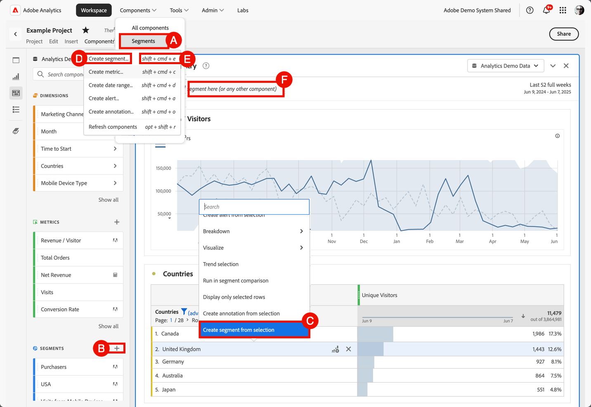

# 创建区段

您可以在Adobe Analytics中创建不同类型的区段。  您选择的类型取决于区段需要达到的复杂程度以及区段是应仅应用于当前Workspace项目还是应应用于所有项目。 可直接在Adobe Analytics的主界面中或在Workspace项目中工作时创建区段。

[按角色划分的区段权限](/help/components/segmentation/seg-reference/seg-rights.md)说明谁可以创建区段。

可通过以下方式创建区段：

* **A**。在主界面中，选择&#x200B;**[!UICONTROL 组件]**&#x200B;并选择&#x200B;**[!UICONTROL 区段]**。 从[[!UICONTROL 区段]管理器](seg-manage.md)中选择 [!UICONTROL **[!UICONTROL Add]**]。
* **B**。在Workspace项目中，从“组件”左侧面板中选择 **区段**&#x200B;上的。
* **C**。在Workspace项目中，从可视化图表的上下文菜单中，选择&#x200B;**[!UICONTROL 从所选内容创建区段]**。
* **D**。在Workspace项目中，从菜单中选择&#x200B;**[!UICONTROL 组件]**，然后选择&#x200B;**[!UICONTROL 创建区段]**。
* **E**。在Workspace项目中，使用快捷键&#x200B;**[!UICONTROL shift+cmd+e]** (macOS)或&#x200B;**[!UICONTROL shift+ctrl+e]** (Windows)。
* **F**。选择&#x200B;***在此处放置区段（或任何其他组件）***&#x200B;放置区域中的。 此操作创建一个仅用于项目的区段。

要定义新区段，请使用[区段生成器](seg-build.md)。

当您在Workspace项目中时，还可以使用[快速区段](seg-quick.md)快速创建区段。
