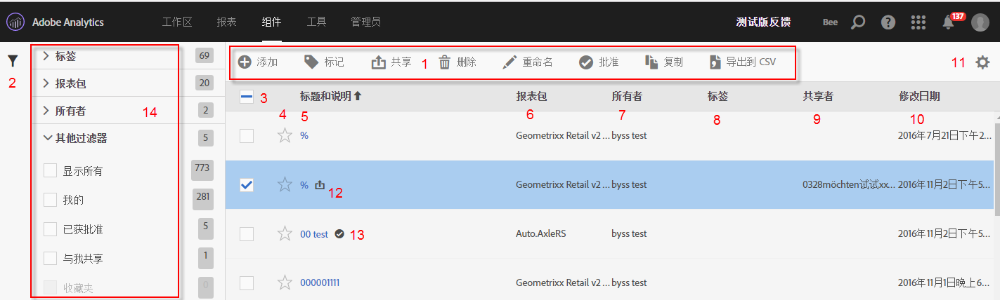

# 管理区段

区段管理器提供了许多种管理区段的方式，如共享、过滤、标记、批准、复制、删除和标记为收藏。

Analytics 区段管理器显示了您拥有的所有区段以及共享给您的所有区段。管理员级别的用户可以查看组织内的所有区段。此概述说明了用户界面和区段管理器的功能。访问区段管理器的方法如下：

* 在顶部导航中，转到 **[!UICONTROL Analytics]** > **[!UICONTROL 组件]** > **[!UICONTROL 区段]**。
* 显示一个现有报表，然后单击左侧导航中的“区段”图标 。接下来，单击&#x200B;**[!UICONTROL 管理]**。

## 操作方法视频 {#section_B3C5DA22DC5248DBA17C56E03DA2D4F2}

这段 [Adobe Analytics 视频](https://docs.adobe.com/content/help/zh-Hans/analytics-learn/tutorials/components/segmentation/segment-management-and-sharing.html)简要概述了区段管理器的使用方法。

## 区段管理器用户界面 {#section_7FDCD12949BE4741A402DB83AB7B37DF}

| # | UI 功能 | 描述 |
|---|---|---|
| 1 | 区段管理工具栏 | 选中某个区段后，此工具栏将显示。大多数管理任务都可以通过此工具栏完成。 |
| 2 | 显示过滤器 | 单击过滤图标可调出过滤菜单。您可以按“标记”、“所有者”、“全部显示”（仅管理员）、“我的”、“收藏”、“已批准”和“已与我共享”进行过滤。 |
| 3 | 复选框 | 选中某个区段可管理该区段。 |
| 4 | 收藏夹 | 单击区段旁边的星形标记可将该标记变为黄色并将此区段标记为收藏。 |
| 5 | 区段标题和描述 | 在区段生成器中提供。要编辑标题和描述，请单击标题链接，这可以让您返回区段生成器。 |
| 6 | 报表包 | 此列指示区段最后保存的报表包。 |
| 7 | 所有者 | 指示区段的所有者。如果是非管理员，则只能看到您拥有的区段或与您分享的区段。 |
| 8 | 标记（在列选择器中未选择，因此列不显示） | 应用到区段的标记，由您或与您共享该区段的人添加。 |
| 9 | 共享人 | 列出您共享该区段的个人或组（仅管理员）或所有人（仅管理员）。 |
| 10 | 修改日期 | 显示最后一次修改区段的日期。 |
| 11 | 列选择器 | 让您在区段管理器中选择或取消选择列。 |
| 12 | 共享图标 | 表示该区段由您或与您共享。 |
| 13 | 批准图标 | 表示该区段已获管理员批准。 |
| 14 | 过滤器 | 让您查看和选择“标记”、“报表包”、“所有者”和“其他”（“全部显示”、“我的”、“已与我共享”、“已批准”和“收藏”）下的过滤器。 |
