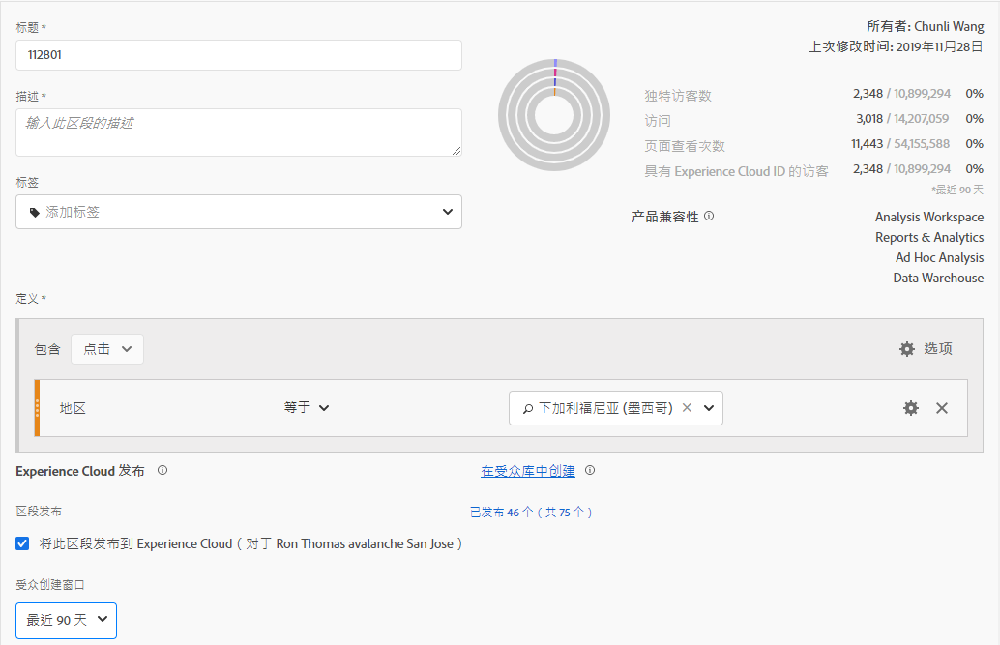

# 发布区段 {#publish-segments}

>[!CONTEXTUALHELP]
>id="components_segments_publishing"
>title="CX Enterprise 发布"
>abstract="您可以将受众发布到受众库，以便在 Target 和其他 CX Enterprise 解决方案中用于营销活动。"

>[!CONTEXTUALHELP]
>id="components_segments_audiencelibrary"
>title="受众库"
>abstract="在受众库中创建的区段立即可用，不受 Analytics 更新的影响。"

您可以将Adobe Analytics区段发布到CX Enterprise。 因此，您可以将该区段用于Audience Manager和其他激活渠道（包括Advertising、Target和Campaign）中的营销活动。

您可以在8小时内将Analytics区段发布到CX Enterprise。 使用这些区段将 Audience Manager 中的受众激活到所有下游目标。

>[!BEGINSHADEBOX]

观看演示视频的[发布区段](https://experienceleague.adobe.com/en/docs/analytics-learn/tutorials/integrations/experience-cloud/improved-experience-cloud-audience-publishing){target="_blank"}。

>[!ENDSHADEBOX]

>[!NOTE]
>
>Adobe Campaign（Classic 和 Standard）的行为方式不同，因为它在 8 小时延迟的基础之上会额外产生 24 小时的延迟。

## 先决条件

* 确保要保存此区段的目标报表包为CX Enterprise [启用了](/help/components/segmentation/segmentation-workflow/seg-publish.md)。 否则，您无法将其发布到CX Enterprise。
* 确保您的组织使用的是 Experience Cloud ID。
* 在发布区段之前，您的管理员需要先在[管理控制台](https://experienceleague.adobe.com/zh-hans/docs/core-services/interface/administration/admin-tool-experience-cloud)中向产品配置文件分配“[!UICONTROL 区段发布]”权限，并将您添加到产品配置文件中。

## 注意事项

* **报告包限制**：每个报告包最多可发布 75 个区段。 此限制是强制实施的。 如果已发布 75 个区段，则只有在取消发布足够数量的区段，使区段数量低于 75 个区段的阈值后，才能发布任何其他区段。
* **成员资格限制**：从Adobe Analytics共享到CX Enterprise的受众数量不能超过2000万个独特成员。
* **数据隐私**：受众并非基于访客的身份验证状态进行过滤。 访客可能能够在未验证和已验证状态下浏览您的网站。 在访客未经过身份验证时发生的操作仍可能会导致将访客包含在受众中。 请查看[Adobe CX Enterprise隐私](https://www.adobe.com/cn/privacy/experience-cloud.html)，了解受众共享对隐私的全面影响。
* 有关[!DNL Adobe Analytics]和Audience Manager **中区段之间的**&#x200B;差异的讨论，请参阅[了解Analytics和Audience Manager中的区段](/help/integrate/c-audience-analytics/aam-analytics-segments.md)。

## 区段发布时间轴

| 可用内容 | 可用时间 | 可用位置 |
|---|---|---|
| 元数据（区段标题和定义） | 发布后立即 | Audience Manager 、 CX Enterprise Audience Library 、 Target |
| 具有会员资格的可用区段 | 发布后约 8 小时 | Audience Manager中的访客资料查看器 |
| 特性和会员人群 | 24 - 48 小时内 | Audience Manager |

>[!NOTE]
>每周一次，所有数据都会完全同步，以考虑上周未捕获的任何增量或差异。

## 在[!UICONTROL 区段生成器]中发布区段

1. 在Adobe Analytics中，转到&#x200B;**[!UICONTROL 组件]** > **[!UICONTROL 区段]**
1. 选择&#x200B;**[!UICONTROL 添加]**以创建新区段。
   
1. 提供区段的标题和描述。 在保存区段之前，需要填写这些字段。
1. 在&#x200B;**[!UICONTROL Experience Cloud发布]**&#x200B;部分中，选择选项&#x200B;**[!UICONTROL 将此区段发布到Experience Cloud（对于&#x200B;*报表包*）]**。

   >[!IMPORTANT]
   >
   >将Experience Cloud数字与Audience Manager数字进行比较时，请确保在&#x200B;**[!UICONTROL 数据预览]**&#x200B;中监视&#x200B;**[!UICONTROL 具有Adobe Analytics ID]**&#x200B;的访客，而不是&#x200B;**[!UICONTROL 独特访客]**。
   >

| 元素 | 描述 |
|---|---|
| **[!UICONTROL 将此区段发布到Experience Cloud（对于&#x200B;*报表包*）]** | 启用此选项后，区段标题和定义会立即与CX Enterprise共享，而区段成员资格则每4小时进行一次评估和共享。  例如，当该受众与Target中的某个活动关联时，[!DNL Analytics]将开始发送具有CX Enterprise和Target受众资格的访客的ID。 此时，受众名称和相应的数据开始显示在CX Enterprise的[!DNL Audience Library]页上。  |
| **[!UICONTROL 受众创建窗口]** | 您选择的时间范围用于按滚动日历创建受众。 例如，**[!UICONTROL 最近30天]**（默认）包括从今天日期（不是创建区段的原始日期）起最近30天内符合受众条件的访客。 |
| **[!UICONTROL 在受众库中创建]** | 在CX Enterprise中，您创建和发布的区段可在[!DNL Audience Library]页面上无延迟地提供。 它们不依赖于 Analytics 更新。 这些区段不会计入 75 个已发布区段的限制。 |
| **[!UICONTROL 已发布 x 个（限制为 75 个）]** | 已发布到CX Enterprise的区段数。 单击该链接可查看已发布的区段，及其关联的报告包和所有者的列表。 |
| **[!UICONTROL 保存]** | 保存此区段。 |

## 取消发布或删除区段

>[!CAUTION]
>
>要删除已发布到CX Enterprise的区段，必须先取消发布该区段。 要取消发布区段，只需取消选择&#x200B;**[!UICONTROL 将此区段发布到Experience Cloud（对于&#x200B;*报表包*）]**。

>[!NOTE]
>
>您&#x200B;**无法**&#x200B;取消发布以下任何Adobe解决方案当前正在使用的区段： Analytics（在Audience Analytics中）、Campaign、Advertising（适用于核心服务和Audience Manager客户）和所有其他外部合作伙伴（适用于Audience Manager客户）。 您&#x200B;**可以**&#x200B;取消发布Target正在使用的区段。

## 查看区段的发布状态

可发布的Adobe Analytics区段的最大数量为75个。

要查看已发布的区段，请执行以下操作：

1. 在Adobe Analytics中，转到&#x200B;**[!UICONTROL 组件]** > **[!UICONTROL 区段]**。

1. 查看&#x200B;**[!UICONTROL 已发布]**&#x200B;列。 此列中的&#x200B;**[!UICONTROL 是]**&#x200B;表示该区段已发布到CX Enterprise。 **[!UICONTROL 否]**&#x200B;表示该区段未发布。

## 检索Audience Manager UUID

有两种方法可捕获当前与浏览器关联的Adobe Audience Manager UUID：

* Adobe CX企业调试器
* 浏览器中的本机开发人员工具（例如，Chrome Developer Tools）

以下屏幕截图显示了如何在浏览器中检索Adobe Audience Manager UUID，并在Audience Manager访客资料查看器中使用它来验证特征和区段成员资格。

### 方法1：使用Adobe CX Enterprise Debugger

1. 在Chrome网上应用商店中下载并安装[Adobe CX Enterprise Debugger](/help/implement/validate/debugger.md)。
1. 加载页面时启动该调试器。
1. 滚动到Audience Manager部分，然后找到在当前浏览器页面上设置的Adobe Audience Manager UUID
（以下示例中的`35721780439475290181087231320657663953`）

   

### 方法 2：使用 Chrome 开发人员工具（或其他浏览器开发人员工具）

1. 在加载页面之前启动 Chrome 开发人员工具
1. 加载页面，并选中“应用程序”>“Cookie”。 Adobe Audience Manager UUID应在第三方中设置
Demdex Cookie （以下示例中为[adobe.demdex.net](https://experienceleague.adobe.com/en/docs/audience-manager/user-guide/reference/demdex-calls)）。 字段demdex是Adobe Audience Manager UUID集
在浏览器上（以下示例中为`35721780439475290181087231320657663953`）。

   

## 使用 Audience Manager [!UICONTROL 访客轮廓查看器]

默认情况下，加载[!UICONTROL 访客资料查看器]时，浏览器上的Adobe Audience Manager UUID是默认的。 如果验证其他用户的特性实现，请在UUID字段中输入UUID，然后单击[!UICONTROL 刷新]。 请参阅[访客轮廓查看器](https://experienceleague.adobe.com/en/docs/audience-manager/user-guide/features/visitor-profile-viewer)，以了解详细信息。

## 在Audience Manager中查看区段特征

在Adobe Audience Manager中，当Analytics与CX Enterprise共享区段时，将对给定区段的具有ECID的访客列表进行评估。

1. 在Audience Manager中，转到&#x200B;**[!UICONTROL 受众数据]** > **[!UICONTROL 特征]** > **[!UICONTROL Analytics特征]**。 您将看到每个Analytics报表包对应的文件夹，这些报表包已映射到您的CX Enterprise组织。 在启动或置备轮廓和受众/人员核心服务时，将创建这些文件夹（针对特性、区段和数据源）。
1. 选择报表包对应的文件夹，您之前在该报表包中创建了要与Audience Manager共享的区段。 您会看到所创建的区段/受众。 当您共享区段时，Audience Manager中会发生以下两种情况：
   * 将创建一个特性，起初该特性中没有数据。 在 在[!DNL Analytics]中发布该区段大约8小时后，会载入一个ECID列表，并将其与Audience Manager和其他CX Enterprise解决方案共享。

     

   * 将创建一个区段，其中包含一个特性。 该区段使用与您在其中发布该区段的报告包关联的数据源。
   * 特征有效期限现在设置为 16 天（以前为 2 天）。

## 在 [!DNL Adobe Target] 中查看区段

将此区段发布到Experience Cloud **[!UICONTROL 后，该区段即可在Adobe Target的自定义受众库中使用。]**&#x200B;在 Analytics 或 Audience Manager 中创建的区段可用于 Target 中的活动。 例如，您可以根据 Analytics 转化量度和 Analytics 中创建的受众区段，来创建营销活动。

在Adobe Target中：

1. 选择&#x200B;**[!UICONTROL 受众]**。
1. 在&#x200B;**[!UICONTROL 受众]**&#x200B;页面上，找到源自CX Enterprise的受众。 这些受众可在Target活动中使用。

   
