# 生成顺序区段

顺序区段使用 THEN 运算符（而非 AND 或 OR）创建。THEN 意味着出现一个区段标准后，接着出现另一个区段标准。默认情况下，顺序区段会识别所有匹配数据，并显示过滤器“包含每个人”。可以使用“仅在序列前”和“仅在序列后”选项将顺序区段进一步过滤为匹配点击的子集。

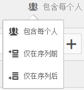

此外，您还可以使用 [After 和 Within 运算符](/help/components/segmentation/segmentation-workflow/seg-sequential-build.md)，将顺序区段限制为检查点之间的特定时间段、粒度和计数。

以下是一段关于顺序区段的视频：

>[!VIDEO](https://video.tv.adobe.com/v/25405/?quality=12)

## 包含每个人 {#section_75ADDD5D41F04800A09E592BB2940B35}

在创建一个设置了“包含每个人”的区段时，该区段能够识别匹配整个给定模式的路径。这是一个基本的序列区段示例，用于查找同一访客访问的一个点击（页面 A）及下一个点击（页面 B）。将区段设置为“包含每个人”。

| 如果结果为... | 序列 |
|--- |--- |
| 匹配 | A -> B A ->（在不同的访问中）B A -> D -> B |
| 不匹配 | B -> A |

## “仅在序列前”和“仅在序列后” {#section_736E255C8CFF43C2A2CAAA6D312ED574}

**[!UICONTROL 仅在序列前]**&#x200B;和&#x200B;**[!UICONTROL 仅在序列后]**&#x200B;选项可将区段过滤为指定序列之前或之后的数据子集。

* **仅在序列前**：包含序列之前的所有点击 + 该序列自身的第一次点击（见示例 1、3）。如果序列在路径中出现多次，则“仅在序列前”包括该序列最后一个实例的第一次点击和之前的所有点击（见示例 2）。
* **仅在序列后**：包含序列之后的所有点击 + 该序列自身的最后一次点击（见示例 1、3）。如果序列在路径中出现多次，则“仅在序列后”包括该序列首个实例的最后一次点击和之后的所有点击（见示例 2）。

以 B -> D 序列为例。三种过滤器将按以下方式确定点击量：

**示例 1：B -> D 出现一次**

| 示例 | A | B | C | D | E | F |
|---|---|---|---|---|---|---|
| 包含每个人 | A | B | C | D | E | F |
| 仅在序列前 | A | B |  |  |  |  |
| 仅在序列后 |  |  |  | D | E | F |

**示例 2：B -> D 出现多次**

| 示例 | A | B | C | D | B | C | D | E |
|---|---|---|---|---|---|---|---|---|
| 包含每个人 | A | B | C | D | B | C | D | E |
| 仅在序列前 | A | B | C | D | B |  |  |  |
| 仅在序列后 |  |  |  | D | B | C | D | E |

我们还可以使用“点击深度”维度来描述这个概念。

**示例 3：点击深度 3 -> 5**

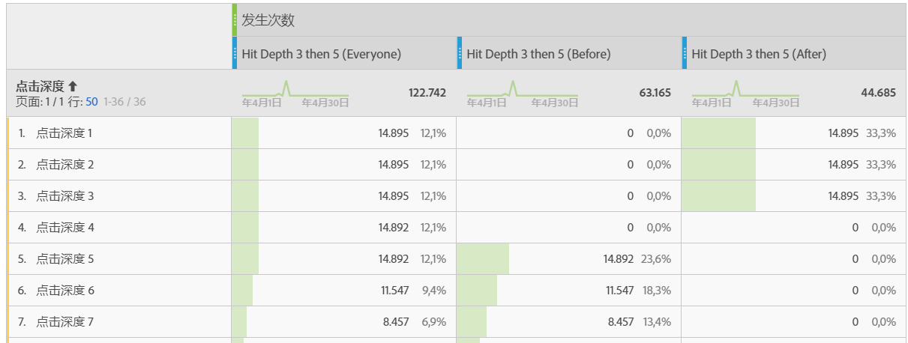

## 维度约束 {#section_EAFD755F8E674F32BCE9B642F7F909DB}

在 THEN 语句之间的“within”子句中，您可以添加“在 1 个搜索关键词实例之内”、“在 1 个 eVar 47 实例之内”。此条件可将区段限制在维度的一个实例之内。

在规则之间设置“在维度之内”子句，能够使区段将数据限制为满足此子句的序列。请参见以下示例，其中约束条件被设置为“在 1 个页面之内”：

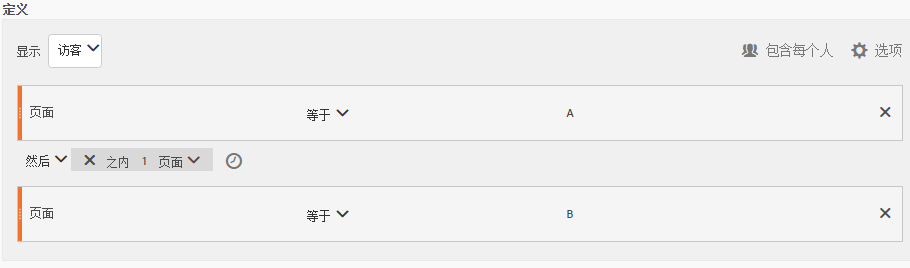

| 如果结果为... | 序列 |
|--- |--- |
| 匹配 | A -> B |
| 不匹配 | A -> C -> B（因为 B 不在 A 的 1 个页面之内） **注意：**&#x200B;如果取消维度限制，则“A -> B”和“A -> C -> B”都将匹配。 |

## 简单页面查看序列

确定查看某个页面并随后查看另一个页面的访客。点击级别数据将过滤该序列，但不考虑之前、过去或中间的访问会话或它们之间的时间或页面查看次数。

**示例**：访客查看了页面 A，然后在同一次访问或其他访问中查看了页面 B。

**用例**

以下是如何使用该区段的示例：

1. 体育站点的访客查看足球登录页面，然后按顺序（但不必在同一次访问中）查看篮球登录页面。这提示促销活动在足球赛季期间向足球观众推送篮球内容。
1. 汽车经销商确定登录客户忠诚度页面，然后在该次访问或另一次访问期间的任何时候转到视频页面的访客之间的关系。

**创建此区段**

在顶级[!UICONTROL 访客]容器中嵌套两个页面规则，然后使用 [!UICONTROL THEN] 运算符序列化页面点击。

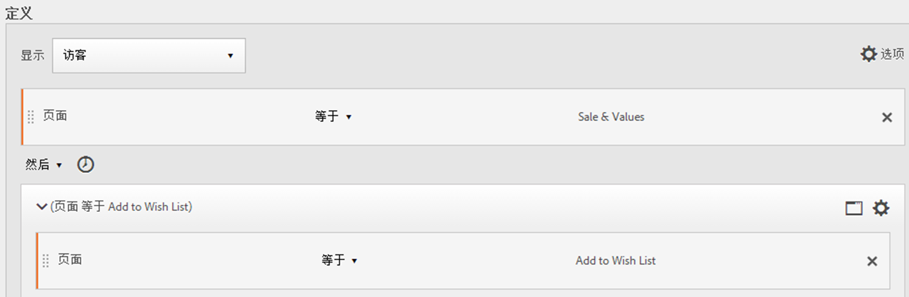

## 跨访问的访客序列

确定退出促销活动但随后在另一个会话中返回页面查看序列的访客。

**示例**：访客在一次访问中查看了页面 A，然后在另一次访问中查看了页面 B。

**用例**

以下是如何使用这种类型区段的示例：

* 访客先访问新闻站点的“体育”页面，然后在另一个会话中再次访问“体育”页面。
* 服装零售商可以查看访客先在一个会话内访问登录页面，然后在另一个会话中直接进入支付页面之间的关系。

**创建此区段**

此示例将两个&#x200B;**[!UICONTROL 访问]**&#x200B;容器嵌套至顶级&#x200B;**[!UICONTROL 访客]**&#x200B;容器，并使用 [!UICONTROL THEN] 运算符对区段进行排序。

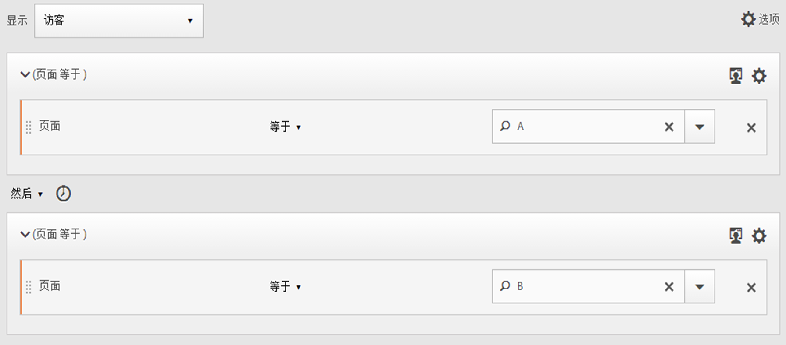

## 混合级别序列

识别在次数不定的访问中查看两个页面，然后在单独的访问中查看第三个页面的访客。

**示例**：访客在一次或多次访问中访问页面 A，然后访问页面 B，随后在单独的访问中访问页面 C。

**用例**

以下是如何使用这种类型区段的示例：

* 访客首先访问新闻站点，然后在同一次访问中查看体育页面。在另一次访问中，访客访问天气页面。
* 经销商确定进入主页，然后转到“我的帐户”页面，并在另一次访问中访问“查看购物车”页面的访客。

**创建此区段**

1. 从左侧窗格中拖动两个页面维度到顶级[!UICONTROL 访客]容器中。
1. 在两个维度之间添加 THEN 运算符。
1. 单击&#x200B;**[!UICONTROL “选项”]**>**[!UICONTROL “添加容器”]**，然后在[!UICONTROL “访客”]级别下添加[!UICONTROL “访问”]容器，并使用 [!UICONTROL THEN] 运算符排列。

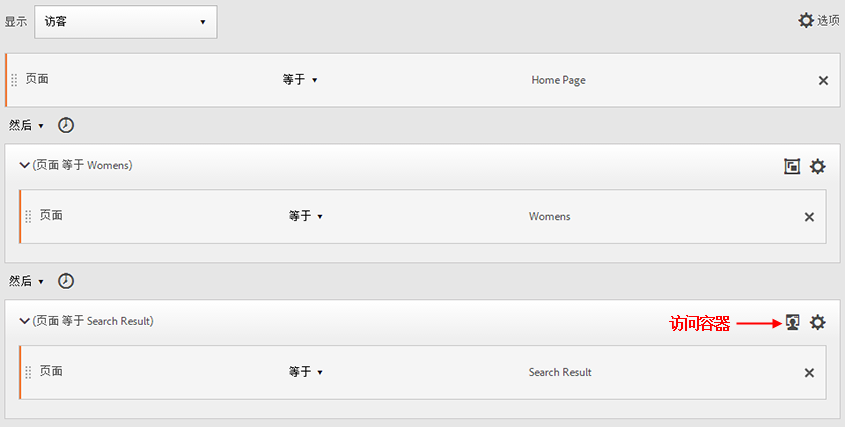

## 汇总容器

通过在[!UICONTROL 访客]容器中添加多个[!UICONTROL 点击]容器，您可以在相同类型的容器之间使用相应的运算符，使用规则和维度（如页数和访问次数）定义页面查看以及在[!UICONTROL 点击]容器中提供序列维度。通过在点击级别应用逻辑，您可以在[!UICONTROL 访客]容器中的相同点击级别限制和合并匹配项，从而生成各种不同类型的区段。

**示例**：在页面查看序列中的第一次点击（示例中的页面 D）后，访客访问页面 A，然后访问页面 B 或页面 C，而与访问次数无关。

**用例**

以下是如何使用这种类型区段的示例：

* 确定在一次访问中转到主登录页面，然后在另一次访问中查看男士服装页面，接着在其他访问中查看女士或儿童服装登录页面的访客。
* e-zine 捕获在一次访问中转到主页，在另一次访问中查看体育页面，在其他访问中查看意见页面的访客。

**创建此区段**

1. 选择[!UICONTROL 访客]容器作为顶级容器。
1. 添加两个[!UICONTROL 点击]级别容器，这是一个使用 [!UICONTROL AND] 和 [!UICONTROL OR] 运算符在相同[!UICONTROL 点击]级别联接相应数值维度的维度。
1. 在[!UICONTROL 访问]容器中，再添加一个[!UICONTROL 点击]容器，并嵌套两个使用 [!UICONTROL OR] 或 [!UICONTROL AND] 运算符联接的其他[!UICONTROL 点击]容器。

   使用 [!UICONTROL THEN] 运算符排列这些嵌套的[!UICONTROL 点击]容器。

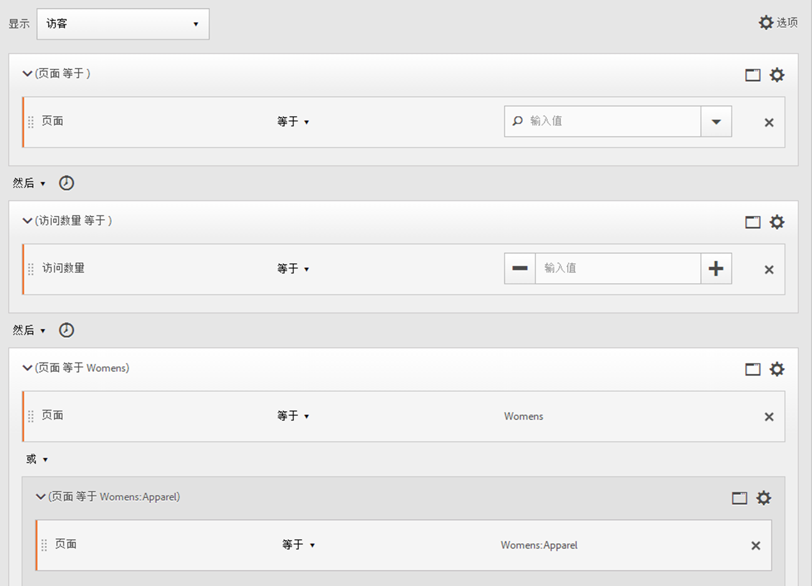

## 在顺序区段中“嵌套”

通过在[!UICONTROL 访问]和[!UICONTROL 点击]级别放置检查点，您可以限制区段以满足特定访问以及特定点击中的要求。

**示例**：访客访问了页面 A，然后在同一访问中访问了页面 B。接下来，访客在新的访问中访问页面 C。

**创建此区段**

1. 在顶级[!UICONTROL 访问]容器下，拖入两个页面维度。
1. 通过多选选择两个规则，单击“选项”****>“从选择添加容器”****，然后将其更改为[!UICONTROL 访问]容器。
1. 使用 [!UICONTROL THEN] 运算符将二者联接起来。
1. 创建一个点击容器作为[!UICONTROL 访问]容器的对等容器并拖入一个页面维度。
1. 使用另一个 [!UICONTROL THEN] 运算符，将[!UICONTROL 访问]容器中的嵌套序列与[!UICONTROL 点击]容器联接在一起。

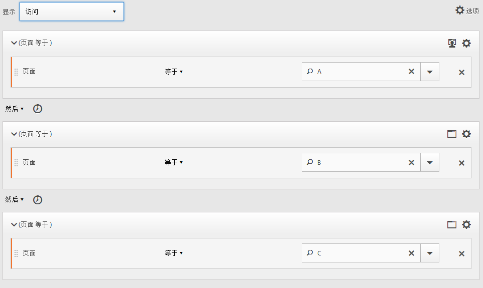

## 排除点击

区段规则包括所有数据，除非您明确使用[!UICONTROL 排除]规则排除[!UICONTROL 访客]、[!UICONTROL 访问]或[!UICONTROL 点击]数据。这样，您就可以排除一般数据，创建更具目标性的区段。或者，您可以在创建区段时排除找到的组，以确定其余数据集，例如，创建一个规则以包括成功下订单的访客，然后将他们排除以确定非顾客。不过，在大多数情况下，最好创建规则以[!UICONTROL 排除]大多数的值，而不是尝试使用排除规则排除特定的包含值。

例如：

* **排除页面**。使用区段规则从报告中排除特定页面(如 *`Home Page`*)，创建页面等于“Home Page”的点击规则，然后将其排除。 此规则自动包括 Home Page 以外的所有值。
* **排除反向链接域**。使用仅包括 Google.com 中的反向链接域并排除所有其他域的规则。
* **确定非顾客**。确定订单大于零的[!UICONTROL 访客]，然后将其排除。

可以使用 [!UICONTROL Exclude] 运算符确定访客没有执行特定访问或点击的序列。[!UICONTROL 排除检查点] 也可包含在 [逻辑组](/help/components/segmentation/segmentation-workflow/seg-sequential-build.md).

### 检查点之间排除

执行逻辑以细分符合以下条件的访客：某个检查点没有明确出现在两个其他检查点之间。

**示例**：访客访问了页面 A，然后访问页面 C，但未访问页面 B。

**用例**

以下是如何使用这种类型区段的示例：

* 访客访问“日常生活”页面，然后访问“剧院”部分，但未访问“艺术”页面。
* 汽车零售商可以看到那些先访问主登录页面，然后不访问“汽车”页面而直接进入“免付利息”促销活动的访客之间的关系。

**创建此区段**

像创建简单的混合级别顺序区段或嵌套顺序区段一样创建一个区段，然后为容器元素设置 [!UICONTROL EXCLUDE] 运算符。下面的示例是一个聚合区段，其中将三个[!UICONTROL 点击]容器拖到画布中，分配 [!UICONTROL THEN] 运算符以联接容器逻辑，然后排除中间的页面查看容器以仅包含从序列中的页面 A 访问页面 C 的访客。

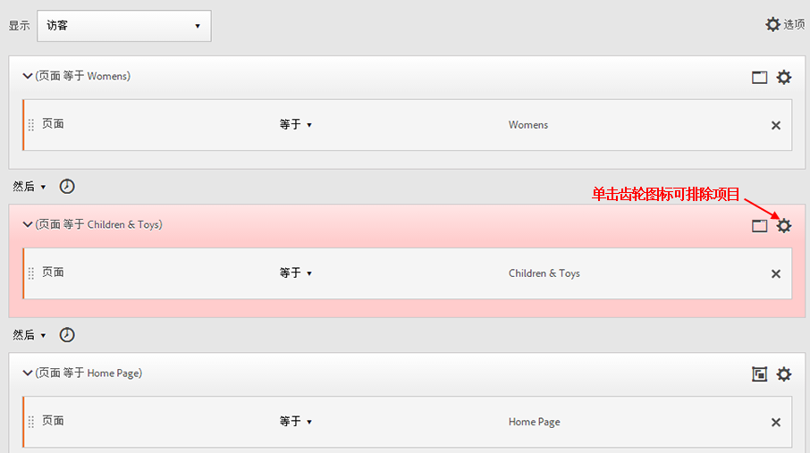

### 序列开头排除

如果排除检查点位于顺序区段开头，则它确保排除的页面查看不会位于第一个非排除的点击前面。

例如，餐厅想要查看倾向于避开主登陆页面直接转到“下单”页面的用户。 您可以查看此数据，方法是在一个顺序区段中排除对登陆页面的点击，并包括对“下订单”页面的点击。

**创建此区段**

在顶级“访客”容器中创建两个单独的“点击”容器。然后，为第一个容器设置 [!UICONTROL EXCLUDE] 运算符。

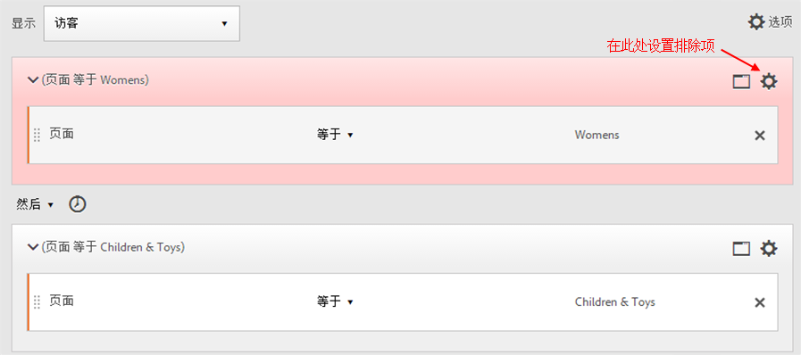

### 序列末尾排除

如果排除检查点位于序列末尾，则它确保在上一非排除的检查点和访客序列结束之间不会出现检查点。

例如，一家服装店希望查看所有查看过产品页面但之后从未访问过购物车的访客。 此示例可以简化为访客访问页面 A，然后在当前或后续访问中永远不会访问页面 B。

**创建此区段**

生成简单顺序区段，方法是：将两个[!UICONTROL 点击]容器拖到画布中，然后使用 [!UICONTROL THEN] 运算符连接它们。接下来，将 [!UICONTROL EXCLUDE] 运算符分配给序列中的第二个[!UICONTROL 点击]容器。

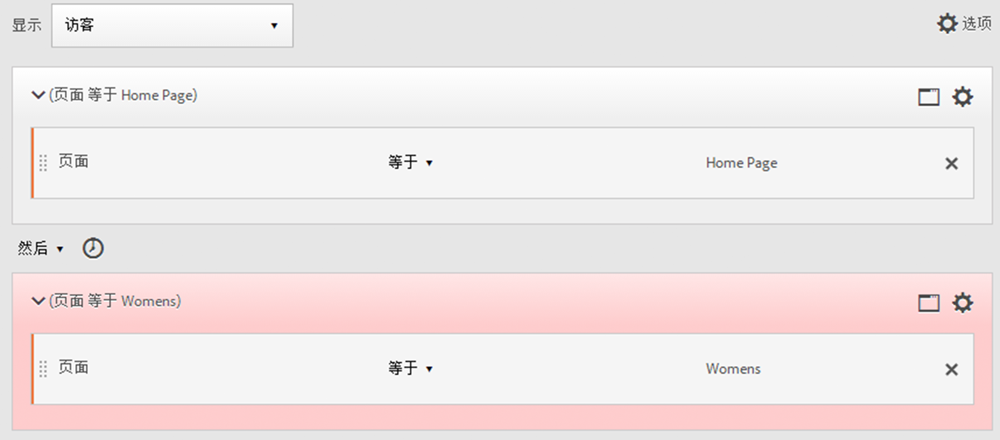

## 逻辑组容器

将条件分组到一个顺序区段检查点时，需要使用逻辑组容器。特殊逻辑组容器仅在顺序区段中可用，以确保其条件在任何先前顺序检查点之后和任何后续顺序检查点之前都得到满足。可以按任意顺序满足逻辑组检查点自身内的条件。相反，非顺序容器（点击、访问、访客）不要求在整个序列中满足其条件，因此，如果与 THEN 运算符一起使用，则会产生不直观的结果。[!UICONTROL 逻辑组]容器设计为“将多个检查点视为一个组”**，在分组检查点中“不进行任何排序”**。换句话说，我们不关心该组内检查点的顺序。例如，无法在[!UICONTROL 访客]容器中嵌套[!UICONTROL 访客]容器。但是，您可以将[!UICONTROL 逻辑组]容器嵌套在具有特定[!UICONTROL 访问]和[!UICONTROL 点击]级别检查点的[!UICONTROL 访客]容器中。

>[!NOTE]
>
>[!UICONTROL 逻辑组]只能在顺序区段中定义，这意味着表达式中会使用 [!UICONTROL THEN] 运算符。

| 容器层次结构 | 插图 | 定义 |
|---|---|---|
| 标准容器层次结构 |  | 在[!UICONTROL 访客]容器中，按顺序嵌套[!UICONTROL 访问]和[!UICONTROL 点击]容器，以便根据点击数、访问次数和访客提取区段。 |
| 逻辑容器层次结构 |  | 在[!UICONTROL 逻辑组]容器外部，也需要使用标准容器层次结构。但在[!UICONTROL 逻辑组]容器内，检查点不需要采用设置的顺序或层次结构；采用任意顺序的访客都可以满足这些检查点的要求。 |

逻辑组可能看起来令人望而却步，以下是一些关于如何使用逻辑组的最佳实践：

**逻辑组容器，还是点击/访问容器？**
如果要对顺序检查点进行分组，则“容器”为逻辑组容器。但是，如果这些顺序检查点必须出现在单个点击或访问范围内，则需要使用“点击”或“访问”容器。（当然，当一次点击可能只计入一个检查点时，“点击”对于一组顺序检查点没有意义）。

**逻辑组是否可以简化顺序区段的生成过程？**
是的，可以。假设您试图识别以下访客区段：**查看了页面 A，然后又依次查看了页面 B、C 和 D 的访客**

您可以不使用逻辑组容器生成此区段，但是这样既费时又费力。您必须指定访客可以查看的每个页面序列：
* `Visitor Container [Page A THEN Page B THEN Page C THEN Page D] or`
* `Visitor Container [Page A THEN Page B THEN Page D THEN Page C] or`
* `Visitor Container [Page A THEN Page C THEN Page B THEN Page D] or`
* `Visitor Container [Page A THEN Page C THEN Page D THEN Page B] or`
* `Visitor Container [Page A THEN Page D THEN Page B THEN Page C] or`
* `Visitor Container [Page A THEN Page D THEN Page C THEN Page B]`

逻辑组容器可以大大简化生成此区段的过程，如下所示：

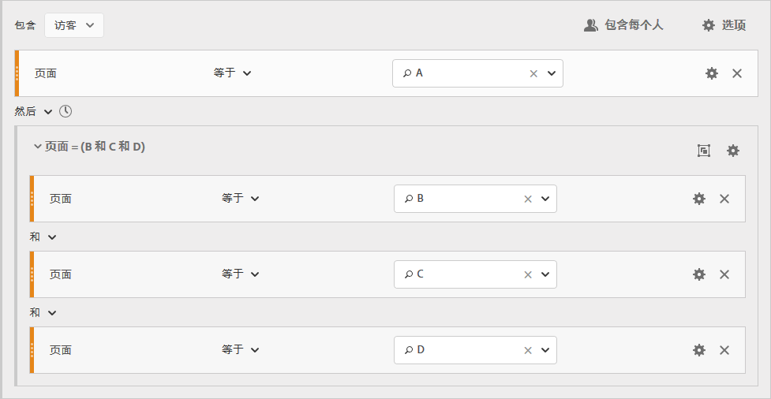

### 生成逻辑组区段 {#section_A5DDC96E72194668AA91BBD89E575D2E}

与其他容器一样，[!UICONTROL 逻辑组]容器也可以在[!UICONTROL 区段生成器]中以多种方式生成。下面是嵌套[!UICONTROL 逻辑组]容器的首选方法：

1. 从左侧窗格拖动维度、事件或区段。
1. 将顶部容器更改为[!UICONTROL 访客]容器。
1. 将默认插入的 [!UICONTROL AND] 或 [!UICONTROL OR] 运算符更改为 THEN 运算符。
1. 选择[!UICONTROL 点击]容器（维度、事件或项目）并单击“选项”****>“从选择添加容器”****。
1. 单击容器图标并选择&#x200B;**[!UICONTROL 逻辑组]**。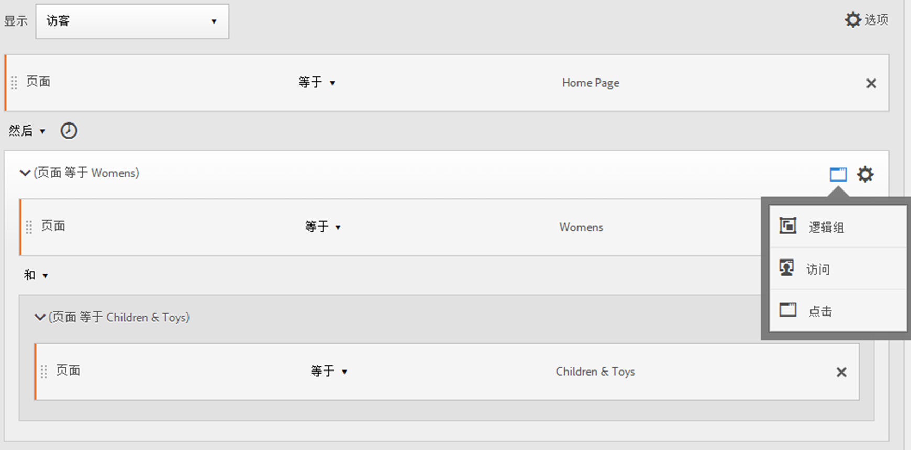
1. 现在，您可以在[!UICONTROL 逻辑组]容器中设置[!UICONTROL 点击]，而与层次结构无关。

### 采用任意顺序的逻辑组检查点

通过使用[!UICONTROL 逻辑组]，您可以满足该组中不在序列范围内的条件。这样，您就可以生成一些区段，其中的[!UICONTROL 访问]或[!UICONTROL 点击]容器不采用正常的层次结构。

**示例**：访客访问了页面 A，然后按任意顺序访问了页面 B 和页面 C。

**创建此区段**

将页面 B 和 C 嵌套到外部[!UICONTROL 访客]容器的[!UICONTROL 逻辑组]容器中。页面 A 的[!UICONTROL 点击]容器后跟[!UICONTROL 逻辑组]容器，并使用 [!UICONTROL AND] 运算符指定页面 B 和 C。由于它位于[!UICONTROL 逻辑组]中，因此，未定义该序列，按任意顺序点击页面 B 或 C 将满足该条件。

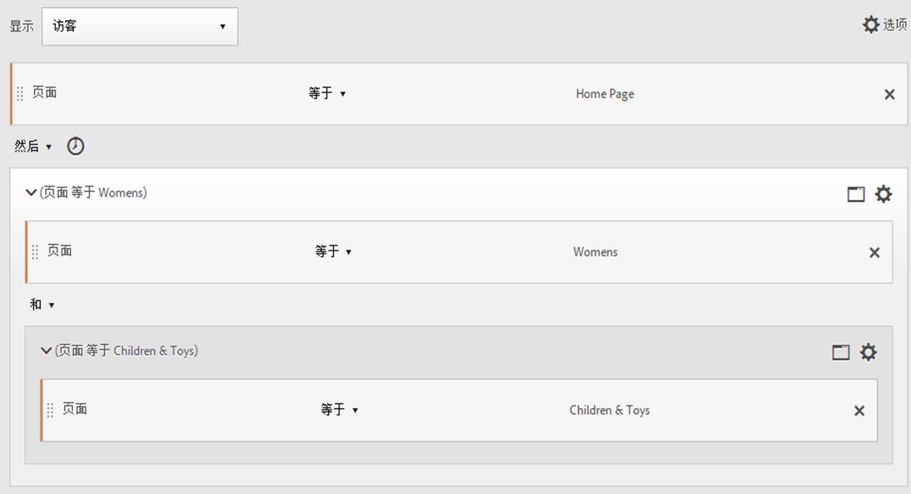

**另一个示例**：访客访问了页面 B 或页面 C，然后访问了页面 A：

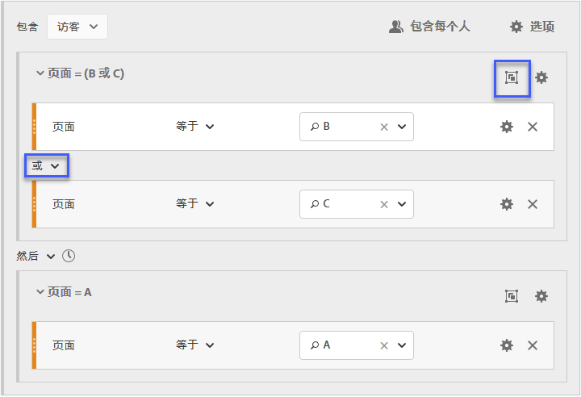

区段必须匹配逻辑组的至少一个检查点（B 或 C）。此外，可在同一点击中或在多次点击中满足逻辑组条件。

### 逻辑组第一个匹配

通过使用[!UICONTROL 逻辑组]，您可以满足该组中不在序列范围内的条件。在该无序的第一个匹配区段中，先将[!UICONTROL 逻辑组]规则指定为页面 B 或页面 C 的页面查看，然后指定为页面 A 的所需查看。

**示例**：访客访问了页面 B 或页面 C，然后访问了页面 A。

**创建此区段**

在[!UICONTROL 逻辑组]容器中放入页面 B 和页面 C 维度并选择 [!UICONTROL OR] 运算符，然后[!UICONTROL 点击]容器将页面 A 的页面查看识别为该值。

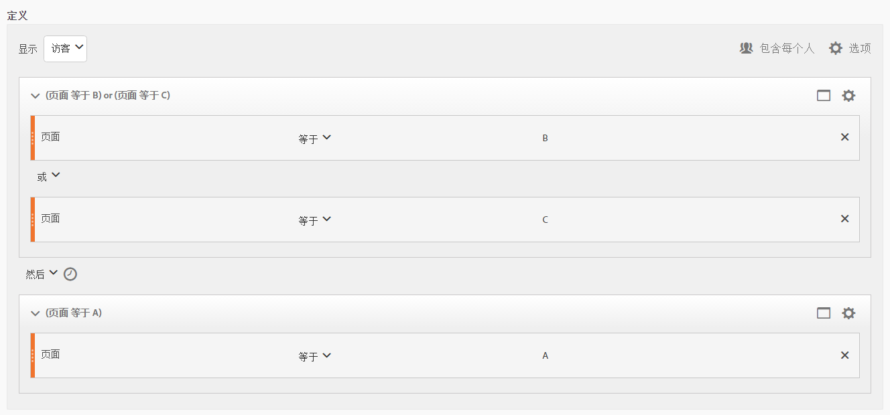

### 逻辑组排除 AND

使用[!UICONTROL 逻辑组]生成区段，其中聚合多个页面查看以定义需要点击的页面，同时明确跳过其他页面。****

**示例**：访客访问了页面 A，然后明确不访问页面 B 或 C，但点击页面 D。

**创建此区段**

从左窗格中拖动维度、事件和预生成的区段以生成该区段。请参阅[生成逻辑组区段](/help/components/segmentation/segmentation-workflow/seg-sequential-build.md)。

在[!UICONTROL 逻辑组]中嵌套这些值后，单击&#x200B;**[!UICONTROL 逻辑组]**&#x200B;容器中的[!UICONTROL 排除]按钮。

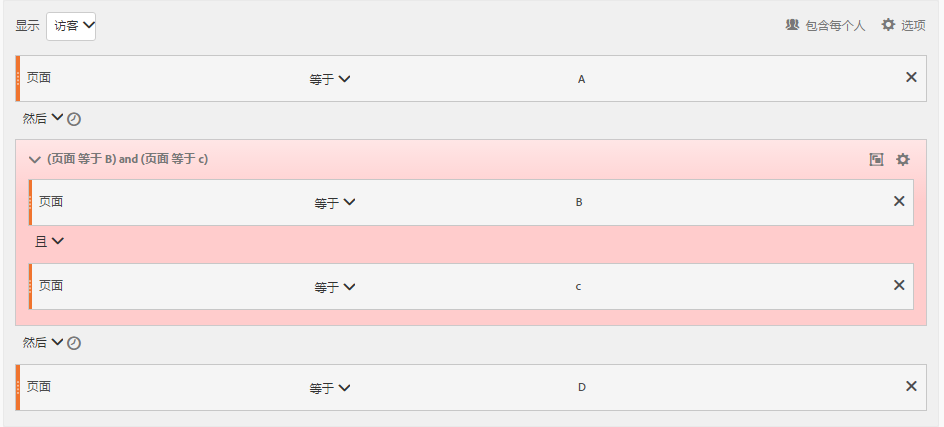

### 逻辑组排除 OR

使用[!UICONTROL 逻辑组]生成区段，其中聚合多个页面查看以定义需要点击的页面，同时明确跳过其他页面。

**示例**：访客访问了页面 A，但在页面 A 之前没有访问页面 B 或页面 C。

**创建此区段**

在排除的[!UICONTROL 逻辑组]容器中指定初始页面 B 和 C，然后访客点击页面 A。

从左窗格中拖动维度、事件和预生成的区段以生成该区段。

在[!UICONTROL 逻辑组]中嵌套这些值后，单击&#x200B;**[!UICONTROL 逻辑组]**&#x200B;容器中的[!UICONTROL 排除]按钮。

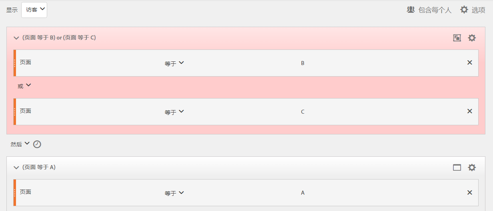

## 生成 Time-Within 和 Time-After 区段

可以使用每个容器标题中内置的 [!UICONTROL Within] 和 [!UICONTROL After] 运算符定义时间、事件和计数。

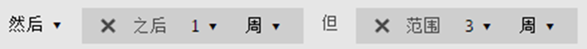

您可以使用 [!UICONTROL Within] 和 [!UICONTROL After] 容器并指定粒度和计数，以将匹配限制为指定的持续时间。[!UICONTROL Within] 运算符用于指定两个检查点之间的时间长度的最大限制。[!UICONTROL After] 运算符用于指定两个检查点之间的时间长度的最小限制。

>[!NOTE]
>
>在类似命名的元素之间求值存在差异，例如 **天** 或 **天**. 对于Within和After的基于时间的定义，利用弹出窗口中列出的第一个选项：
>
>
>
>对于“之内”和“之后”的基于维度的定义，利用子菜单下的选项 *其他Dimension*：
>
>

### After 和 Within 运算符 {#section_CCAF5E44719447CFA7DF8DA4192DA6F8}

持续时间是由表示粒度的单个大写字母以及后面表示粒度重复次数的数字指定的。

**[!UICONTROL Within]** 包括终结点（小于或等于）。

**[!UICONTROL After]** 不包括终结点（大于）。

| 运算符 | 描述 |
|--- |--- |
| AFTER | After 运算符用于指定两个检查点之间的时间长度的最小限制。在设置 After 值后，时间限制将从应用区段时算起。例如，如果在容器上设置 After 运算符以识别访问页面 A，但直到一天后才返回访问页面 B 的访客，那么该时间将从访客离开页面 A 时开始。对于要包含在此区段中的访客，从离开页面 A 后至查看页面 B，必须至少经过 1440 分钟（一天）。 |
| WITHIN | Within 运算符用于指定两个检查点之间的时间长度的最大限制。例如，如果在容器上设置 Within 运算符以识别访问页面 A，然后在一天内返回访问页面 B 的访客，那么该时间将从访客离开页面 A 时开始。要包含在此区段中，访客需要在一天之内打开页面 B。对于要包含在此区段中的访客，在离开页面 A 后至查看页面 B，所经过的时间不能超过 1440 分钟（一天）。 |
| AFTER/WITHIN | 在使用 After 和 Within 运算符时，一定要了解这两个运算符是并行开始和结束的，而不是按顺序开始和结束的。例如，如果生成一个区段并将容器设置为： `After = 1 Week(s) and Within = 2 Week(s)` 则确定区段中的访客的条件仅在 1 周后但在 2 周内满足要求。这两个条件是从第一次页面点击时开始执行的。 |

### 使用 After 运算符

* 通过使用 Time After，您可以按年、月、日、小时和分钟跟踪以匹配访问。
* Time After 只能应用于[!UICONTROL 点击]容器，因为它是定义这种细粒度的唯一级别。

**示例**：访客访问了页面 A，然后仅在 2 周后访问了页面 B。****

**创建区段**：通过添加包含两个[!UICONTROL 点击]容器的[!UICONTROL 访客]容器来创建该区段。然后，您可以设置 [!UICONTROL THEN] 运算符，打开 [!UICONTROL AFTER] 运算符下拉列表并设置星期数。

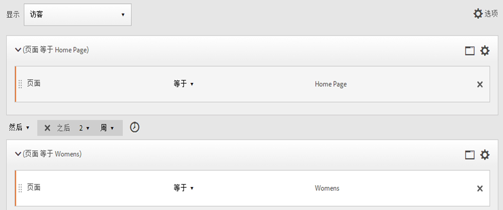

**匹配**

在指定“After 2 weeks”时，如果在 2019 年 6 月 1 日 00:01 点击了页面 A，只要随后在 2019 年 6 月 15 日 00:01（14 天后）之前点击页面 B，该点击就匹配。

| 点击 A | 点击 B | 匹配 |
|--- |--- |--- |
| **A** 点击：2019 年 6 月 1 日，00:01 | **B** 点击：2019 年 6 月 15 日，00:01 | **匹配**：该时间约束了匹配情况，因为该时间是在 2019 年 6 月 1 日之后（两周）。 |
| **A** 点击：2019 年 6 月 1 日，00:01 | **B** 点击：2019 年 6 月 8 日，00:01 B 点击：2019 年 6 月 15 日，00:01 | **不匹配**：页面 B 的第一次点击不匹配，因为它与约束条件（要求在两周后点击）冲突。 |

### 使用 Within 运算符

* 通过使用 [!UICONTROL Within]，您可以按年、月、日、小时和分钟跟踪以匹配访问。
* [!UICONTROL Within] 只能应用于[!UICONTROL 点击]容器，因为它是定义这种细粒度的唯一级别。

>[!TIP]
>
>在 THEN 语句之间的“within”子句中，您可以添加“在 1 个搜索关键词实例之内”、“在 1 个 eVar 47 实例之内”。此条件可将区段限制在维度的一个实例之内。

**示例**：访客访问了页面 A，然后在 5 分钟内访问了页面 B。

**创建区段**：通过添加[!UICONTROL 访客]容器，并拖入两个[!UICONTROL 点击]容器来创建该区段。随后您可以设置 [!UICONTROL THEN] 运算符，并打开 [!UICONTROL AFTER] 运算符下拉列表，然后设置间隔：点击、页面查看、访问、分钟、小时、天、周、月、季度或年。

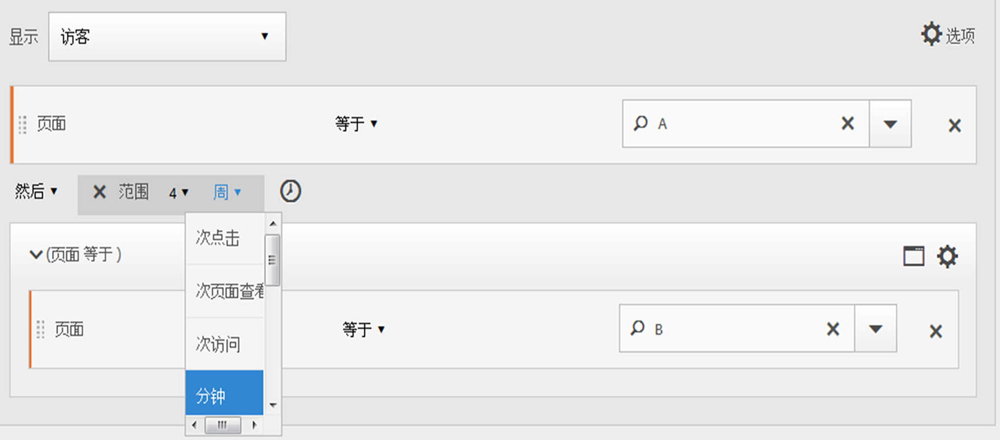

**匹配**

匹配项必须位于时间限制内。对于   表达式，如果访客在 00:01 点击页面 A，只要随后在 00:06（5 分钟后，含 5 分钟）或之前点击页面 B，该点击就匹配。整 5 分钟的点击也匹配。

### Within 和 After 运算符

可以使用 [!UICONTROL Within] 和 [!UICONTROL After] 在区段两端提供最大和最小端点。

**示例**：访客访问了页面 A，然后在两周后但在一个月内访问了页面 B。

**创建区段**：通过在[!UICONTROL 访客]容器中排列两个[!UICONTROL 点击]容器来创建该区段。然后设置 [!UICONTROL After] 和 [!UICONTROL Within] 运算符。

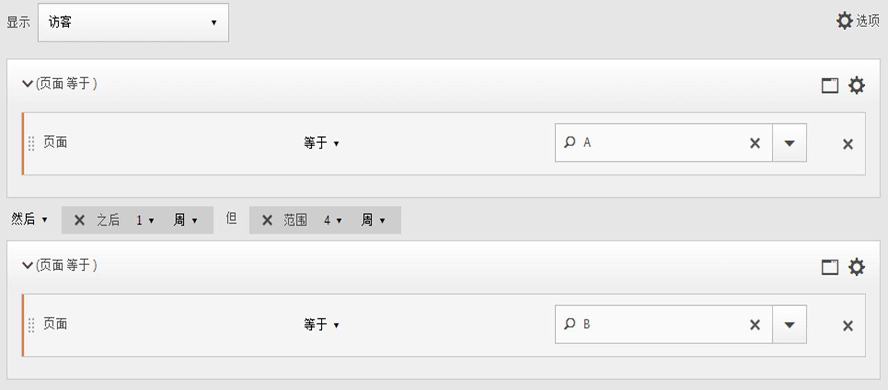

**匹配**

在 2019 年 6 月 1 日点击页面 A 并在 2019 年 6 月 15 日 00:01 之后但在 2019 年 7 月 1 日&#x200B;*之前*&#x200B;返回的任何访客将包含在该区段中。与[排除项之间的时间](/help/components/segmentation/segmentation-workflow/seg-sequential-build.md)进行比较。

可以将 [!UICONTROL After] 和 [!UICONTROL Within] 运算符一起使用以定义顺序区段。

该示例说明在两周后但在一个月内第二次访问以点击页面 B 的情况。
