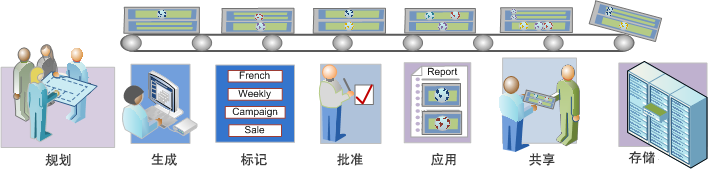

# 分段工作流程概述

描述了使用区段生成器创建并通过区段管理器管理的区段的建议工作流程。

 [计划区段](/help/components/segmentation/segmentation-workflow/seg-plan.md)

在生成区段和设置区段管理环境之前，是否提出了所有该问的问题？设计的区段是否符合其预期目标和拥有明确的用途？

请参阅区段规划核对清单，以帮助您规划和组织区段。

 [生成区段](/help/components/segmentation/segmentation-workflow/seg-build.md)

生成和编辑区段以便在所有 Analytics 功能中使用。

有关如何使用THEN运算符生成区段的信息，请参阅[生成顺序区段](/help/components/segmentation/segmentation-workflow/seg-sequential-build.md)。

 [标记区段](/help/components/segmentation/segmentation-workflow/seg-tag.md)

为区段加标签便于整理和共享。请参阅如何规划和分配标签以进行简单和高级搜索和整理。

 [批准区段](/help/components/segmentation/segmentation-workflow/seg-approve.md)

批准区段作为规范区段。

 [应用区段](/help/components/segmentation/segmentation-workflow/t-seg-apply.md)

您可以在报表中直接从区段边栏（“显示区段”）应用区段。

 [共享区段](/help/components/segmentation/segmentation-workflow/t-seg-share.md)

将您的区段与其他 Analytics 工具中的目标受众共享，以及共享到 Adobe Target 和 Adobe Marketing Cloud。

 [筛选区段](/help/components/segmentation/segmentation-workflow/t-seg-filter.md)

按照标记、所有者和其他过滤器（全部显示、我的、已与我共享、收藏和已批准）进行过滤。

 [将区段标记为收藏](/help/components/segmentation/segmentation-workflow/t-seg-favorite.md)

将区段标记为收藏是另一种组织区段以便于使用的方式。

[管理区段](/help/components/segmentation/segmentation-workflow/seg-manage.md)

区段管理器提供多种编排区段的方式，如共享、过滤、标记、批准、复制、删除和标记为收藏。
