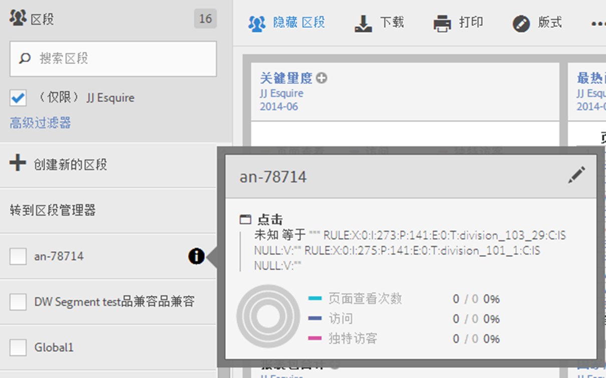
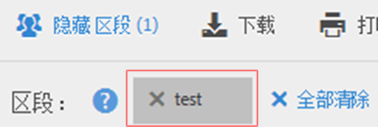

# 使用区段

要在Analysis Workspace中使用区段，您只需从组件边栏中的&#x200B;**[!UICONTROL 区段]**&#x200B;中拖动一个或多个区段并放置在：

* Analysis Workspace中的[面板](/help/analyze/analysis-workspace/c-panels/panels.md)，用于划分面板中的所有可视化图表。
* Analysis Workspace中[自由格式表](/help/analyze/analysis-workspace/visualizations/freeform-table/freeform-table.md)中的标题行用于替换维度。
* Analysis Workspace中[自由格式表](/help/analyze/analysis-workspace/visualizations/freeform-table/freeform-table.md)中的一行用于启动划分。
* Analysis Workspace中[自由格式表](/help/analyze/analysis-workspace/visualizations/freeform-table/freeform-table.md)中的列，用于添加或替换列或启动过滤器。
* 配置可视化面板或允许放置区段的面板。 例如，在[区段比较](/help/analyze/analysis-workspace/c-panels/c-segment-comparison/segment-comparison.md)面板或[关键量度](/help/analyze/analysis-workspace/visualizations/key-metric.md)摘要可视化中
* 区段[的](/help/components/segmentation/segmentation-workflow/seg-build.md#definition-builder)定义生成器，因此在区段定义中包含区段。
* 计算量度的[定义生成器](/help/components/c-calcmetrics/c-workflow/cm-workflow/c-build-metrics/cm-build-metrics.md#definition-builder)，因此您需要在计算量度定义中包含区段。

<!--
How to apply one or more segments to a report from the segment rail.

1. Bring up the report to which you want to apply a segment, for example the [!UICONTROL Pages Report].
1. Click **[!UICONTROL Show Segments]** above the report. The segment rail opens.

   

1. Mark the checkbox next to one or more of the segments or **[!UICONTROL Search Segments]** to find the right segment.

   >[!NOTE]
   >
   >You can apply more than one segment to a report (this is called segment stacking). When multiple segments are applied, the criteria in each segment is combined using an 'and' operator and then applied. There is no limit to how many segments you can stack.

   >[!NOTE]
   >
   >Clicking the Information icon (i) next to the segment name lets you preview the key metrics to see whether you have a valid segment and how broad the segment is.

1. You can filter by report suite by selecting the **[!UICONTROL (Only) `<report suite name>`]** check box. This will show only those segments that were last saved in that report suite.
1. Click **[!UICONTROL Apply Segment]** and the report will refresh. The segment or segments that are applied now display at the top of the report:

   

-->
