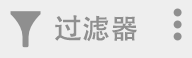
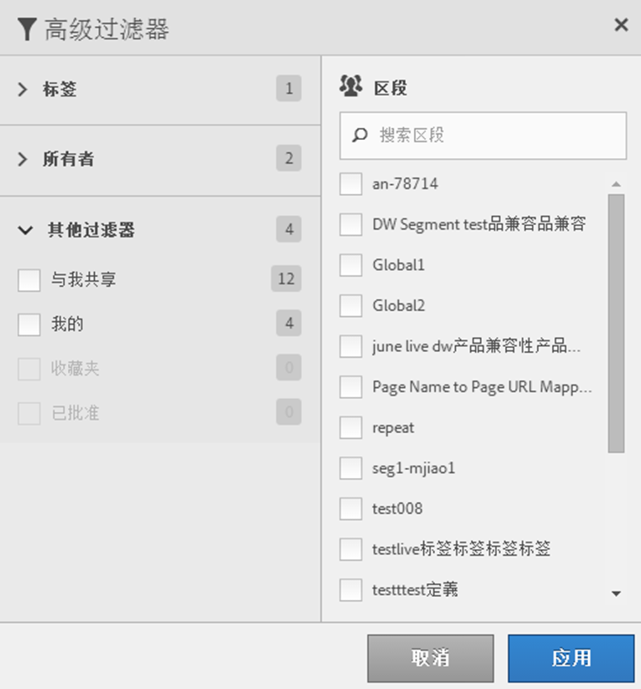

# 过滤区段

按照标记、所有者和其他过滤器（全部显示、我的、已与我共享、收藏和已批准）进行过滤。

过滤功能使得在区段边栏中搜索区段变得更加容易。

1. 在区段管理器中，单击&#x200B;**[!UICONTROL 过滤器]**&#x200B;图标：

   

1. 可用过滤器如下：

   | 过滤器名称 | 描述 |
   |---|---|
   | 标记 | 用于过滤具有特定[标记](/help/components/segmentation/segmentation-workflow/seg-tag.md)。默认情况下显示“标记”列。 |
   | 所有者 | 用于按所有者过滤区段。 |
   | 其他过滤器 > 显示所有 | **（仅限管理员）**&#x200B;显示所有区段、其所有者和上一次修改日期。 |
   | 其他过滤器 > 我的 | 显示您拥有的所有区段。 |
   | “其他过滤器”>“已与我共享” | 显示其他人与您[共享](/help/components/segmentation/segmentation-workflow/t-seg-share.md)的所有区段。 |
   | “其他过滤器”>“收藏” | 显示标记为[收藏次数](/help/components/segmentation/segmentation-workflow/t-seg-favorite.md)。 |
   | “其他过滤器”>“已批准” | 显示所有正式[批准](/help/components/segmentation/segmentation-workflow/seg-approve.md)的区段。 |
   | 搜索区段 | 用于按名称搜索区段。 |
