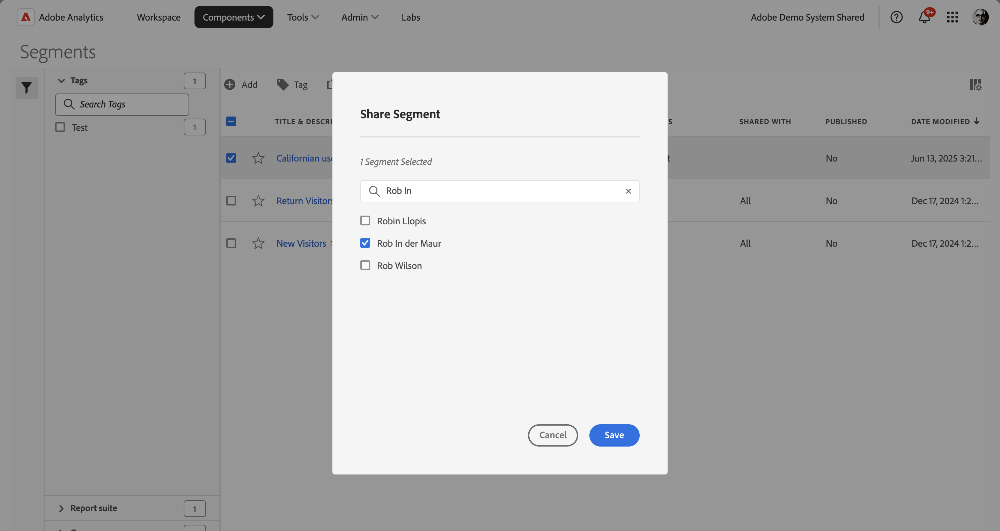

# 共享区段

根据您的权限，可以与整个组织、组或个人用户共享区段。

| 管理员 | 可以与“所有人”、“群组”和“用户”共享区段。 组在Admin Console中设置为权限组。 |
|---|---|
| 非管理员 | 只能与个人用户共享区段。 |

何时应将区段共享给整个公司而不仅是一组用户或个人？ 下面是可能需要遵循的一些最佳实践：

* 作为管理员，如果某个区段对整个公司都有用，或者每个人都能熟练使用，那么就应当与“**[!UICONTROL 所有人]**”共享该区段。 在这种情况下，还应当考虑将其设为[已批准](/help/components/segmentation/segmentation-workflow/seg-approve.md)的区段。

* 作为管理员，如果某个区段为团队带来良好的商业价值，那么就应当将此区段与特定“**[!UICONTROL 组]**”共享。 请勿正式批准此类型的区段。
* 作为管理员或个人用户，请将区段与其他个人共享以审查和验证区段。 如果经证实没有用处，则可以放弃。 请勿正式批准此类型的区段。

1. 在区段管理器中，选中要共享的区段旁边的复选框。
1. 选择共享。
1. 在&#x200B;**[!UICONTROL 共享区段]**&#x200B;对话框中：

   

   如果您是管理员，则可以选择“**[!UICONTROL 所有人]**”或组织中的“**[!UICONTROL 组]**”和“用户&#x200B;**[!UICONTROL ”。]** 如果您不是管理员，则只能看到个人用户。 使用&#x200B;**[!UICONTROL 搜索]**&#x200B;字段搜索组或用户。 1.

   1. （可选）使用到&#x200B;*搜索个人或组*，并限制要与其共享区段的组或个人的列表。

   1. 选择&#x200B;**[!UICONTROL 保存]**&#x200B;以共享区段。 选择&#x200B;**[!UICONTROL 取消]**&#x200B;即可取消。

   “共享”图标将在区段旁边显示：

1. 您可以过滤与您共享的区段，方法是：转到“**[!UICONTROL 过滤器]**”>“**[!UICONTROL 其他过滤器]**”>“**[!UICONTROL 与我共享]**”。

## 最佳实践

以下是您应该共享区段以及与谁共享区段的一些最佳实践。

* 作为管理员，只有在您确信组织中的任何人能够熟练使用这些区段的情况下，才能与所有人共享区段。 您还可以考虑偏好这些区段。 有关详细信息，请参阅[将区段标记为收藏](t-seg-favorite.md)。

* 作为管理员，如果某个区段为特定组的用户提供业务价值，那么就应当将该区段与该组共享。

* 作为管理员或个人用户，请将区段共享给一个或多个个人来验证区段。 如果区段经证实没有用处，则可以删除该区段。
