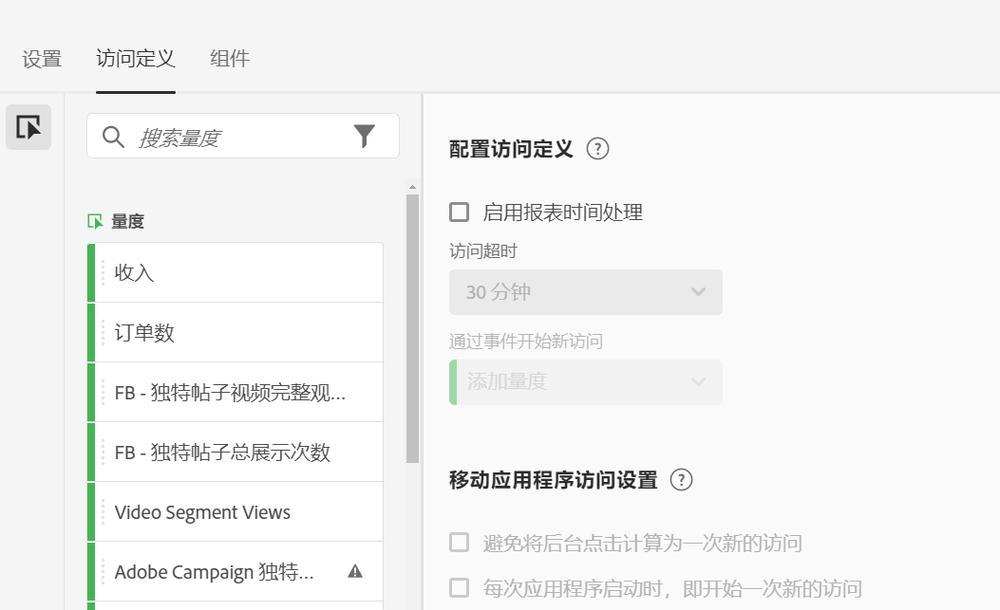
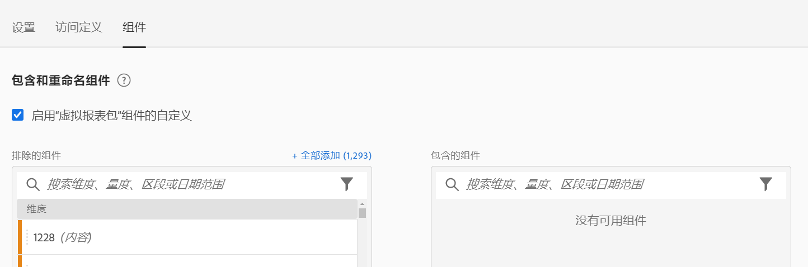

# 创建虚拟报表包

在您开始创建虚拟报表包之前，请注意下面一些事项。

* 非管理员用户看不到虚拟报表包管理器。
* 无法共享虚拟报表包。可通过群组/权限实现“共享”。
* 在虚拟报表包管理器中，您只能看到自己的虚拟报表包。 您需要单击“显示所有”才能看到其他所有人的虚拟报表包。

1. 导航到 **[!UICONTROL 组件]** > **[!UICONTROL 虚拟报表包]**.
1. 单击&#x200B;**[!UICONTROL 添加 +]**。

   

## 定义设置

在[!UICONTROL 设置]选项卡上，定义这些设置，然后单击&#x200B;**[!UICONTROL 继续]**。

| 元素 | 描述 |
| --- |--- |
| 名称 | 虚拟报表包的名称不会继承父报表包的名称，该名称应当具有独特性。 |
| 描述 | 为便于业务用户识别，应添加适当的描述。 |
| 标记 | 您可以添加标记以组织报表包。 |
| 来源 | 此虚拟报表包从中继承以下设置的报表包。大多数服务级别和功能（例如，eVar 设置、处理规则、分类等）都会被继承。要更改虚拟报表包中的这些继承设置，您必须编辑父报表包（“管理员”>“报表包”）。 |
| 时区 | 选择时区为可选操作。如果您选择了时区，则该时区会与虚拟报表包一起保存。 如果您没有选择时区，则使用父报表包的时区。编辑虚拟报表包时，与虚拟报表包一起保存的时区会显示在下拉选择器中。 如果虚拟报表包是在添加时区支持之前创建的，则父报表包的时区将显示在下拉选择器中。 |
| 区段 | 您可以仅添加一个区段，也可以堆叠区段。注意：堆叠两个区段时，将使用 AND 语句联接它们。无法更改为 OR 语句。当您尝试删除或修改虚拟报表包中当前使用的某个区段时，会显示一条警告。 |

## 定义访问定义

在[!UICONTROL 访问定义]选项卡上，定义这些设置，然后单击&#x200B;**[!UICONTROL 继续]**。

以下是一段关于如何在虚拟报表包中调整访问定义的视频：

>[!VIDEO](https://video.tv.adobe.com/v/23545/?quality=12)

| 元素 | 描述 |
| --- |--- |
| **配置访问定义** |  |
| 启用报表时间处理 | 使用报表时间处理可更改默认的访问超时时长。这些设置不具有任何破坏性，仅适用于 Analysis Workspace。[了解详情](/help/components/vrs/vrs-report-time-processing.md) |
| 访问超时 | 定义在自动计算为新访问之前，独特访客必须有多长时间处于非活动状态。这将影响访问指标、访问区段容器和访问时过期的 eVar。 |
| 通过事件开始新访问 | 当任何指定事件触发时，无论会话是否超时，都将计为启动了一个新会话。 |
| **移动应用程序访问设置** | 修改如何定义由Adobe的移动SDK收集的移动设备应用程序点击的访问量。这些设置不具有破坏性，仅适用于Analysis Workspace。 |
| 避免将后台点击计算为一次新的访问 | 避免将后台点击计算为一次新的访问，从而防止后台点击量使访问次数和独特访客指标被夸大。 |
| 在每次应用程序启动后即开始一个新访问 | 每当应用程序启动时，即视为开始了一个新会话。[了解详情](/help/components/vrs/vrs-mobile-visit-processing.md) |

## 包括和重命名组件

1. 在[!UICONTROL 组件]选项卡上，选中此复选框可应用策划，以在 Analysis Workspace 中包含、排除和重命名此虚拟报表包的组件。
有关虚拟报表包管理的更多信息，请参阅 [虚拟报表包组件管理](https://experienceleague.adobe.com/docs/analytics/components/virtual-report-suites/vrs-components.html#virtual-report-suites?lang=zh-Hans).

1. 将要包含在虚拟报表包中的组件（维度、量度、区段或日期范围）拖入 [!UICONTROL 包含的组件] 部分。

1. 完成后，单击&#x200B;**[!UICONTROL 保存]**。

## 预览数据

在每个选项卡的右侧，您可以预览与原始报表包相比，此虚拟报表包中的总点击量、总访问量和总访客量。

## 查看产品兼容性

并非所有Adobe Analytics产品都支持虚拟报表包的某些功能。 产品兼容性列表基于您当前的虚拟报表包设置，列出了Adobe Analytics中受支持的产品。
