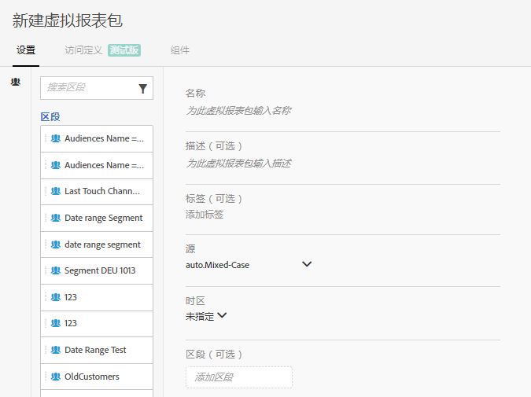

# 创建虚拟报告套件

在您开始创建虚拟报表包之前，请注意下面一些事项。

* 非管理员用户看不到虚拟报表包管理器。
* 无法共享虚拟报表包。可通过群组/权限实现“共享”。
* 在虚拟报表包管理器中，您只能看到自己的虚拟报表包。您需要单击“显示全部”才能看到其他所有人的虚拟报表包。

1. Navigate to **[!UICONTROL Components]** &gt; **[!UICONTROL Virtual Report Suites]**.
1. Click **[!UICONTROL Add +]**.

   

1. 填写以下字段：

<table id="table_0F85B56480BB46CBA5BE236BBD70156D"> 
 <thead> 
  <tr> 
   <th colname="col1" class="entry"> 元素 </th> 
   <th colname="col2" class="entry"> 描述 </th> 
  </tr> 
 </thead>
 <tbody> 
  <tr> 
   <td colname="col1"> 名称 </td> 
   <td colname="col2"> 
虚拟报表包的名称不会继承父报表包的名称，该名称应当具有独特性。 
 </td> 
  </tr> 
  <tr> 
   <td colname="col1"> 描述 </td> 
   <td colname="col2"> 
为便于业务用户识别，应添加适当的描述。 
 </td> 
  </tr> 
  <tr> 
   <td colname="col1"> 标记 </td> 
   <td colname="col2"> 
您可以添加标记以组织报表包。 
 </td> 
  </tr> 
  <tr> 
   <td colname="col1"> 群组 </td> 
   <td colname="col2"> 
选择您希望对此 VRS 拥有访问权限的权限群组。（您也可以从管理员 &gt; 用户管理 &gt; 群组中管理群组权限。） 
 </td> 
  </tr> 
  <tr> 
   <td colname="col1"> 父报表包 </td> 
   <td colname="col2"> 
此虚拟报表包从中继承以下设置的报表包。大多数服务级别和功能（例如，eVar 设置、处理规则、分类等）都会被继承。要更改 VRS 中的这些继承设置，您必须编辑父报表包（管理员 &gt; 报表包）。 
 </td> 
  </tr> 
  <tr> 
   <td colname="col1"> 时区 </td> 
   <td colname="col2"> 
选择时区为可选操作。 
 
如果您选择了时区，则该时区会与 VRS 一起保存。如果您没有选择时区，则使用父报表包的时区。 
 
编辑 VRS 时，与 VRS 一起保存的时区将会显示在下拉选择器中。如果 VRS 是在添加时区支持之前创建的，则父报表包的时区将显示在下拉选择器中。 
 </td> 
  </tr> 
  <tr> 
   <td colname="col1"> 区段 </td> 
   <td colname="col2"> 
您可以仅添加一个区段，也可以<a href="https://marketing.adobe.com/resources/help/en_US/analytics/segment/seg_stack.html" format="https" scope="external">堆叠区段</a>。 
 
 
注意：堆叠两个区段时，将使用 AND 语句联接它们。无法更改为 OR 语句。 
 
 
当您尝试删除或修改虚拟报表包中当前使用的某个区段时，会显示一条警告。 
 </td> 
  </tr> 
 </tbody> 
</table>

