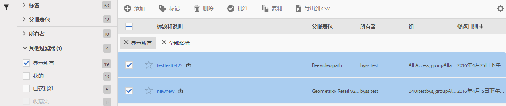

# 管理虚拟报告套件

在虚拟报表包管理器中，管理员可以编辑、添加、标记、删除、重命名、批准、复制、导出和过滤虚拟报表包。虚拟报表包管理器对非管理员用户不可见。

**[!UICONTROL “分析]** ”&gt; **[!UICONTROL “组件]** ”&gt; **[!UICONTROL “虚拟报表包”]**

>[!NOTE]
>
>在虚拟报表包管理器中，您只能看到自己的虚拟报表包。您需要单击&#x200B;**[!UICONTROL 显示全部]才能看到其他所有人的虚拟报表包。**

| 任务 | 描述 |
|--- |--- |
| 新 | 转到虚拟报表包生成器，在该生成器中，您可以创建新的虚拟报表包。 |
| 标记 | 所有用户均可为区段创建标记，并将一个或多个标记应用于区段。但是，您只能看到自己拥有的那些区段的标记。应创建哪种类型的标记？以下是对实用标记的一些建议：<ul><li>基于团队名称的标记，如社交营销、移动营销</li><li>项目标记（分析标记），如登录页面分析</li><li>类别标记：男士；地理位置</li><li>工作流程标记：管理对象（具体业务单位）；已批准</li></ul> |
| 删除 | 如果您删除虚拟报表包，则应用了此虚拟报表包的计划报表和功能板将继续正常工作。该报表或功能板将继续使用已删除的虚拟报表包，直到您重新保存计划报表为止。编辑具有相同名称的虚拟报表包时，计划报表不会更新。 例如：假定您有两个具有相同名称和不同父报表包的虚拟报表包： 您有一个书签，引用Maprod报表包的虚拟报告套件。然后，由于该虚拟报表包是重复项，您将其删除。书签将继续运行，仍引用已删除 VRS 的定义。如果您更改剩余 VRS 的定义，则应用到书签的 VRS 并不会发生更改。它会使用旧定义。要修复此问题，请更新书签以引用新定义。如果不确定书签、功能板或计划报表是否在使用已删除的 VRS，可以更改剩余 VRS 的名称，这样可以更加明确书签是否在使用剩余的 VRS。 |
| 重命名 | 在显示虚拟报表包的所有位置（例如，在报表包选择器中），虚拟报表包都会显示其新名称。 |
| 批准/取消批准 | 批准虚拟报表包可使其变为“正式”或“规范”的报表包。您还可以通过取消批准来反向执行此过程。 |
| 复制 | 创建一个独特副本，使其具有自身的新报表包 ID，但使用相同的名称和定义。 |
| 导出到 CSV | 将虚拟报表包定义导出到 .csv 文件。 |
| 过滤器 | 按标记、父报表包、所有者及其他过滤器（“显示全部”、“我的”、“收藏夹”和“已批准”）进行过滤。 |
