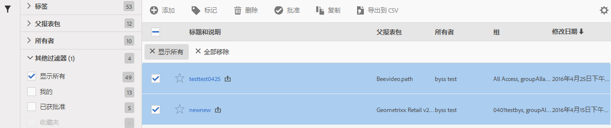

# 管理虚拟报告包

通过虚拟报表包管理器，管理员可以编辑、添加、标记、删除、重命名、批准、复制、导出和筛选虚拟报表包。 虚拟报表包管理器对非管理员用户不可见。

**[!UICONTROL Analytics]** > **[!UICONTROL 组件]** > **[!UICONTROL 虚拟报表包]**

>[!NOTE]
>
>在虚拟报表包管理器中，您只能看到自己的虚拟报表包。 您需要单击&#x200B;**[!UICONTROL 显示所有]**&#x200B;才能看到其他所有人的虚拟报表包。

| 任务 | 描述 |
| --- | --- |
| 添加 | 将您转到虚拟报表包生成器，您可以在其中创建新的虚拟报表包。 |
| 标记 | 所有用户均可为虚拟报表包创建标记，并将一个或多个标记应用于虚拟报表包。 但是，您只能查看自己拥有的虚拟报表包的标记。 您应该创建哪些类型的标记？ 以下是一些对有用标记的建议：<ul><li>基于团队名称的标记，如社交营销、移动营销</li><li>项目标记（分析标记），例如登入页面分析</li><li>类别标记：“男性”、地理位置</li><li>工作流程标记：管理对象（具体业务单位）；已批准</li></ul> |
| 删除 | 如果删除虚拟报表包，则应用了此虚拟报表包的计划报表和功能板将继续正常工作。 报表或功能板将继续使用已删除的虚拟报表包，直至您重新保存计划报表。  编辑具有相同名称的虚拟报表包时，计划报表不会更新。 例如：假设您有两个名称相同，但父报表包不同的虚拟报表包： 您有一个书签，该书签引用 mainprod 报表包的虚拟报表包。 然后，由于该虚拟报表包是重复项，您将其删除。 书签将继续运行，并引用已删除的虚拟报表包的定义。 如果更改其余虚拟报表包的定义，则应用于书签的虚拟报表包不会更改。 它使用旧的定义。 要解决此问题，请更新书签以引用新定义。 如果您不确定书签、功能板或计划报表是否在使用已删除的虚拟报表包，可以更改其余虚拟报表包的名称，这样可以更加明确书签是否在使用其余虚拟报表包。 |
| 重命名 | 无论虚拟报表包在何处显示（例如在报表包选择器中），它都会显示新名称。 |
| 批准/取消批准 | 批准虚拟报表包，使其成为“官方”或“规范”。 您可以通过取消批准来撤消该流程。 |
| 复制 | 创建一个独特副本，使其具有自身的新报表包ID，但使用相同的名称和定义。 |
| 导出到 CSV | 将虚拟报表包定义导出到.csv文件。 |
| 过滤器 | 按标记、父报表包、所有者及其他过滤器（“显示所有”、“我的”、“收藏夹”和“已批准”）进行过滤。 |
