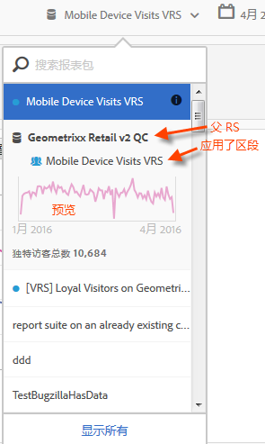

# 查看虚拟报表包信息

单击报表包名称旁边的 i（信息）图标可获取有关该报表包的信息。

## 在报表包选择器中  {#section_74E43B60C1CA4180B5ACA57574C1FA0F}

在报表包选择器中，单击虚拟报表包旁边的“信息”图标会提供以下信息：

* 父报表包的名称。
* 应用于该报表包的任何区段的名称。
* 该报表包在应用区段后的简单预览。
* 唯一访客总数。

