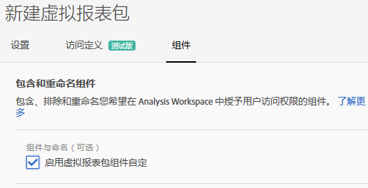
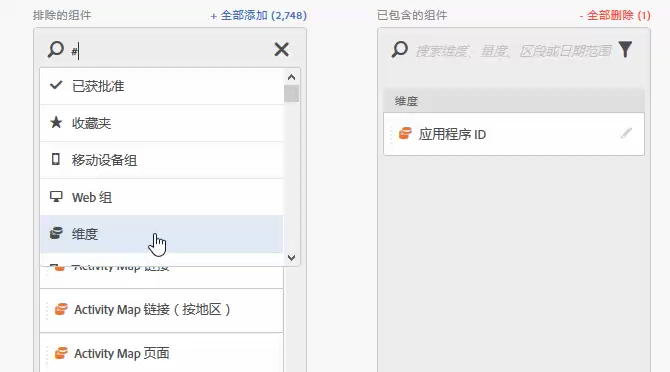
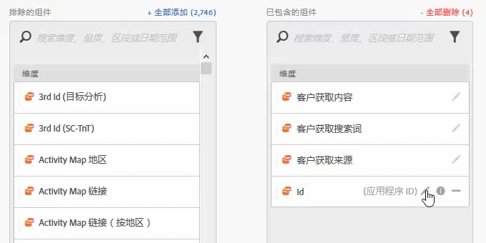
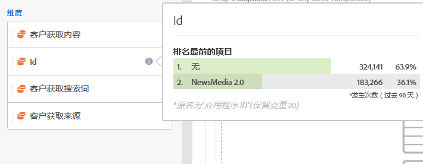

# 虚拟报表包组件管理

可以对虚拟报表包进行管理，以在Analysis Workspace中包含和排除组件。

>[!BEGINSHADEBOX]

观看演示视频的 [组件策划](https://experienceleague.adobe.com/en/docs/analytics-learn/tutorials/components/virtual-report-suites/component-curation-in-virtual-report-suites){target="_blank"}。

>[!ENDSHADEBOX]

>[!NOTE]
>
>对于管理员和非管理员可在策划的 Workspace 项目和策划的虚拟报告包中看到哪些组件作出了更改。 以前，单击&#x200B;**[!UICONTROL 显示所有组件]**&#x200B;后，大家只能看到非策划的组件。 [更新的策划体验](/help/analyze/analysis-workspace/curate-share/curate.md)允许对可查看的组件进行更细粒度的控制。

要启用组件管理，请执行以下操作：

1. 转到&#x200B;**[!UICONTROL Analytics]** > **[!UICONTROL 组件]** > **[!UICONTROL 虚拟报表包]** > **[!UICONTROL 新建虚拟报表包]**。
1. 定义&#x200B;**[!UICONTROL 设置]**&#x200B;后，单击&#x200B;**[!UICONTROL 组件]**&#x200B;选项卡。

1. 选中复选框&#x200B;**[!UICONTROL 启用虚拟报表包组件的自定义]**：

   

   >[!NOTE]
   >
   >如果启用了组件自定，则虚拟报表包&#x200B;**“只能在 Analysis Workspace 中”**&#x200B;访问，而不能在以下位置访问：
   >
   >* [!UICONTROL Data Warehouse]
   >* [!UICONTROL Report Builder]
   >* [!UICONTROL Activity Map]
   >* Analytics 报表 API

   选中后，您可以添加要包含在虚拟报表包中的组件，方法是将适用的组件从“排除的组件”列拖到“包含的组件”列。 可包含和排除的组件包括：

   * 维度
   * 量度
   * 区段
   * 日期范围

   >[!NOTE]
   >
   >不需要&#x200B;*共享*&#x200B;已经过策划的组件（区段、计算指标、日期范围）。 在管理虚拟报表包的上述组件时，则即使没有共享，它们也会在 Analysis Workspace 中始终保持可见。

1. 此外，您还可以过滤或搜索组件，并单击&#x200B;**[!UICONTROL 添加全部]**&#x200B;以将整个过滤的选定内容添加到“已包括”列中。

   

## 重命名组件 {#section_0F7CD9F684FE4765BC00A2AFED56550E}

您可以更改特定于虚拟报表包的已包含组件的显示名称。 例如，如果您想在虚拟报表包中包含页面名称，但希望将其重命名为对移动设备更友好的上下文，则可以将其更改为应用程序Screens。 每当使用此虚拟报表包时，Analysis Workspace中都会显示新名称。

在Analysis Workspace中，单击任何包含的组件的信息图标，以显示重命名组件的原始名称：

## 组件组 {#section_483BEC76F49E46ADAAA03F0A12E48426}

使用组件组向虚拟报表包中添加批量组件。 例如，如果要导入一组特定于移动设备应用程序分析的默认组件，请选择移动设备应用程序组。 对应的一组维度和指标（已重命名）会被自动添加到虚拟报表包的“已包括”列表中。

## Workspace行为 {#section_6C32F8B642804C0097FCB14E21028D4A}

有关 Analysis Workspace 中策化的更多信息，请参阅[策划和共享项目](/help/analyze/analysis-workspace/curate-share/curate.md)。
