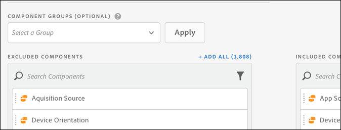

# 虚拟报表包组件管理

可对虚拟报表包进行管理以在 Analysis Workspace 中包含和排除组件。

>[!NOTE]
>
>无论是管理员还是非管理员，都可以在策划的 Workspace 项目和策划的虚拟报表包 (VRS) 中，查看发生更改的组件。Previously, anyone could see non-curated components by clicking **[!UICONTROL Show all Components]**. [策划体验经过更新后](https://marketing.adobe.com/resources/help/en_US/analytics/analysis-workspace/curate-projects-vrs.html)，在查看组件方面提供了更加精细化的控制。

要启用组件管理，请执行以下操作：

1. Go to **[!UICONTROL Analytics]** &gt; **[!UICONTROL Components]** &gt; **[!UICONTROL Virtual Report Suites]** &gt; **[!UICONTROL Create new virtual report suite]**.
1. 定义&#x200B;**[!UICONTROL 设置]**&#x200B;后，单击&#x200B;**组件]选项卡。[!UICONTROL **

1. Select the checkbox **[!UICONTROL Enable Customization of Virtual Report Suite Components]**:

   

   >[!NOTE]
   >
   >If component customization is enabled, the virtual report suite is accessible **only in Analysis Workspace** and is not accessible in the following:

   * [!UICONTROL Reports &amp; Analytics]
   * [!UICONTROL Ad Hoc Analysis]
   * [!UICONTROL 数据仓库]
   * [!UICONTROL Report Builder]
   * Analytics 报表 API
   选中后，通过将适用组件从“排除的组件”列拖入“已包含的组件”列，可添加要包含在虚拟报表包中的组件。可包含和排除的组件包括：

   * 维度
   * 量度
   * 区段
   * 日期范围
   >[!NOTE]
   >
   >There is no need to *share* curated components (segments, calculated metrics, date ranges). 在管理虚拟报表包的上述组件时，则即使没有共享，它们也会在 Analysis Workspace 中始终保持可见。

1. Additionally, you can filter or search the components and add the entire filtered selection to the included column by clicking **[!UICONTROL Add All]**.

   

## 重命名组件 {#section_0F7CD9F684FE4765BC00A2AFED56550E}

您可以将包含的组件的显示名称更改为特定于虚拟报表包的名称。例如，如果您要在虚拟报表包中包含“页面名称”，但又希望将其重命名为一个更适合移动设备且用户更易理解的名称，则可以将其更改为“应用程序屏幕”。每当使用此虚拟报表包时，都会在 Analysis Workspace 中显示新名称。

在 Analysis Workspace 中，单击任何包含的组件的信息图标，均可显示已重命名组件的原始名称：

## 组件组 {#section_483BEC76F49E46ADAAA03F0A12E48426}

使用组件组可向您的虚拟报表包中批量添加组件。例如，如果您要导入一组专门用于移动设备应用程序分析的默认组件，请选择移动设备应用程序组。对应的一组维度和量度（已重命名）会被自动添加到虚拟报表包的“已包括”列表中。

## 工作区行为 {#section_6C32F8B642804C0097FCB14E21028D4A}

有关 Analysis Workspace 中策化的更多信息，请参阅[策划和共享项目](https://marketing.adobe.com/resources/help/en_US/analytics/analysis-workspace/curate.html)。