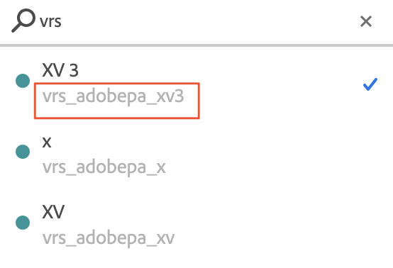

# 虚拟报表包常见问题解答

针对虚拟报表包新用户的提示和最佳实践。

| 问题 | 回答 |
| --- | --- |
| **是否应在实施中将多个报表包合并为一个“全局”报表包，然后使用虚拟报表包向用户公开不同的数据区段？** | 也许应该这样做。以下是您应该考虑继续使用单个报表包的一些情况：<ul><li>如果您的变量/维度中有大量唯一值，那么整合成一个报表包可能会导致这个全局报表包超出每月唯一值限制，从而发生截断（报表中的行项目显示“低流量”）。</li><li>如果您需要针对数据的单个区段（例如，品牌、业务单位等）获取实时或“当前数据”报表。</li><li>您的各种报表包可能都有独特的跟踪要求（即，如果它们使用 Adobe Analytics 变量和事件的方式非常不同）。如果是这种情况，请注意，合并到全局报表包将不会授予您额外的变量或事件以进行跟踪。</li></ul> |
| **虚拟报表包上的哪些设置是从父报表包继承而来？** | 虚拟报表包会继承父报表包的大部分服务级别，如eVar设置、处理规则、分类等。  以下设置不会被继承：<ul><li>报表包 ID</li><li>报表包名称 </li><li>权限群组（可将虚拟报表包分配给其自身的权限群组）</li></ul>**注意**：这不包括用户创建的大部分实体，如书签、功能板、计划报表等；这些项目不会从父报表包继承，也不能专门针对虚拟报表包创建和使用（在下一个问题中会详细说明）。 |
| **在 Analytics UI 中使用虚拟报表包与使用基础报表包有何不同？** | 创建虚拟报表包后，在整个用户界面中都会像对待基础报表包一样对待虚拟报表包，并且大部分扩展功能通常也支持虚拟报表包。例如：<ul><li>报表包选择器中会显示虚拟报表包，可以像选择任何其他基础报表包一样逐个选择虚拟报表包。</li><li>可以针对虚拟报表包创建报表、书签、功能板、目标、警报、区段和计算指标等，并且这些项目的行为不依赖于父报表包。</li><li>与任何其他报表包一样，可以单独授予虚拟报表包权限。</li><li>在虚拟报表包的上下文中运行报表时，仍然可以应用区段；在检索报表数据时，会自动将应用区段与虚拟报表包的区段栈叠在一起。</li></ul> |
| **在 Admin Console 和 Admin API 中如何对待虚拟报表包？能否像对基础报表包一样，对虚拟报表包保存功能？** | 不可以，大多数管理功能不支持虚拟报表包。如上所述，虚拟报表包从父报表包继承了大多数服务级别和功能(例如，eVar设置、处理规则、分类等)，因此要更改虚拟报表包中的这些继承设置，您必须更改父报表包。 因此，虚拟报表包仅在 UI 中的以下位置显示：<ul><li>虚拟报表包管理器，您可以在此处创建和编辑虚拟报表包。 （Analytics > 组件 > 虚拟报表包）</li><li>Adobe [Admin Console](https://helpx.adobe.com/cn/enterprise/using/admin-console.html)。要在报表中或整个Adobe Analytics中使用虚拟报表包，权限的作用就像它们在报表包中的作用一样。 这意味着虚拟报表包显示在产品配置文件的选择工具中，并像报表包一样分配给产品配置文件。</li></ul>**注意**：当您使用Web服务API并尝试为虚拟报表包保存功能设置时，将会显示异常。 您只能为基础报表包设置功能。 |
| **我选中了“在每次应用程序启动后即开始一个新访问”。为何仍发现访问次数远大于启动次数？** | 选中“在每次应用程序启动后即开始一个新访问”选项后，超时仍适用。因此，如果用户使用一个应用程序 10 分钟，并且各个操作之间有一分钟的间隔，则会在应用程序启动后开始一次新访问，然后在访问超时时创建其他 9 次访问。选中“在每次应用程序启动后即开始一个新访问”选项后，要使启动次数与访问次数尽可能接近，使用的超时时间应大于 SDK 中设置的会话超时时间。 |
| **我设置了“在每次应用程序启动后即开始一个新访问”，并设置了比我的 SDK 长的超时。为何我的启动次数仍远小于访问次数？** | 如果您设置的超时时间大于 SDK 中设置的值，原因很可能是您的应用程序在后台发送了点击，并且这些点击被计为新的访问。可通过使用父报表包中的点击类型维度来查看是否存在任何后台点击。 **注意**：只有在 SDK 4.13.6 及更高版本中才会区分后台点击和前台点击。如果您使用的是较低版本，则所有点击都会显示为前台点击。如果您使用的是正确的 SDK 版本，则应当启用“避免将后台点击计算为一次新的访问”设置。注意：如果您在 Admin Console 中禁用了后台点击旧版处理功能，则这些点击将不会显示在父报表包中，但会显示在虚拟报表包中。 |
| **需要使用哪个 SDK 版本才能跟踪后台点击？** | 必须使用 SDK 4.13.6 或更高版本。 |
| **如何才能找到虚拟报表包的 ID？** | <ul><li>打开Workspace项目，单击报表包选择器，然后在搜索框中搜索虚拟报表包的名称。 ID显示在搜索结果中的名称下方： </li><li> 或者，以编程方式显示在 [虚拟报表包API](https://www.adobe.io/apis/experiencecloud/analytics/docs.html#!AdobeDocs/analytics-2.0-apis/master/vrs.md).</li></ul> |
