# 上下文感知会话

虚拟报告套件中的上下文感知会话可更改Adobe Analytics计算移动访问的方式。本文介绍了后台点击处理和应用程序启动事件处理（均由移动 SDK 设置）对移动设备访问定义方式的影响。

您可以采用任何所需的方式定义访问，而无需更改基础数据，以便与您的访客与移动设备应用程序进行交互的方式相匹配。

## 客户观点 URL 参数 {#section_8B298006362341E3AC16A148422D1F65}

Adobe Analytics 数据收集过程允许您设置一个用于指定客户观点的查询字符串参数（表示为“cp”查询字符串参数）。此字段可指定最终用户数字应用程序的状态。这有助于您了解在移动设备应用程序处于后台状态时是否生成了点击。

## 后台点击处理 {#section_D47B3161B7E145B6A32AB06E9AA03FA3}

后台点击是一种点击类型，当应用程序在后台状态下发出跟踪请求时，它会从 Adobe Mobile SDK 4.13.6 及更高版本发送到 Analytics。其典型的示例包括：

* 地理围栏交叉时发送的数据
* 推送通知交互

以下示例概述了在为虚拟报表包启用或未启用“避免将后台点击计算为一次新的访问”的情况下，用于确定任意访客开始访问时间和结束访问时间的逻辑。

**如果未启用“防止后台点击启动新访问”功能：****

如果没有为虚拟报表包启用此功能，则会像对待任何其他点击一样来对待后台点击，即它们会开始新访问，并且与前台点击开始新访问的方式相同。例如，如果后台点击在一系列前台点击之前发生，且间隔时间小于 30 分钟（报表包的标准会话超时时间），则后台点击属于会话的一部分。

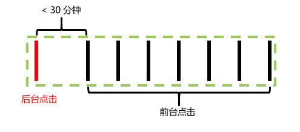

如果后台点击在任何前台点击之前发生，且间隔时间大于 30 分钟，则后台点击会创建其自身的访问，总访问次数则为 2。

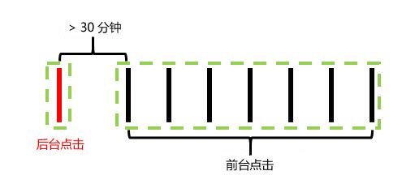

**如果启用“防止后台点击启动新访问”功能：****

以下示例说明了启用此功能时后台点击的行为。

示例 1：后台点击在一系列前台点击之前的某个时间段 (t) 发生。

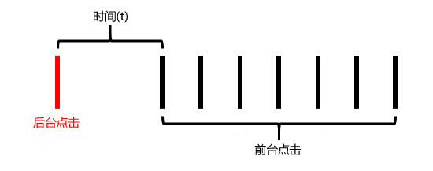

在此示例中，如果 *t* 大于虚拟报表包配置的访问超时时间，则由前台点击构成的访问中不包括后台点击。例如，如果将虚拟报表包访问超时时间设置为 15 分钟，而 *t* 为 20 分钟，则由这一系列点击（如绿色边框所示）构成的访问将不包括后台点击。这意味着后台点击中任何设有“访问”过期时间的 eVar 都&#x200B;**不会**&#x200B;在随后的访问中保留，并且访问区段容器将只包含绿色边框内的前台点击。

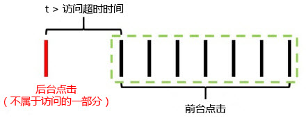

相反，如果 *t* 小于虚拟报表包配置的访问超时时间，则后台点击将会与前台点击一样，作为访问的一部分被包含在内（如绿色边框所示）：

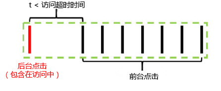

这意味着：

* 后台点击中任何设有“访问”过期时间的 eVar 都会将其值保留到此次访问的其他点击中。
* 后台点击中设置的任何值都会包含在访问级别区段容器逻辑评估中。

在这两种情况下，总访问次数都将为 1。

示例 2：如果后台点击在一系列前台点击之后发生，则行为类似：

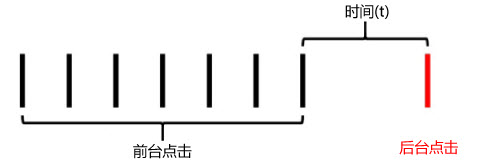

如果后台点击在虚拟报表包配置的超时时间后发生，则后台点击不属于会话的一部分（如绿色边框所示）：

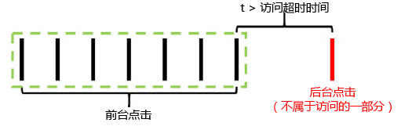

同样，如果时间段 *t* 小于虚拟报表包配置的超时时间，则后台点击将包含在之前的前台点击所构成的访问中：

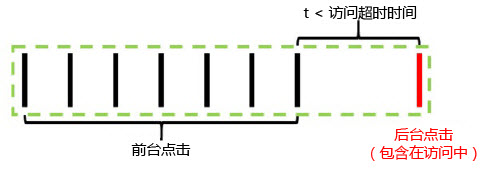

这意味着：

* 之前的前台点击中任何设有“访问”过期时间的 eVar 都会将其值保留到此次访问的后台点击中。
* 后台点击中设置的任何值都会包含在访问级别区段容器逻辑评估中。

与前面一样，这两种情况下的总访问次数也都将为 1。

示例 3：在某些情况下，后台点击可能会导致将两次单独访问合并为一次访问。在以下情况中，后台点击前后均发生了一系列前台点击：

在这个示例中，如果 *t1* 和 *t2* 都小于虚拟报表包配置的访问超时时间，则即使 *t1* 和 *t2* 之和大于访问超时时间，所有这些点击也将被合并为一次访问：

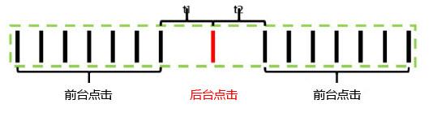

但是，如果 *t1* 和 *t2* 均大于虚拟报表包配置的超时时间，则这些点击将会分为两次不同的访问：

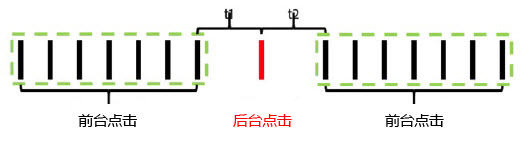

同样（与前面的示例一样），如果 *t1* 小于超时时间，且 *t2* 也小于超时时间，则后台点击将会包含在第一次访问中：

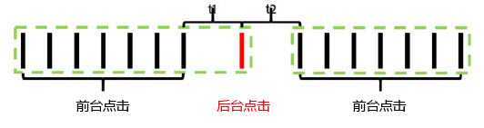

如果 *t1* 大于超时时间，而 *t2* 小于超时时间，则后台点击将会包含在第二次访问中：

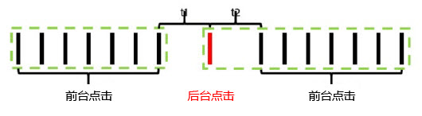

示例 4：如果在虚拟报表包访问超时时段内发生了一系列后台点击，则这些点击会构成一次不可见的“后台访问”，该访问不会被计入访问次数，且不能使用访问分段容器进行访问。

即使该点击不被视为一次访问，任何设有访问过期时间的 eVar 都会将其值保留到此次“后台访问”的其他后台点击中。

示例 5：如果在一系列前台点击之后连续发生多次后台点击，则根据超时时间设置，这些后台点击可能会保留访问一直处于活动状态，且保留时间长于访问超时时段。例如，如果 *t1* 和 *t2* 之和大于虚拟报表包访问超时时间，但两者各自都小于超时时间，则访问仍将延长以包含两次后台点击：

同样，如果一系列后台点击发生在一系列前台事件之前，则会出现类似的行为：

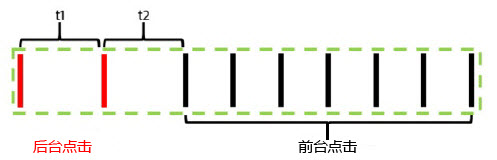

为了保留在后台点击期间设置的 eVar 或其他变量的任何属性影响，后台点击会出现此类行为方式。这允许将下游前台转化事件归因于当应用程序处于后台状态时所采取的操作。它还允许访问区段容器包含导致下游前台会话的后台点击，下游前台会话对于测量推送消息有效性非常有用。

## “访问”量度行为 {#section_50B82618A39B454493B33B1450CCBD3E}

访问计数完全基于至少包含一次前台点击的访问计数。这意味着任何孤立的后台点击或“后台访问”都不会计入“访问”量度。

## “每次访问逗留时间”量度行为 {#section_0A149ABB3E034B97BD0B3A7F3EB67383}

逗留时间仍将通过与没有后台点击时的类似方式，使用两次点击之间的时间进行计算。尽管如此，如果访问包含后台点击（因为它们发生的时间足够接近前台点击），这些点击将会与前台点击一样，被包含在每次访问逗留时间的计算中。

## 后台点击处理设置 {#section_C8B1D38C06FF4ABAAFA78CE9550C0F4B}

由于后台点击处理仅适用于使用报表时间处理 的虚拟报表包，因此 Adobe Analytics 支持两种后台点击处理方式，以便将访问计数保留在不使用报表时间处理的基础报表包中。要访问此设置，请导航至 Adobe Analytics 管理控制台，转到适用的基础报表包设置，接着导航至“移动设备管理”菜单，然后转到“移动设备应用程序报表”子菜单。

1. “开启旧版处理”：这是所有报表包的默认设置。如果保留开启旧版处理，只要涉及到非报表时间属性基础报表包，就会在我们的处理通道中像处理正常点击一样处理后台点击。这意味着任何出现在基础报表包中的后台点击都会像正常点击一样增加访问次数。如果您不希望后台点击出现在基础报表包中，请将此设置更改为“关闭”。
1. “关闭旧版处理”：如果关闭计算后台点击量的旧版处理，基础报表包会忽略向其发送的任何后台点击，并且这些后台点击只有在此基础报表包上创建的虚拟报表包配置为使用报表时间处理时才可进行访问。这意味着由后台点击捕获并发送到此基础报表包的任何数据只会出现在启用了报表时间处理的虚拟报表包中。

   此设置适用于希望利用新的后台点击处理方式而不改变其基础报表包的访问计数的客户。

在这两种情况下，后台点击的计费金额与发送给 Analytics 的任何其他点击的计费金额相同。

## 在每次应用程序启动后即开始新访问 {#section_9DA9A8B9758248A6B311EFBA06AECA80}

除了后台点击处理之外，虚拟报表包还可以在移动 SDK 发送应用程序启动事件时强制开始一次新访问。启用此设置后，无论处于打开状态的访问是否到达其超时时间，都会在 SDK 发送应用程序启动事件时强制开始一次新访问。包含应用程序启动事件的点击会被作为第一次点击包含在下次访问中，而且还会增加访问计数，并创建一个用于分段的独特访问容器。
