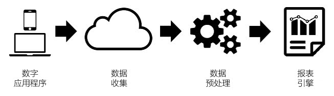
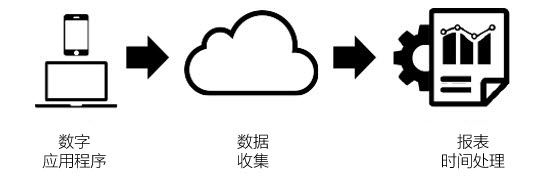

# 报表时间处理

报告时间处理是一个虚拟报告套件设置，它允许以非破损的、可追溯的方式处理数据。

> [!NOTE] 报告时间处理仅适用于Analysis Workspace。

报表时间处理仅影响虚拟报表包中的数据，而不会影响基础报表包中的任何数据或数据收集。通过下图可以最好地理解报表时间处理与传统 Analytics 处理之间的区别：

在 Analytics 数据处理过程中，数据会通过数据收集通道传输到预处理步骤，进而为报告准备数据。在收集数据时，此预处理步骤会将访问过期逻辑和 eVar 持久性逻辑（以及其他内容）应用于数据。这种预处理模式的主要缺点在于，它需要在收集数据之前预先完成所有配置。这意味着对预处理设置的任何更改仅适用于在此更改后收集的新数据。如果数据未按顺序到达或设置的配置错误，这种模式就会出现问题。

报表时间处理是一种截然不同的 Analytics 报表数据处理方式。在收集数据之前，Analytics 不会预先确定处理逻辑，它而是会在预处理步骤中忽略数据集，并在每次运行报表时应用此逻辑：

这种处理架构提供了更为灵活的报表选项。例如，您可以将访问超时时段以非破坏性的方式更改为任何所需时长，这些更改将以追溯方式反映在您的 eVar 持久性和区段容器中，就如同您在收集数据之前应用了这些设置一样。此外，您还可以创建任意数量的虚拟报表包，每个虚拟报表包均具有不同的报表时间处理选项，这些选项基于相同的基础报表包，而无需更改基础报表包中的任何数据。

通过报表时间处理，Analytics 还可以避免将后台点击计算为新的访问，并且[移动 SDK](https://marketing.adobe.com/developer/get-started/mobile/c-measuring-mobile-applications) 也可以让报表在每次触发应用程序启动事件时才开始一次新访问。

以下配置选项当前可用于启用了报表时间处理的虚拟报表包：

* **访问超时：** 访问超时设置定义了一个唯一访客必须具有的不活动程度，即在新访问自动启动之前。默认为 30 分钟。例如，如果将访问超时设置为 15 分钟，则会以 15 分钟的非活动状态进行分隔，为每个收集的点击序列创建一个新访问组。此设置不仅会影响您的访问计数，还会影响访问区段容器的评估方式，以及任何在访问时过期的 eVar 的访问过期逻辑。缩短访问超时时间可能会增加报表中的总访问次数，而延长访问超时时间可能会减少报表中的总访问次数。
* **移动应用程序访问设置：** 对于包含通过Adobe Mobile [SDK](https://www.adobe.io/apis/cloudplatform/mobile.html)生成的移动应用程序生成的数据的报表包，可提供其他访问设置。这些设置不具有破坏性，只会影响通过移动 SDK 收集的点击量。这些设置对通过移动 SDK 之外的程序收集的数据没有影响。
* **防止后台点击启动新访问：** 应用程序处于后台状态时，移动SDK会收集背景点击。
* **在每个应用程序启动时开始新访问：** 除了访问超时之外，无论不活动窗口，每当从Mobile SDK录制应用程序启动事件，您都可以强制访问开始。此设置会影响访问量度和访问区段容器，以及 eVar 中的访问过期逻辑。
* **开始新访问活动：** 无论会话是否超时，新会话都会在触发活动时开始。新创建的会话包含启动该会话的事件。此外，您可以使用多个事件启动会话，如果在数据中观察到这些事件中的任何一个，便会触发新会话。此设置将影响您的访问计数、访问分段容器以及 eVar 上的访问过期逻辑。

报表时间处理不支持传统 Analytics 报表中提供的所有量度和维度。Virtual report suites utilizing Report Time Processing are only accessible in Analysis Workspace and will not be accessible in [!UICONTROL Reports &amp; Analytics], Ad Hoc Analysis, Data Warehouse, Report Builder, Data Feeds, or the reporting API.

另外，报表时间处理仅可处理报告日期范围（以下称为“日期时限”）内的数据。这意味着在报告日期范围之前为访客设置的“永不过期”的 eVar 值不会在报告时限内持续保留，并且也不会显示在报表中。这还意味着客户忠诚度测量完全基于报告日期范围内的数据，而不是报告日期范围之前的整个历史记录。

以下是使用报表时间处理时，当前不支持的量度和维度列表：

* **针对Target的Analytics：** 当前不支持。计划将来支持。
* **针对Advertising Cloud保留指标/维度的分析：** 当前不支持。计划将来支持。
* **单次访问指标：** 永久不受支持。
* **列表变量：** 当前不支持。计划将来支持。
* **计数器eVar：** 永久不受支持。
* **营销渠道变量：** 当前不支持。计划将来支持。
* **上次购买维度之后的天数：** 由于报告时间处理日期窗口的性质，不支持此维度。
* **首次购买维度之前的天数：** 由于报告时间处理日期窗口的性质，不支持此维度。
* **回访频率维度：** 由于报告时间处理日期窗口的性质，不支持此维度。可以使用一种替代方法，即在区段中使用访问计数量度，或者在直方图报表中使用访问量度。
* **上次访问维度之后的天数：** 由于报告时间处理日期窗口的性质，不支持此维度。
* **进入页面原始维度：** 由于报告时间处理日期窗口的性质，不支持此维度。
* **线性分配eVar：** 当前不支持。计划将来支持。
* **原始引用域维度：** 当前不支持。计划将来支持。
* **访问次数：** 由于报告时间处理日期窗口的性质，不支持此量度。作为移动应用程序中的替代工具，您可以使用计算指标(包括访客/访问次数)来确定新访客或访问量。
* **交易ID数据源：** 当前不支持。计划将来支持。

以下是受影响的维度和量度列表，具体取决于所选的报表时间处理设置：

* 如果启用“防止从新访问启动背景点击”，则会发生以下更改。有关更多信息，请参阅 [上下文感知化信息。](vrs-mobile-visit-processing.md)
   * **弹回/弹回率：** 未点击前台点击的背景点击不会被视为退回，而且不会计入跳出率。
   * **每次访问的停留时间：** 只有包含前台点击的访问才会计入此指标。
   * **每次访问所花费的时间：** 只有包含前台点击的访问才会计入此指标。
   * **输入/退出维度和指标：** 只有进入前台点击的条目和退出才会出现在此维度中。
   * **唯一访客指标：** 唯一访客不包括报告日期范围内只有后台点击的访客。
* **访问：** 访问反映了虚拟报告套件配置的任何设置，这些设置可能不同于基础报表包。
* **具有活动ID的序列化事件：** 对于在访客的报告日期范围内发生的事件，只会重复对事件ID使用事件序列化的事件。由于报告时间处理日期开窗口，这些活动不会在全球范围内消除重复的所有日期或访客。
* **购买/收入/订购/单位：** 使用购买ID时，这些指标仅会重复为访客的报告日期范围内发生的重复购买ID重复重复购买ID，而不是由于报告时间处理日期窗口开窗数而导致的重复购买ID重复。
* **非销售eVar/保留eVar：** eVar中设置的值仅在报表日期范围内设置了报告日期处理日期窗口中的值时保持不变。此外，如果持续时间延长了夏时制，则基于时间的过期时间可能提前一小时或提前一小时过期。
* **销售eVar/保留eVar：** 请参阅上述内容。此外，对于将绑定设置为“任何事件”的转化语法，将改用“任何点击”。
* **点击类型：** 此维度指定点击是前景还是背景。
