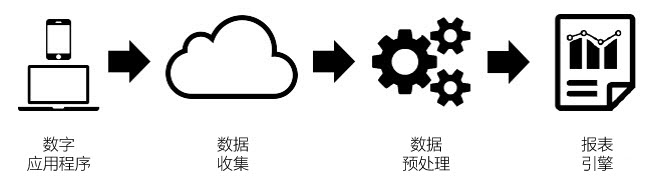
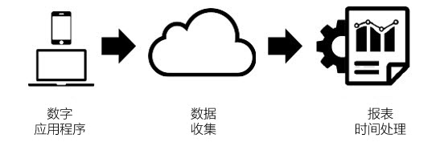

# 报表时间处理

[!UICONTROL 报表时间处理]是一个虚拟报表包设置，它允许以一种非破坏性的追溯方式处理Analysis Workspace中的数据。

[!UICONTROL 报表时间处理]仅影响虚拟报表包中的数据，不影响基本报表包中的任何数据或数据收集。 使用下图可以最好地理解[!UICONTROL 报表时间处理]和传统 Analytics 处理之间的区别：

在Analytics数据处理过程中，数据会流经数据收集管道并进入预处理步骤，该步骤会为报表准备数据。 此预处理步骤在收集数据时将访问过期逻辑和eVar持久性逻辑（及其他内容）应用于数据。 这种预处理模型的主要缺点是，在采集数据之前，它要求预先完成任何配置。 这意味着对预处理设置的任何更改仅适用于该时间之后的新数据。 如果数据未按顺序到达或设置配置错误，则会出现此问题。

[!UICONTROL 报表时间处理]是一种截然不同的 Analytics 报表数据处理方式。 在收集数据之前，Analytics 不会预先确定处理逻辑，它而是会在预处理步骤中忽略数据集，并在每次运行报表时应用此逻辑：

此处理架构允许使用更加灵活的报告选项。 例如，您可以无损地将访问超时时段更改为所需的任意时间长度，并且这些更改会反映在完整报表时段的eVar持久性和区段容器中。 此外，您可以创建任意数量的虚拟报表包，每个报表包均具有基于同一基础报表包的不同报表时间处理选项，而无需更改基础报表包中的任何数据。

[!UICONTROL 报表时间处理]还允许Analytics避免将后台点击计算为新的访问，并允许[Adobe Experience Platform Mobile SDK](https://experienceleague.adobe.com/docs/mobile.html)在每次触发应用程序启动事件时才开始一次新访问。

## 配置选项

以下配置选项当前可用于启用了报表时间处理的虚拟报表包：

* **[!UICONTROL 访问超时]：**&#x200B;访问超时设置定义在自动计算为新访问之前，独特访客必须有多长时间处于非活动状态。 默认为 30 分钟。例如，如果将访问超时设置为15分钟，则会以15分钟的非活动状态进行分隔，为每个收集的点击序列创建一个新的访问分组。 此设置不仅影响您的访问计数，还会影响访问区段容器的评估方式，以及访问时过期的任何eVar的访问过期逻辑。 减少访问超时可能会增加报表中的访问总数，而增加访问超时可能会减少报表中的访问总数。
* **[!UICONTROL 移动应用程序访问设置]：**&#x200B;对于包含移动应用程序通过 [Adobe Mobile SDK](https://experienceleague.adobe.com/docs/mobile.html) 生成的数据的报表包，可以使用其他访问设置。 这些设置不具有破坏性，只会影响通过 Mobile SDK 收集的点击量。这些设置对通过 Mobile SDK 之外的程序收集的数据没有影响。
* **[!UICONTROL 避免将后台点击计算为一次新的访问]：**&#x200B;当应用程序处于后台状态时，后台点击由 Mobile SDK 收集。
* **[!UICONTROL 在每次应用程序启动后即开始一个新访问]：**&#x200B;除了访问超时之外，只要从 Mobile SDK 记录了应用程序启动事件，您就可以强制开始访问，而不管处于非活动状态的时间长短。 此设置会影响访问量度和访问区段容器，以及 eVar 中的访问过期逻辑。
* **[!UICONTROL 通过事件开始新访问]：**&#x200B;无论会话是否超时，都会在触发事件时启动新会话。 新创建的会话包括启动该会话的事件。 此外，您可以使用多个事件来启动会话，如果在数据中观察到这些事件中的任一事件，则会触发新会话。 此设置将影响您的访问计数、访问分段容器以及eVar上的访问过期逻辑。

>[!BEGINSHADEBOX]

观看演示视频的 [开始新的访问（事件](https://experienceleague.adobe.com/en/docs/analytics-learn/tutorials/components/virtual-report-suites/start-a-new-visit-on-any-event-in-virtual-report-suites){target="_blank"}）。

>[!ENDSHADEBOX]

## 报表时间处理限制

报表时间处理不支持传统 Analytics 报表中提供的所有量度和维度。 只能在Analysis Workspace中访问使用报表时间处理的虚拟报表包，而在Data Warehouse、Report Builder、数据馈送或报表API中无法访问。

此外，报表时间处理仅处理来自报表日期范围内的数据（在下文中称为“日期加窗”）。 这意味着在报表日期范围之前为访客设置的eVar值“永不过期”不会保留在报表窗口中，也不会显示在报表中。 这也意味着客户忠诚度衡量方法完全基于报告日期范围内存在的数据，而不是基于报告日期范围之前的整个历史记录。

报表时间处理不支持以下维度和量度：

* **Analytics for Target**
* **Analytics for Advertising Cloud维度/量度**
* **计数器eVar**
* [**首次购买间隔天数**](/help/components/dimensions/days-before-first-purchase.md)
* [**上次购买间隔天数**](/help/components/dimensions/days-since-last-purchase.md)
* [**上次访问间隔天数**](/help/components/dimensions/days-since-last-visit.md)
* **原始登入页面**
* **线性分配eVar**
* **列表变量**
* [**“营销渠道”维度**](/help/components/dimensions/marketing-channel.md)
* [**原始反向链接域**](/help/components/dimensions/original-referring-domain.md)
* [**回访频度**](/help/components/dimensions/return-frequency.md)
* [**单次存取**](/help/components/metrics/single-access.md)
* **交易ID数据源**
* [**访问量**](/help/components/dimensions/visit-number.md)

## 受影响的维度和量度

以下是受影响的维度和指标列表，具体取决于所选的报表时间处理设置：

* 如果启用了“避免将后台点击计算为一次新的访问”，则会发生以下更改。有关详细信息，请参阅[上下文感知会话化](vrs-mobile-visit-processing.md)。
   * [**跳出次数**](/help/components/metrics/bounces.md) / [**跳出率：**](/help/components/metrics/bounce-rate.md)&#x200B;未后跟前台点击的后台点击不被视为跳出，也不会增加跳出率。
   * [**每次访问逗留时间（秒）：**](/help/components/metrics/time-spent-per-visit.md)&#x200B;只有包含前台点击的访问才会计入此指标。
   * **每次访问逗留时间：**&#x200B;只有包含前台点击的访问才会计入此指标。
   * [**登录指标**](/help/components/metrics/entries.md) / [**退出指标：**](/help/components/metrics/exits.md)&#x200B;此维度中仅显示具有前台点击的访问中的登录和退出次数。
   * [**登录维度**](/help/components/dimensions/entry-dimensions.md) / [**退出维度：**](/help/components/dimensions/exit-dimensions.md)&#x200B;此维度中仅显示具有前台点击的访问中的登录和退出。
   * [**独特访客数指标：**](/help/components/metrics/unique-visitors.md)&#x200B;独特访客数不包括在报表日期范围内只具有后台点击的访客。
* [**访问次数：**](/help/components/metrics/visits.md)&#x200B;访问次数反映了虚拟报表包配置的任何设置，这些设置可能与基础报表包不同。
* **使用事件 ID 序列化的事件：**&#x200B;对于一个访客在报表日期范围内发生的事件，只会对使用事件 ID 进行序列化的事件进行重复数据删除。由于报表时间处理存在日期时限，因此，不会在全局范围内对所有日期或访客发生的这些事件进行重复数据删除。
* **购买** / [**收入**](/help/components/metrics/revenue.md) / [**订单**](/help/components/metrics/orders.md) / [**件数：**](/help/components/metrics/units.md)&#x200B;当使用购买ID时，由于报表时间处理存在日期时限，这些量度仅会对一个访客在报表日期范围内出现的重复购买ID进行重复数据删除，而不会在全局范围内对所有日期或访客出现的重复购买ID进行重复数据删除。
* 由于报表时间处理存在日期时限，在eVar中设置的&#x200B;[**非推销eVars**](/help/components/dimensions/evar.md) / **保留eVars：**&#x200B;只有在报表日期范围内设置了该值时，才会保留该值。 此外，如果持久保留时间跨越夏令时变更，则基于时间的过期可能会提前一小时或延后一小时。
* [**促销eVar**](/help/components/dimensions/evar-merchandising.md) / **保留eVar：**&#x200B;请参阅上文。 此外，对于将绑定设置为“任何事件”的转化语法，将改用“任何点击”。
* [**点击类型：**](/help/components/dimensions/hit-type.md)&#x200B;此维度指定点击是前台点击还是后台点击。
* **具有（低流量）或“超出唯一数”的维度：**（低流量）订单项在使用报表时间处理时的确定略有不同，并且不能保证与在基本报表包上生成报表时观察到的一致。不属于低流量的Dimension行项目不能保证代表该行项目的100%数据。 维度中存在的唯一值数量越多，这些差异就越明显。
