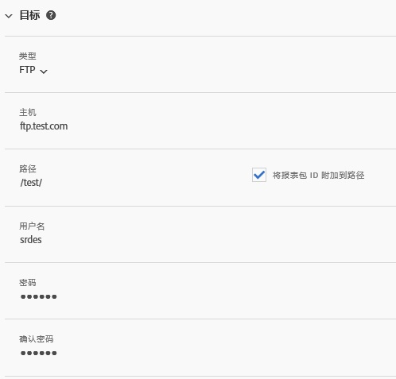
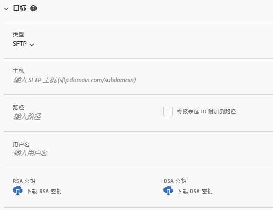
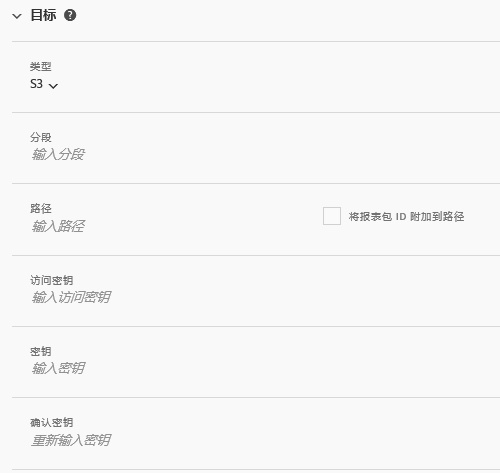
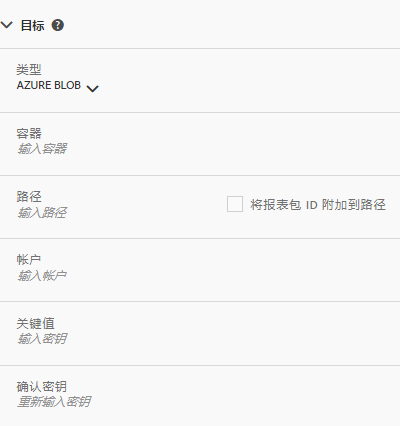

# 馈送目标

“馈送目标”部分介绍分发馈送的方法。

有以下四种分发渠道：

* FTP
* SFTP
* Amazon S3
* Azure Blob

## FTP {#section_D2B521C49BDE4F91A1999FE222CF306F}

数据馈送数据可以提交到由 Adobe 或客户托管的 FTP 位置。

如果您选择将数据上载到 FTP 服务器，则必须向 Adobe 提供相应的用户名、密码和上载路径。您必须实施自己的流程，以便在服务器上管理磁盘空间，因为 Adobe 不从服务器删除任何数据。

## SFTP {#section_8D9215E441474D2BBC56228C2BC926E5}

数据馈送数据可以提交到由 Adobe 或客户托管的 sFTP 位置。

如果您选择将数据上载到 FTP 服务器，则必须向 Adobe 提供相应的用户名和上载路径。

<!-- 

Adobe Customer Care will provide you with a Public key. Verify in recording.

 -->

您必须实施自己的流程，以便在服务器上管理磁盘空间，因为 Adobe 不从服务器删除任何数据。

## Amazon S3 {#section_4191CD7B8D3F419EB850B286B542C14A}

您可以将文件上载到 Amazon S3 存储段。Amazon 将（在 Amazon 服务器上）自动加密静态数据。当您下载数据时，数据会自动解密。

如果您选择通过 Amazon S3 上载数据，则必须提供存储段名称、访问密钥 ID、密钥和文件夹名称。

数据馈送可以与以下 11 个标准 AWS 地区进行通讯（必要时需使用适合的签名算法）：

* us-east-1
* us-west-1
* us-west-2
* ap-south-1
* ap-northeast-2
* ap-southeast-1
* ap-southeast-2
* ap-northeast-1
* eu-central-1
* eu-west-1
* sa-east-1

目前，我们不支持中国北京 AWS 地区 (cn-north-1)。

## Azure Blob {#section_1E9F1D0E7EAB4189A5D748FCA57D63D1}

您可以将文件上载到 Azure Blob 中。

## 字段 {#section_AD54B41BC7C945DC85F5FB8FCD4A4792}

下表显示了所有分发渠道的所有选项。可用选项取决于所选择的分发渠道。

<table id="table_F743C620C82349D9943A13B99EA312BA"> 
 <thead> 
  <tr> 
   <th colname="col1" class="entry"> 字段 </th> 
   <th colname="col2" class="entry"> 描述 </th> 
  </tr> 
 </thead>
 <tbody> 
  <tr> 
   <td colname="col1"> 
访问密钥 
 </td> 
   <td colname="col2"> 
输入 Amazon S3 访问密钥。 
 </td> 
  </tr> 
  <tr> 
   <td colname="col1"> 
存储段 
 </td> 
   <td colname="col2"> 
输入 Amazon S3 存储段位置。 
 
此值应符合正确的 S3 存储段格式。(See <a href="https://docs.aws.amazon.com/awscloudtrail/latest/userguide/cloudtrail-s3-bucket-naming-requirements.html" format="html" scope="external"> https://docs.aws.amazon.com/awscloudtrail/latest/userguide/cloudtrail-s3-bucket-naming-requirements.html</a>.) 
 
 
注意：有关 Amazon S3 设置的详细信息，请参阅下面的<a href="../../../export/analytics-data-feed/feed-troubleshooting.md#section_6797EBBB7E6D44D4B00C7AEDF4C2EE1D" format="dita" scope="local">适用于 Amazon S3 数据馈送的 BucketOwnerFullControl 设置</a>。 
 
 </td> 
  </tr> 
  <tr> 
   <td colname="col1"> 
容器 
 </td> 
   <td colname="col2"> 
输入 Azure Blob 容器名称。 
 </td> 
  </tr> 
  <tr> 
   <td colname="col1"> 
 主机 
 </td> 
   <td colname="col2"> 
指定 FTP 或 SFTP 主机位置。 
 
此值必须符合正确的 ftp/sftp 格式，<code>ftp.domain.com/subdomain</code> 或 <code>sftp.domain.com/subdomain</code>。 
 
 FTP 的标准端口 21 和 sFTP 的标准端口 22 都是必填项。 
 </td> 
  </tr> 
  <tr> 
   <td colname="col1"> 
密码 
 
确认密码 
 </td> 
   <td colname="col2"> 
输入 FTP 密码。重新输入以确认 
 </td> 
  </tr> 
  <tr> 
   <td colname="col1"> 
路径 
 </td> 
   <td colname="col2"> 
选择主机或存储段的路径。该路径必须先于馈送创建存在。 
 
 
注意：有关 Amazon S3 设置的详细信息，请参阅下面的<a href="../../../export/analytics-data-feed/feed-troubleshooting.md#section_6797EBBB7E6D44D4B00C7AEDF4C2EE1D" format="dita" scope="local">适用于 Amazon S3 数据馈送的 BucketOwnerFullControl 设置</a>。 
 
 </td> 
  </tr> 
  <tr> 
   <td colname="col1"> 
帐户 
 </td> 
   <td colname="col2"> 
 输入 Azure 存储帐户。 
 </td> 
  </tr> 
  <tr> 
   <td colname="col1"> 
公钥 
 </td> 
   <td colname="col2"> 
请提供 SFTP 公钥。 
 
您必须下载公钥才能设置 SFTP 存储库。 
 
 
注意：创建馈送不需要下载公钥。 
 
 
创建上一个馈送时，可以使用已下载的公钥。 
 
有关更多信息，请参阅 <a href="https://marketing.adobe.com/resources/help/en_US/whitepapers/ftp/ftp_sftp_dw.html" format="html" scope="external">https://marketing.adobe.com/resources/help/zh_CN/whitepapers/ftp/ftp_sftp_dw.html</a>。 
 </td> 
  </tr> 
  <tr> 
   <td colname="col1"> 
键值 
 
确认密钥 
 </td> 
   <td colname="col2"> 
 输入存储访问密钥。重新输入以确认。 
 
 
注意：要获取访问密钥，请访问 <a href="https://docs.microsoft.com/en-us/azure/storage/common/storage-create-storage-account#view-and-copy-storage-access-keys" format="https" scope="external">https://docs.microsoft.com/zh-cn/azure/storage/common/storage-create-storage-account#view-and-copy-storage-access-keys</a>。 
 
 </td> 
  </tr> 
  <tr> 
   <td colname="col1"> 
密钥 
 
确认密钥 
 </td> 
   <td colname="col2"> 
输入 Amazon S3 密钥。重新输入以确认。 
 </td> 
  </tr> 
  <tr> 
   <td colname="col1"> 
类型 
 </td> 
   <td colname="col2"> 
选择目标类型。 
 
 
     <ul id="ul_B893EEDA73A34DE0AEB8570BE9027F21"> 
      <li id="li_325546FCEB404C50AA6829573CCA340B">FTP（默认） </li> 
      <li id="li_6A2C03115903484797485D073A610607">AmazonS3 </li> 
      <li id="li_C24540F6FCD24702B7693A515CEBE977">SFTP </li> 
      <li id="li_8E03CA78E7FE427C9F6F8B112BC76266">Azure Blob </li> 
     </ul> 
 
选择目标类型后，字段列表会改为反映选定目标的可用选项。 
 </td> 
  </tr> 
  <tr> 
   <td colname="col1"> 
用户名 
 </td> 
   <td colname="col2"> 
输入 FTP 用户名。 
 </td> 
  </tr> 
 </tbody> 
</table>

